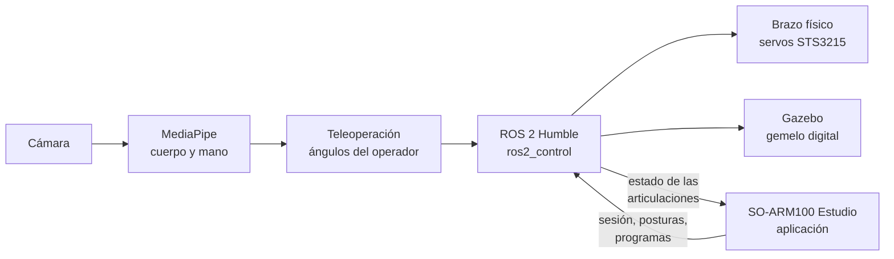

# Teleoperación por Visión del Manipulador SO-ARM100

**ROS 2 Humble · Gazebo Fortress · ros2_control · MediaPipe · Mapeo articular directo**

Estación didáctica de teleoperación en tiempo real para el manipulador de cinco grados de libertad **SO-ARM100**. Una cámara web mide los ángulos de las articulaciones del brazo y la mano del operador, y el sistema los **replica articulación por articulación** sobre el gemelo digital en Gazebo, sobre el brazo físico o sobre ambos a la vez. **No hay cinemática inversa en el lazo de control**: no se calcula dónde situar el efector en el espacio, se replican ángulos. El jacobiano se usa sólo para mostrar el índice de manipulabilidad en pantalla. La explicación completa está en [docs/07 — Cómo funciona el sistema](docs/07-como-funciona.md).

Todo se maneja desde **SO-ARM100 Estudio**, una aplicación con botones y el brazo en 3D: arranca la teleoperación, mueve el brazo, lo **programa con instrucciones de robot industrial** (`MoveJ`, `MoveL`, `MoveC`…), ejecuta los ensayos de rendimiento y enseña robótica en **18 lecciones** interactivas.

> Proyecto de la asignatura Análisis y Diseño de Sistemas Mecatrónicos — Ingeniería Mecatrónica, Universidad Tecnológica La Salle (ULSA), León, Nicaragua, 2026.


---

## Inicio rápido

Hace falta **Ubuntu 22.04**: instalado en el equipo, en una máquina virtual o en **WSL2** dentro de Windows (en Windows se abre la aplicación **Ubuntu** desde el menú Inicio). Todo lo demás se instala con los comandos de abajo. Cada bloque se copia completo y se pega en la terminal de Ubuntu.

### 1. Instalar (una sola vez)

```bash
sudo apt update && sudo apt install -y git
git clone https://github.com/Edangelux/so-arm100-teleop.git ~/so-arm100-teleop
cd ~/so-arm100-teleop
bash scripts/soarm.sh instalar
source ~/.bashrc
```

Instala ROS 2 Humble, Gazebo, MoveIt, MediaPipe y el workspace del brazo, y crea los atajos de una palabra y los iconos del escritorio. Tarda un buen rato la primera vez; se puede volver a ejecutar sin romper nada.

### 2. Abrir la aplicación

```bash
soarm-app
```

Se abre **SO-ARM100 Estudio** en una ventana propia. También se abre con doble clic en el icono **SO-ARM100 Estudio**. Desde ahí se hace todo con botones: iniciar la teleoperación, mover el brazo, programarlo, hacer los ensayos y las lecciones.

### 3. Teleoperar con la cámara (sin la aplicación)

```bash
teleop
```

Pregunta qué cámara usar, detecta si el brazo está conectado y arranca Gazebo, el brazo o los dos. Se calibra con la mano visible y la tecla `C`; se sale con `Q`.

### Órdenes de uso diario

| Para… | Comando |
|---|---|
| Abrir la aplicación | `soarm-app` |
| Cerrar el servidor de la aplicación | `soarm-app --parar` |
| Teleoperación directa | `teleop` · `teleop sim` · `teleop real` · `teleop ambos` |
| Traer la última versión del repositorio | `soarm-actualizar` |
| Revisar que todo esté bien instalado | `soarm-diagnostico` |
| Ver los servos (posición, carga, temperatura) | `servos` |
| Llevar los seis servos al centro (2048) | `centrar` |
| Ensayos de rendimiento | `soarm-ensayo a1` … `soarm-ensayo analizar` |
| Ver todas las órdenes | `soarm-ayuda` |

<details>
<summary><b>Sólo la aplicación, sin instalar ROS</b> (para las lecciones y el robot virtual)</summary>

Sirve en cualquier Linux con Python 3 y un navegador: Aprender, Programar y Mover funcionan completos con el robot virtual. Sesión y Ensayos avisan de que hace falta ROS.

```bash
git clone https://github.com/Edangelux/so-arm100-teleop.git ~/so-arm100-teleop
bash ~/so-arm100-teleop/app/abrir.sh
```

Si no se abre ninguna ventana, se entra desde el navegador a **http://127.0.0.1:8642**.
</details>

<details>
<summary><b>Actualizar una instalación anterior</b></summary>

```bash
cd ~/so-arm100-teleop
git pull
bash scripts/instalar_atajos.sh
source ~/.bashrc
```
</details>

---

## Cómo funciona



1. **La cámara y MediaPipe** encuentran el hombro, el codo, la muñeca y los dedos del operador en cada imagen.
2. **La teleoperación** convierte esos puntos en cinco ángulos y la apertura de la pinza, los filtra y los envía a ROS 2. No calcula dónde poner la pinza: **copia ángulos**, articulación por articulación.
3. **ROS 2** mueve el brazo real por el bus serie, el robot de Gazebo o los dos a la vez.
4. **SO-ARM100 Estudio** es la cara de todo: un servidor local en Python ejecuta las mismas órdenes que se escribirían en la terminal y una página web dibuja el brazo en 3D con sus mallas reales.

| Pestaña de la aplicación | Qué se hace |
|---|---|
| **Sesión** | Elegir modo (Gazebo, brazo o ambos) y cámara, iniciar y cerrar la teleoperación, llevar el brazo a `init` o `home` |
| **Mover** | Mover cada articulación con deslizadores o arrastrando la pinza en 3D (cinemática inversa), guardar posturas |
| **Programar** | Programas de robot industrial: `MoveJ`, `MoveL`, `MoveC`, pinza, señales, bucles; celda virtual con cubos; ejemplos y retos ([docs/19](docs/19-programar.md)) |
| **Aprender** | 18 lecciones interactivas, de grados de libertad a cuaterniones duales, dinámica, control, seguridad y celdas industriales |
| **Ensayos** | Ejecutar y analizar los ensayos A1 a A5 del brazo real |
| **Revisar** | Diagnóstico completo de la instalación |

La explicación completa está en [docs/07 — Cómo funciona el sistema](docs/07-como-funciona.md) y [docs/18 — SO-ARM100 Estudio](docs/18-aplicacion-estudio.md).

---

## Estado final del proyecto

El sistema se construyó, se integró y **se presentó en funcionamiento** con el brazo físico en septiembre de 2026. La versión que se ejecutó en la defensa fue `teleop_v13.py`, que se conserva sin modificaciones en [`entrega/teleoperacion/`](entrega/teleoperacion/).

| Componente | Estado | Evidencia |
|---|---|---|
| Ubuntu 22.04 → ROS 2 Humble → Gazebo → teleoperación por visión | **Verificado** | Instalación completa desde cero |
| Brazo físico por bus serie (`/dev/ttyACM0`) | **Operado** | 23 sesiones registradas con los seis servos inicializados y la interfaz activada, entre el 9 y el 19 de septiembre |
| Réplica simultánea simulación ↔ brazo físico | **Operado en la defensa** | Secuencia de órdenes recuperada del equipo — [docs/10](docs/10-espejo-simulacion-y-robot-real.md) |
| Indicadores de desempeño | **Cumplidos y reproducibles** | Recalculados desde los registros originales — [pruebas/](pruebas/README.md) |
| Modelo cinemático | **Verificado** contra implementaciones independientes | [analisis/cinematica/](analisis/cinematica/ANALISIS_CINEMATICO.md) |
| Instalación nativa por ISO / USB | Escrita, **no verificada desde cero** | [docs/02](docs/02-instalacion-nativa-iso.md) |

El detalle de cada componente, de los seis bloqueos que se identificaron antes de tener el brazo y de lo que pasó con cada uno está en [docs/09 — Estado del robot físico](docs/09-robot-fisico.md).

### Resultados medidos

| Indicador | Resultado | Umbral | Cumplimiento |
|---|---|---|:---:|
| Latencia de procesamiento más escritura serial | 21,87 ms | ≤ 150 ms | Cumple |
| Desviación angular articular | 0,492° de promedio · 1,494° de máximo | ≤ 1,5° | Cumple |
| Tasa de la canalización de visión | 34,05 FPS de promedio | ≥ 25 FPS | Cumple |

Las tres cifras se reproducen exactamente a partir de los registros originales con `python3 pruebas/recalcular_resultados.py`. Qué mide cada una, y qué no, se explica en [pruebas/README.md](pruebas/README.md).

### Ensayos de rendimiento del brazo (25 de septiembre de 2026)

Después de la defensa se midió el brazo real con los ensayos del [capítulo 17](docs/17-ensayos-de-rendimiento.md#resultados-del-25-de-septiembre-de-2026). Los datos, las tablas y las gráficas están en [`pruebas/resultados/2026-09-25/`](pruebas/resultados/2026-09-25/resumen.md).

| Ensayo | Resultado | Lectura |
|---|---|---|
| **A1** Precisión estática | Error medio: hombro −1,53°, codo −1,26°; las otras tres articulaciones, menos de 0,25° | La gravedad hace que hombro y codo se queden cortos; en `init`, −2,38° y −1,82° |
| **A2** Repetibilidad (ISO 9283) | **RP = 2,30 mm** en 30 llegadas | Medida con los codificadores de los servos |
| **A3** Carga útil | Sostiene **227 g** en las tres posturas; esfuerzo máximo del codo **50 %** | El error del codo sube de −2,0° sin carga a −5,5° con 227 g |
| **A4** Temperatura | Máxima **54 °C** (hombro, al empezar) y bajó a 50 °C; límite 55 °C | Interrumpido a los 18 min de 30; hombro y codo son los servos críticos |
| **A5** Respuesta al escalón | Retardo 139–317 ms · subida 161–192 ms · establecimiento 333–501 ms · sobrepaso ≤ 1,1 % | Sobreamortiguado, sin oscilación |


---

## Operación con el lanzador unificado

Los atajos del [inicio rápido](#inicio-rápido) llaman a este guion. Desde la entrega, el sistema se instala y se opera con un solo guion, [`scripts/soarm.sh`](scripts/soarm.sh), que ejecuta la versión 13 presentada y elige las conexiones según el modo. Requiere **Ubuntu 22.04**, nativo, en máquina virtual o bajo WSL2.

```bash
sudo apt update && sudo apt install -y git
git clone https://github.com/Edangelux/so-arm100-teleop.git ~/so-arm100-teleop
cd ~/so-arm100-teleop
bash scripts/soarm.sh instalar                        # una sola vez
bash scripts/soarm.sh sim                             # sólo el gemelo digital
bash scripts/soarm.sh real  --puerto /dev/ttyACM0     # sólo el brazo físico
bash scripts/soarm.sh ambos --puerto /dev/ttyACM0     # las dos plantas a la vez
```

Después de instalar, basta escribir **`teleop`**, o abrir el icono **SO-ARM100 Teleoperación**. Pregunta la cámara (integrada, virtual o un teléfono por Wi-Fi con su IP), detecta el brazo y arranca el modo que corresponde, en Ubuntu nativo, en máquina virtual o en WSL2 ([docs/14](docs/14-lanzador-v13.md#atajos-de-una-palabra)). Con `--dry-run` el lanzador muestra qué va a hacer sin instalar ni iniciar nada. Todas las opciones, los tópicos que usa cada modo y el orden de arranque están en [docs/14 — Lanzador unificado](docs/14-lanzador-v13.md).

> **Antes de conectar el brazo físico** conviene leer el bloqueo 6 de [docs/09](docs/09-robot-fisico.md): la versión 13 arranca suponiendo que el brazo está en la postura cero y no lee `/joint_states`. Con el brazo sostenido y sin carga en la pinza la primera vez.

¿Todavía no hay Ubuntu instalado? Se empieza por una de estas guías:

- **[Guía 01 — Máquina virtual (VirtualBox)](docs/01-instalacion-maquina-virtual.md)**, recomendada si el equipo tiene memoria y procesador de sobra.
- **[Guía 02 — Instalación nativa por ISO / USB](docs/02-instalacion-nativa-iso.md)**, recomendada para equipos de gama básica.
- **[Guía 11 — WSL2](docs/11-instalacion-wsl2.md)**, la que se usó para operar el brazo físico desde Windows.

---

## Índice de la documentación

| # | Documento | Qué cubre |
|---|-----------|-----------|
| 01 | [Instalación en máquina virtual](docs/01-instalacion-maquina-virtual.md) | VirtualBox, Extension Pack, ajustes críticos, Guest Additions, webcam |
| 02 | [Instalación nativa por ISO](docs/02-instalacion-nativa-iso.md) | USB de arranque con Rufus, BIOS/UEFI, particionado, arranque dual |
| 03 | [Instalación de ROS 2 Humble](docs/03-instalacion-ros2.md) | Locales, repositorio APT, ROS 2, Gazebo, MoveIt 2, visión artificial |
| 04 | [Workspace y compilación](docs/04-workspace-y-compilacion.md) | `~/ros2_ws`, paquetes del SO-ARM100, `rosdep`, `colcon build` |
| 05 | [Ejecución y control](docs/05-ejecucion.md) | Lanzamiento de la simulación y de la teleoperación, calibración, gestos |
| 06 | [Solución de problemas](docs/06-solucion-de-problemas.md) | Los errores reales que aparecieron durante el desarrollo y cómo se resolvieron |
| 07 | [**Cómo funciona el sistema**](docs/07-como-funciona.md) | Nodos, tópicos y acciones; el recorrido de la cámara al robot |
| 08 | [**Análisis cinemático**](docs/08-analisis-cinematico.md) | Por qué mapeo articular directo y no cinemática inversa |
| 09 | [**Estado del robot físico**](docs/09-robot-fisico.md) | Estado verificado de cada componente; los seis bloqueos y su desenlace |
| 10 | [**Espejo simulación ↔ robot real**](docs/10-espejo-simulacion-y-robot-real.md) | Espacio de nombres `/real`, los dos nodos espejo, orden de arranque |
| 11 | [Instalación en WSL2](docs/11-instalacion-wsl2.md) | Paso de la cámara y de la placa de servos por `usbipd` |
| 12 | [**Cierre del proyecto**](docs/12-cierre-del-proyecto.md) | Qué se hizo, qué se midió, qué quedó fuera del alcance |
| 14 | [**Lanzador unificado**](docs/14-lanzador-v13.md) | Instalación y operación de la versión presentada en los tres modos |
| 15 | [**v14, MoveIt y posturas seguras**](docs/15-v14-moveit-y-posturas-seguras.md) | Arranque y reanudación desde la postura medida, MoveIt junto a la teleoperación, cierre en `init` y apagado en `home` |
| 16 | [**v15: mejor estimación de ángulos**](docs/16-v15-estimacion-de-angulos.md) | Confianza por articulación, ganancia por postura de referencia y giro de muñeca en 3D |
| 17 | [**Ensayos de rendimiento**](docs/17-ensayos-de-rendimiento.md) | Precisión, respuesta, repetibilidad, carga, temperatura y fidelidad del espejo, con los resultados del 25/09/2026 |
| 18 | [**SO-ARM100 Estudio**](docs/18-aplicacion-estudio.md) | Aplicación con botones y brazo en 3D: sesión, movimiento, ensayos, diagnóstico y 18 lecciones de robótica |
| 19 | [**Programar**](docs/19-programar.md) | Programación tipo robot industrial: MoveJ, MoveL, MoveC, pinza, señales, bucles, celda virtual, ejemplos y retos |
| — | [**Modelo cinemático completo**](analisis/cinematica/ANALISIS_CINEMATICO.md) | Tabla D-H, cinemática directa e inversa, jacobiano, singularidades, verificación cruzada |
| — | [**Documentos entregados**](docs/entregables/README.md) | Documento técnico, formulación y evaluación, y las dos presentaciones |

---

## Requisitos

| Componente | Requisito |
|---|---|
| Sistema operativo | **Ubuntu 22.04 LTS (Jammy Jellyfish)**, obligatorio |
| ROS 2 | Humble Hawksbill |
| RAM | 4 GB mínimo · 8 GB recomendado |
| CPU | 2 núcleos mínimo · 4 recomendados |
| Disco | 40 GB mínimo · 60–80 GB recomendado |
| Gráficos | Aceleración 3D habilitada, indispensable para Gazebo y RViz |
| Cámara | Webcam integrada o USB, o un teléfono con DroidCam por la red ([docs/14](docs/14-lanzador-v13.md#cámara-por-red-droidcam-o-un-teléfono)) |
| Brazo físico (opcional) | SO-ARM100 con seis STS3215 de 7,4 V y placa Waveshare Serial Bus Servo Driver |

> **ROS 2 Humble exige Ubuntu 22.04.** Ubuntu 24.04 trae Python y bibliotecas incompatibles con los binarios de Humble, y 20.04 es demasiado antiguo.

---

## Estructura del repositorio

```
so-arm100-teleop/
├── README.md                      ← este documento
├── entrega/                       ← estado exacto de lo que se presentó
│   ├── teleoperacion/teleop_v13.py  ← nodo ejecutado en la defensa, sin cambios
│   ├── src/                       ← paquetes ROS 2 del workspace de la entrega
│   ├── utilidades_originales/     ← programas de puesta en marcha usados
│   ├── entorno/                   ← versiones de Python y paquetes del sistema
│   └── manifiesto_origen.json     ← SHA-256 de cada archivo recuperado
├── app/                           ← SO-ARM100 Estudio: servidor Python y página web
│   ├── abrir.sh                   ← arranca el servidor y abre la ventana (soarm-app)
│   ├── servidor.py                ← API local en 127.0.0.1:8642
│   └── web/js/                    ← escena 3D, secciones, lecciones y programación
├── teleop_vision/
│   ├── ejecutar_v13.py            ← ejecuta v13 con las conexiones del modo elegido
│   ├── runtime_config.py          ← tópicos y parámetros de cada modo
│   ├── camara_red.py              ← cámara por red: DroidCam, IP Webcam, RTSP
│   └── teleop_vision.py           ← versión anterior del nodo, previa a la entrega
├── scripts/
│   ├── soarm.sh                   ← lanzador unificado: instalar, sim, real, ambos
│   ├── 07_restaurar_entrega.sh    ← reconstruye el workspace de la entrega aparte
│   ├── install.sh                 ← instalador por fases, para la ruta de simulación
│   ├── 01_…06_*.sh                ← las seis fases, ejecutables por separado
│   └── verificar.sh               ← diagnóstico de la instalación
├── pruebas/
│   ├── datos_originales/          ← registros CSV de las mediciones
│   ├── ensayos/                   ← ensayos A1–A5, B1–B2 y su análisis
│   ├── resultados/2026-09-25/     ← resultados de los ensayos del brazo real
│   ├── recalcular_resultados.py   ← reproduce las cifras del documento
│   └── resultados_recalculados.json
├── brazo-fisico/
│   ├── utilidades/originales/     ← instrumentos de medición que se usaron
│   ├── utilidades/metodologicas/  ← reimplementaciones previas al brazo
│   ├── parches/ extras/ launch/   ← adaptación del driver a Humble y espacio /real
│   └── trajectory_mirror/         ← nodos espejo simulación ↔ brazo físico
├── analisis/cinematica/           ← modelo cinemático en Python y MATLAB, con figuras
├── cad/                           ← modelo paramétrico en STL, STEP y SolidWorks (Git LFS)
├── overlay/                       ← configuración verificada de la ruta de simulación
└── docs/
    ├── 01 … 19                    ← guías y documentación del proyecto
    ├── entregables/               ← PDF entregados (Git LFS)
    └── img/                       ← capturas de pantalla
```

El repositorio **no vive dentro del workspace de ROS**. Se clona en la carpeta personal (`~/so-arm100-teleop`) y el lanzador crea el workspace aparte, en `~/ros2_ws_entrega`, para que la documentación y el código de terceros queden separados.

---

## Instalación por fases (ruta de simulación)

La ruta anterior a la entrega se conserva completa. Sirve para entender cada paso o para reanudar una instalación que falló en un punto:

```bash
bash scripts/01_ros2_humble.sh      # Fase 1: ROS 2 Humble
bash scripts/02_simulacion.sh       # Fase 2: Gazebo + MoveIt 2 + controladores
bash scripts/03_vision_python.sh    # Fase 3: OpenCV + MediaPipe + cámara
bash scripts/04_workspace.sh        # Fase 4: workspace y compilación
bash scripts/05_aplicar_overlay.sh  # Fase 5: configuración verificada para Humble
bash scripts/06_brazo_fisico.sh     # Fase 6: brazo físico (opcional)
```

`bash scripts/install.sh` ejecuta las fases 1 a 5 seguidas. Los guiones son **idempotentes**: pueden volver a ejecutarse sin romper nada. Los comandos equivalentes, uno por uno, están en [docs/03](docs/03-instalacion-ros2.md) y [docs/04](docs/04-workspace-y-compilacion.md).

---

## Controles de la teleoperación

| Acción | Gesto o tecla |
|---|---|
| **Calibrar** | Postura neutra, **con la mano visible**, y **`C`** o **`ESPACIO`** |
| Mover el brazo | El robot **replica los ángulos del operador**: hombro, codo y muñeca |
| **Cerrar la pinza** | Pulgar e índice juntos, en pellizco |
| **Abrir la pinza** | Pulgar e índice separados |
| **Invertir un sentido** | Teclas **`1`**–**`5`**, cuando una articulación se mueve al revés |
| Ajustar la sensibilidad | **`TAB`** para seleccionar, **`+`** / **`-`** para la ganancia |
| **Guardar el ajuste** | **`S`**, en `~/teleop_config.json` |
| Cambiar de brazo · Pausa · Salir | **`B`** (exige recalibrar) · **`P`** · **`Q`** |

La guía completa, con la explicación de cada parámetro, está en [docs/05](docs/05-ejecucion.md).

---

## Verificación y problemas frecuentes

```bash
bash scripts/soarm.sh verificar        # ruta del lanzador
bash scripts/verificar.sh              # ruta por fases
```

Los errores que aparecieron durante el desarrollo están documentados con su causa y su solución en **[docs/06 — Solución de problemas](docs/06-solucion-de-problemas.md)**: la cámara que no abre en la máquina virtual, Gazebo en blanco o a 2 FPS, el conflicto de Qt entre OpenCV y ROS 2, las llaves GPG de APT, `rosdep`, controladores que no cargan, la pinza que no responde, articulaciones invertidas y el temblor del brazo.

---

## Autores

- Cristhian Eduardo Guido Meléndez
- Eddy Elías Torrez Escobar
- Rodrigo José Tinoco Aguirre
- Orlando René Cisneros García

Tutor: MSc. Kevin Josué Flores Carvajal.

## Créditos y licencias

- Diseño mecánico, STL y lista de materiales del brazo: [`TheRobotStudio/SO-ARM100`](https://github.com/TheRobotStudio/SO-ARM100) (Apache 2.0). El modelo paramétrico de [`cad/`](cad/README.md) es una obra derivada con fines de análisis y no reclama la autoría del diseño.
- Paquetes ROS 2 del robot: [`brukg/SO-100-arm`](https://github.com/brukg/SO-100-arm) (Apache 2.0).
- Detección de postura y manos: [MediaPipe](https://github.com/google-ai-edge/mediapipe), de Google.
- Documentación, guiones de instalación, nodo de teleoperación, análisis y utilidades: este repositorio, licencia MIT (véase [LICENSE](LICENSE)).
