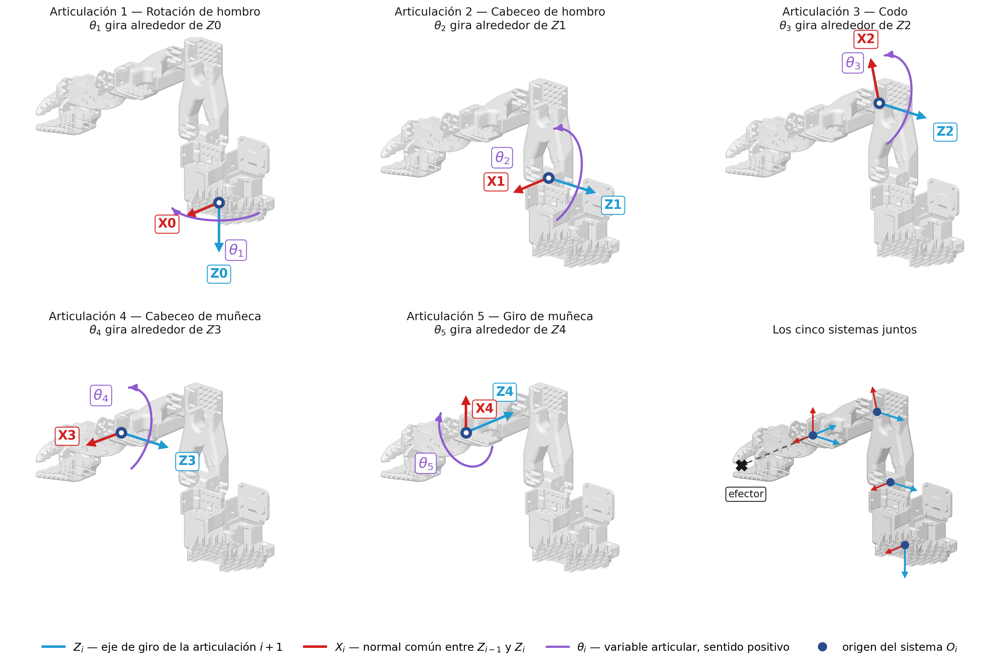
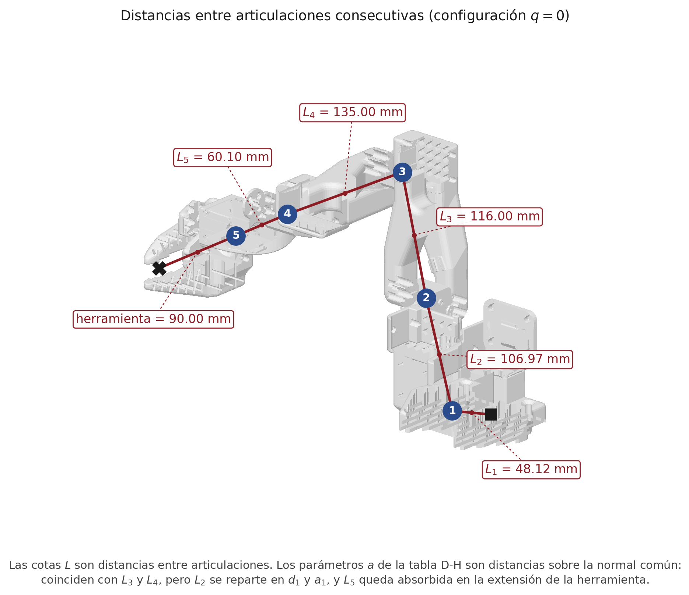
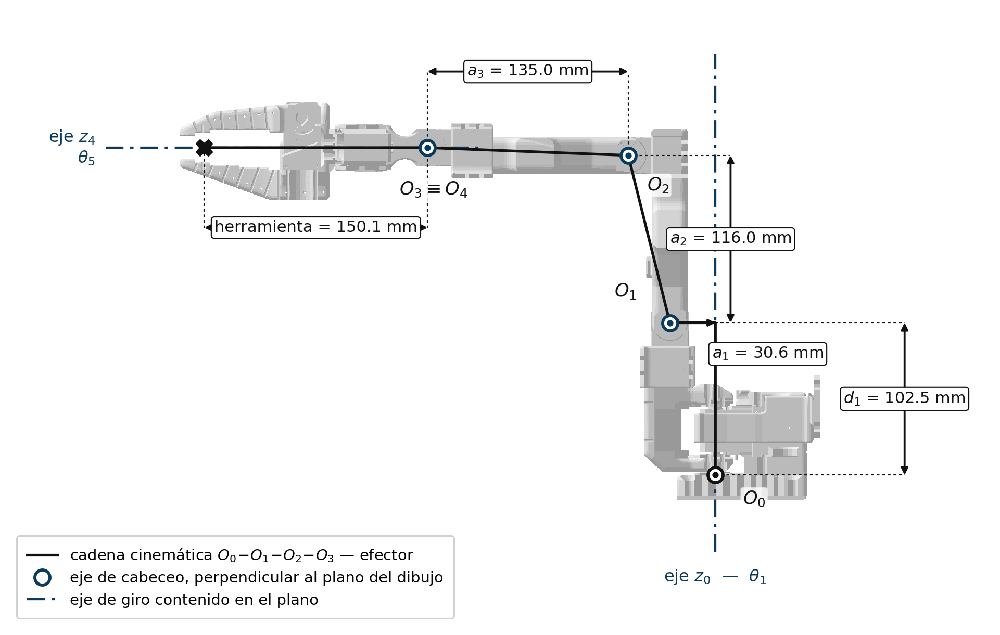
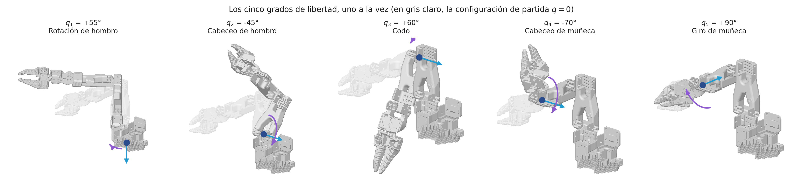
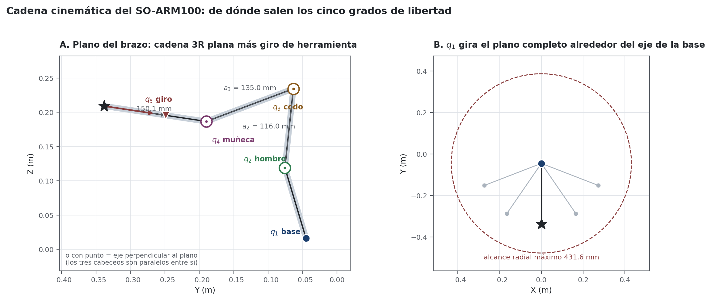
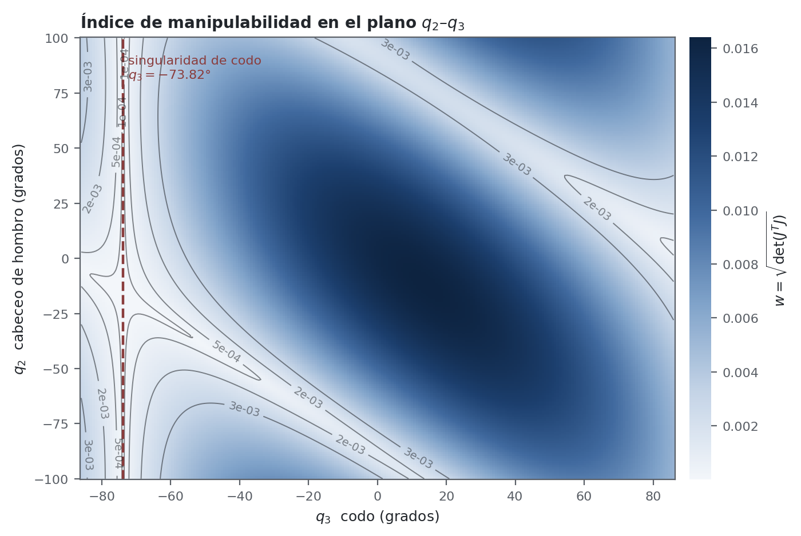
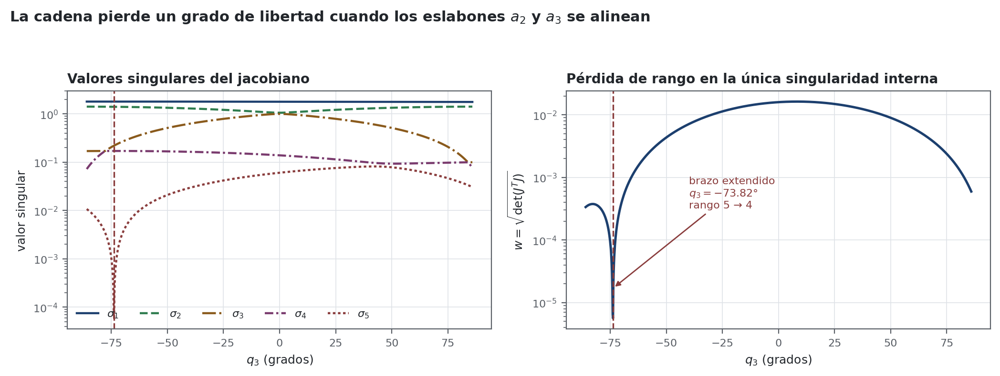
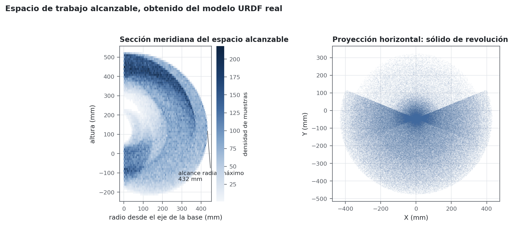
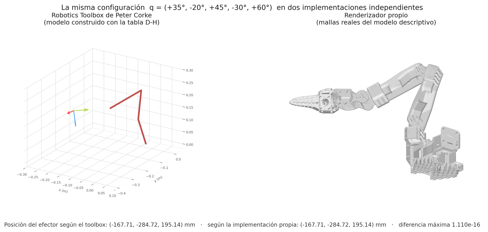

# Análisis Cinemático del Manipulador

## Origen y procedencia del modelo geométrico

Todo el análisis que se expone a continuación se construyó sobre el modelo descriptivo del manipulador, el archivo `so_arm_100_5dof_arm.urdf.xacro` perteneciente al paquete `so_arm_100_description`, publicado en el repositorio de acceso abierto `brukg/SO-100-arm`. Ese archivo es el mismo que cargan el simulador y el planificador de movimiento durante la etapa de simulación del proyecto, de modo que el modelo matemático desarrollado y el modelo que ejecuta el programa describen exactamente el mismo mecanismo. No se emplearon medidas tomadas del modelo asistido por computadora ni valores estimados: cada longitud, cada eje de giro y cada límite articular provienen de ese archivo.

Debe hacerse constar una circunstancia que condicionó el enfoque de todo el capítulo. **El repositorio oficial del manipulador no publica una tabla de parámetros de Denavit-Hartenberg.** En ese repositorio existe una solicitud abierta en la que se piden precisamente esos parámetros, junto con el espacio de trabajo, las velocidades angulares máximas, las aceleraciones y la repetibilidad, datos que la documentación del fabricante no proporciona. Por consiguiente, la tabla que se presenta en este capítulo no se tomó de ninguna fuente secundaria ni se atribuye al fabricante: se derivó de los ejes de giro y de los puntos de anclaje declarados en el modelo descriptivo, aplicando el procedimiento de la normal común, y se validó después contra tres implementaciones independientes del proyecto.

Esa decisión tiene una consecuencia verificable. La cinemática directa construida a partir de los parámetros obtenidos en este capítulo coincidió con la cinemática que el propio middleware calcula, con un error máximo de 1.485 × 10⁻¹⁵ metros sobre veinte mil configuraciones articulares generadas al azar dentro de los límites del mecanismo. Ese residuo corresponde al redondeo aritmético de la representación de punto flotante de sesenta y cuatro bits, no a una diferencia de modelado.

---

## Asignación de Sistemas de Referencia

La convención de Denavit-Hartenberg asigna a cada eslabón un sistema de coordenadas ortonormal anclado a su articulación, de modo que la transformación entre dos eslabones consecutivos quede descrita por únicamente cuatro parámetros. Se empleó la convención clásica, con las reglas siguientes:

- El eje **z** del sistema *i−1* se alineó con el eje de giro de la articulación *i*.
- El eje **x** del sistema *i* se situó sobre la normal común entre los ejes z de los sistemas *i−1* e *i*, apuntando del primero al segundo.
- El eje **y** completó la terna por la regla de la mano derecha.

Dos casos particulares exigen una regla adicional, y ambos se presentaron en este manipulador. Cuando dos ejes consecutivos son paralelos, la normal común no es única; se aplicó entonces la regla habitual de elegir la normal que pasa por el origen del sistema anterior, lo que hace que el desplazamiento *d* de esa fila resulte nulo. Cuando dos ejes se cortan en un punto, la longitud *a* de esa fila es nula por construcción, y el origen del sistema se sitúa en el punto de corte.

La aplicación de estas reglas sobre los ejes reales del modelo descriptivo produjo la tabla de la sección siguiente. Los tres primeros parámetros de cada fila son constantes geométricas del mecanismo; el ángulo articular es la única variable.

**Figura 1**

*Sistemas de referencia de Denavit-Hartenberg sobre el modelo tridimensional del manipulador*

Nota. Elaboración propia. El modelo tridimensional no constituye una ilustración: cada pieza se dibujó con la malla que declara el archivo descriptivo del manipulador, colocada en el lugar que le asigna la cinemática directa para la configuración q = 0. Los ejes se trazaron en los orígenes obtenidos por el procedimiento de la normal común. Cada panel aísla una articulación para que los sistemas de referencia no se superpongan. El eje z₀ apunta hacia abajo porque ese es el sentido del eje de giro declarado para la primera articulación; conservarlo es lo que hace que el signo de q₁ en este capítulo coincida con el signo que el programa de control envía al servomotor.

---

## Parámetros de Denavit-Hartenberg

**Tabla 1**

*Parámetros de Denavit-Hartenberg del manipulador SO-ARM100, obtenidos del modelo descriptivo*

| i | Articulación | θᵢ | dᵢ (m) | aᵢ (m) | αᵢ |
| :-: | :-- | :-- | :-: | :-: | :-: |
| 1 | Shoulder_Rotation | q₁ | −0.1025 | 0.0306 | +90° |
| 2 | Shoulder_Pitch | q₂ − 76.032° | 0 | 0.1160 | 0° |
| 3 | Elbow | q₃ + 73.825° | 0 | 0.1350 | 0° |
| 4 | Wrist_Pitch | q₄ − 87.792° | 0 | 0 | +90° |
| 5 | Wrist_Roll | q₅ + 180° | 0 | 0 | 0° |

Nota. Elaboración propia a partir del modelo descriptivo del manipulador. Los desplazamientos angulares que acompañan a cada variable articular son constantes de montaje: expresan la diferencia entre el cero mecánico declarado en el modelo y el cero que impone la convención de Denavit-Hartenberg.

Dos observaciones sobre esta tabla merecen destacarse.

La primera es que **a₂ = 0.1160 m y a₃ = 0.1350 m** son exactamente las longitudes del brazo y del antebrazo del manipulador, obtenidas como la norma de los vectores de origen de las articulaciones del codo y del cabeceo de muñeca. Son las mismas constantes que emplea el nodo de teleoperación del proyecto para calcular el índice de manipulabilidad, lo lo que confirma que el programa desarrollado y el modelo matemático de este capítulo describen el mismo mecanismo.

Conviene prevenir una confusión frecuente entre las longitudes que se miden sobre el manipulador y los parámetros de la tabla. Las distancias entre articulaciones consecutivas son magnitudes directamente observables, mientras que los parámetros *a* de la convención son distancias medidas sobre la normal común entre dos ejes de giro. Ambas coinciden únicamente cuando el segmento que une las articulaciones ya resulta perpendicular a los dos ejes.

**Tabla 2**

*Distancias entre articulaciones consecutivas y su correspondencia con los parámetros de la tabla*

| Tramo | Longitud (mm) | Correspondencia |
| :-- | :-: | :-- |
| Origen del modelo → articulación 1 | 48.12 | Entra en la transformación constante de base |
| Articulación 1 → articulación 2 | 106.97 | Se reparte en d₁ = −102.5 mm y a₁ = 30.6 mm |
| Articulación 2 → articulación 3 | 116.00 | Coincide con a₂ |
| Articulación 3 → articulación 4 | 135.00 | Coincide con a₃ |
| Articulación 4 → articulación 5 | 60.10 | Absorbida en la extensión de la herramienta |
| Articulación 5 → efector | 90.00 | Absorbida en la extensión de la herramienta |

Nota. Elaboración propia. El reparto de los 106.97 mm en dos parámetros perpendiculares se comprueba de inmediato: √(102.5² + 30.6²) = 106.97 mm. Los 60.10 mm desaparecen de la tabla porque los ejes cuarto y quinto se cortan, lo que obliga a situar el origen del sistema en el punto de corte; esa longitud quedó incorporada a la extensión constante de la herramienta, que resultó de 60.1 + 90.0 = 150.1 mm.

**Figura 2**

*Distancias entre articulaciones consecutivas sobre el modelo tridimensional*

Nota. Elaboración propia. Los círculos numerados marcan las cinco articulaciones; el cuadrado, el origen del modelo; el aspa, el punto de trabajo del efector.

La segunda es que **las filas 4 y 5 tienen a = d = 0**. Eso significa que los ejes de la articulación de cabeceo de muñeca y de la articulación de giro se cortan en un punto. Dos ejes concurrentes no constituyen una muñeca esférica, que exige tres; esta observación resulta determinante para el análisis de la cinemática inversa.

---

## Matriz de Transformación Homogénea y Cinemática Directa

La relación entre dos sistemas de referencia consecutivos se expresa mediante una **matriz de transformación homogénea** de cuatro por cuatro, que reúne en una sola entidad la rotación y la traslación entre ambos. Su bloque superior izquierdo es una matriz de rotación de tres por tres, ortogonal y de determinante unitario; su última columna es el vector de posición; su última fila es fija e igual a (0, 0, 0, 1).

Con los cuatro parámetros de Denavit-Hartenberg la transformación toma la forma

`[ECUACIÓN: insertar con el editor de ecuaciones]`

    A_i =  ⎡ cos θᵢ   −sin θᵢ cos αᵢ    sin θᵢ sin αᵢ    aᵢ cos θᵢ ⎤
           ⎢ sin θᵢ    cos θᵢ cos αᵢ   −cos θᵢ sin αᵢ    aᵢ sin θᵢ ⎥
           ⎢   0          sin αᵢ           cos αᵢ           dᵢ     ⎥
           ⎣   0            0                0              1     ⎦

que se lee como la composición de cuatro movimientos elementales: una rotación de θᵢ sobre el eje z, una traslación de dᵢ sobre ese mismo eje, una traslación de aᵢ sobre el nuevo eje x y una rotación de αᵢ sobre él.

La **cinemática directa** del manipulador se obtuvo encadenando esas cinco transformaciones, más dos transformaciones constantes en los extremos:

    T_efector = T_base · A₁ · A₂ · A₃ · A₄ · A₅ · T_herramienta

La transformación T_base sitúa el sistema de Denavit-Hartenberg cero respecto del sistema de referencia de la base del robot, y T_herramienta traslada el resultado desde la última articulación hasta el punto de trabajo del efector final, a 0.1501 metros sobre el eje de giro de la muñeca.

De la matriz resultante se extrae directamente la información física del efector: su **posición** en las tres primeras filas de la última columna, y su **orientación** en el bloque de rotación de tres por tres.

---

## Estructura de la Cadena Cinemática

Antes de plantear la cinemática inversa se estableció qué estructura tiene realmente esta cadena, porque de ella se derivan todas las conclusiones posteriores. Evaluando los ejes de giro en la configuración cero se obtuvo:

**Tabla 3**

*Producto vectorial entre ejes de giro consecutivos*

| Par de ejes | ‖zᵢ × zⱼ‖ | Relación |
| :-- | :-: | :-- |
| z₁ × z₂ | 1.000000 | no paralelos |
| z₂ × z₃ | 0.000000 | **paralelos** |
| z₃ × z₄ | 0.000000 | **paralelos** |
| z₄ × z₅ | 1.000000 | no paralelos |

Nota. Elaboración propia. Un producto vectorial nulo entre dos vectores unitarios indica ejes paralelos.

La estructura quedó entonces establecida: **un giro vertical, tres cabeceos paralelos entre sí y un giro de herramienta**. De ahí se desprenden tres propiedades que gobiernan todo el comportamiento del mecanismo.

**La cadena central es plana.** Los tres cabeceos comparten dirección de eje, de modo que las articulaciones dos, tres y cuatro forman una cadena de tres eslabones que se mueve dentro de un plano. La primera articulación no participa de ese movimiento: lo que hace es girar el plano completo alrededor del eje vertical de la base.

**El giro de muñeca no desplaza al efector.** Como las filas cuarta y quinta de la tabla tienen a = d = 0 y la herramienta se extiende sobre el eje de giro, el punto de trabajo del efector queda situado exactamente sobre ese eje. La comprobación numérica lo confirmó: al variar únicamente la quinta articulación sobre todo su recorrido, el desplazamiento del efector fue de 1.110 × 10⁻¹⁶ metros, y la quinta columna de la parte lineal del jacobiano es el vector cero. La posición del efector depende, por tanto, solo de las cuatro primeras articulaciones.

**No existe muñeca esférica.** No hay tres ejes que se corten en un punto común, de modo que no es aplicable la descomposición de Pieper, que es el resultado clásico que garantiza solución en forma cerrada para los manipuladores de seis grados de libertad con muñeca esférica.

**Figura 3**

*Parámetros geométricos de la cadena y ejes de giro sobre la vista lateral del manipulador*

Nota. Elaboración propia. La vista se tomó mirando a lo largo del eje de los tres cabeceos, de modo que el plano del dibujo coincide con el plano en que se mueve la cadena central. Las tres circunferencias con punto marcan ejes perpendiculares al papel; las líneas de eje y trazo marcan los dos ejes contenidos en el plano. Las cotas son las constantes de la tabla de Denavit-Hartenberg.

**Figura 4**

*Efecto individual de cada grado de libertad sobre la postura del manipulador*

Nota. Elaboración propia. En gris claro se representa la configuración de partida y en color el resultado de mover únicamente esa articulación. En el último panel el manipulador apenas cambia de postura: la quinta articulación gira la herramienta sobre su propio eje sin desplazar el punto de trabajo.

**Figura 5**

*Descomposición del movimiento: cadena plana de tres eslabones y giro del plano por la primera articulación*

Nota. Elaboración propia.

---

## Cinemática Inversa

El planteamiento de la cinemática inversa exige distinguir dos preguntas que suelen confundirse.

**La primera pregunta es si el manipulador puede alcanzar una pose arbitraria del espacio.** La respuesta es negativa y la razón es estructural, no algorítmica: una pose completa en el espacio tridimensional —posición y orientación— tiene seis grados de libertad, y el mecanismo dispone de cinco. Ningún método de resolución puede recuperar un grado de libertad que el mecanismo no tiene.

La restricción concreta se dedujo de la estructura establecida en la sección anterior y se verificó numéricamente sobre doscientas mil configuraciones: **el eje de la herramienta está obligado a permanecer dentro del plano vertical que definen el eje de la base y el punto del efector**, con una desviación máxima de 1.2 × 10⁻⁴ fuera de una vecindad de diez milímetros alrededor del eje de la base, donde el plano no está definido. El motivo es que ese eje es el resultado de la cadena plana, y el plano lo elige la primera articulación. La quinta articulación gira la herramienta sobre ese eje, pero no lo saca del plano.

La comprobación es concluyente. Al tomar posiciones alcanzables y solicitar sobre ellas orientaciones generadas al azar de forma uniforme, **ninguna de las mil poses planteadas resultó alcanzable**.

**La segunda pregunta es si existe solución cerrada para la tarea que el manipulador sí puede ejecutar.** La respuesta es afirmativa, y esa es la formulación útil del problema. El espacio de tareas alcanzable tiene cinco dimensiones y se descompone así:

- la **posición** del efector, tres coordenadas, que dependen únicamente de las cuatro primeras articulaciones;
- la **dirección del eje de la herramienta**, que aporta un grado de libertad porque su componente fuera del plano está fijada;
- el **giro** de la herramienta sobre su propio eje, que aporta el quinto.

Sobre ese espacio la solución se obtuvo en forma cerrada mediante la descomposición siguiente:

1. La primera articulación se despejó del azimut del punto objetivo respecto del eje de la base, lo que fija el plano de trabajo. Existen dos ramas, separadas ciento ochenta grados.
2. El problema se proyectó sobre ese plano, donde quedó reducido a una cadena de tres eslabones plana con longitudes a₂, a₃ y la extensión de la herramienta.
3. Se retrocedió desde el punto objetivo una distancia igual a la extensión de la herramienta, en dirección contraria a su eje, y se obtiene el punto de la muñeca.
4. El ángulo del codo se despejó de la ley del coseno sobre el triángulo que forman las dos longitudes de eslabón y la distancia al punto de la muñeca. Existen dos ramas, codo arriba y codo abajo.
5. El ángulo del hombro se obtuvo por diferencia de argumentos, y el cabeceo de muñeca por diferencia entre la orientación deseada de la herramienta dentro del plano y la suma de los dos ángulos anteriores.
6. El giro de muñeca se extrajo de la rotación residual entre la orientación alcanzada por las cuatro primeras articulaciones y la orientación solicitada.

La solución no requiere iteración ni valores iniciales. Se validó generando tres mil poses con la cinemática directa y resolviéndolas con este procedimiento:

**Tabla 4**

*Verificación de la cinemática inversa cerrada*

| Magnitud verificada | Resultado |
| :-- | :-- |
| Poses alcanzables resueltas | 3000 de 3000 (100 %) |
| Error máximo de posición | 3.9 × 10⁻¹⁶ m |
| Error máximo de orientación | 2.6 × 10⁻¹⁴ |
| Soluciones exactas por pose | 3.38 en promedio (dos ramas de base × dos de codo) |
| De esas, dentro de los límites articulares | 1.16 en promedio; al menos una siempre |
| Poses de orientación arbitraria resueltas | 0 de 1000 (0 %) |

Nota. Elaboración propia. Las soluciones múltiples corresponden a las dos ramas del ángulo de la base y a las configuraciones de codo arriba y codo abajo. Todas reproducen la pose con error del orden de 10⁻¹⁶; la mayoría, sin embargo, cae fuera del recorrido mecánico de alguna articulación, de modo que en la práctica el manipulador dispone casi siempre de una sola postura admisible para cada pose.

La lectura conjunta de las dos últimas filas resume el resultado: **el manipulador resuelve exactamente y sin ambigüedad la tarea de cinco dimensiones que puede ejecutar, y ninguna de las que están fuera de su alcance estructural.**

---

## Jacobiano Geométrico

El jacobiano relaciona las velocidades articulares con la velocidad del efector final. Para un manipulador de cinco articulaciones y un efector cuyo movimiento se describe con seis componentes —tres de velocidad lineal y tres de velocidad angular— el jacobiano es una **matriz de seis filas por cinco columnas**. Esa forma rectangular, y no cuadrada, es la causa de varias particularidades que se tratan en las secciones siguientes.

La columna correspondiente a la articulación *i*, que es de revolución en los cinco casos, se construyó geométricamente como

    Jᵢ = ⎡ zᵢ × (o_n − oᵢ) ⎤     ← contribución a la velocidad lineal
         ⎣       zᵢ        ⎦     ← contribución a la velocidad angular

donde zᵢ es el eje de giro de la articulación expresado en el sistema de la base, oᵢ el origen de su sistema de referencia y o_n el punto del efector final. El producto vectorial expresa que un giro alrededor de un eje produce sobre un punto una velocidad lineal proporcional al brazo de palanca que los separa y perpendicular a ambos.

El jacobiano así construido se contrastó contra una aproximación por diferencias finitas centradas de la cinemática directa sobre tres mil configuraciones, con un error máximo de 3.0 × 10⁻⁹, que corresponde al error de truncamiento del método de diferencias y no a una discrepancia de formulación.

---

## Índice de Manipulabilidad

El **índice de manipulabilidad** de Yoshikawa cuantifica mediante un solo número la facilidad con que el mecanismo puede moverse desde una configuración dada. Geométricamente expresa el volumen del elipsoide de velocidades que el efector final puede alcanzar. Un valor elevado indica holgura de movimiento en todas las direcciones; un valor que tiende a cero indica proximidad a una configuración singular.

Aquí fue necesaria una precisión que la formulación habitual omite. La expresión que aparece con más frecuencia en la literatura es

    w = √( det( J · Jᵀ ) )

y es correcta **únicamente cuando el número de columnas del jacobiano es mayor o igual que el de filas**. En el manipulador estudiado el jacobiano tiene seis filas y cinco columnas, de modo que el producto J·Jᵀ es una matriz de seis por seis cuyo rango no puede superar cinco: **su determinante es idénticamente nulo en toda configuración**, y la expresión anterior devuelve cero siempre, sin aportar información.

La formulación válida en este caso invierte el orden del producto:

    w = √( det( Jᵀ · J ) )

que equivale al producto de los cinco valores singulares del jacobiano. Evaluada en la configuración cero, la primera expresión devolvió 4.3 × 10⁻²¹ —numéricamente cero— mientras que la segunda devolvió **0.015903**, que coincide exactamente con el producto de los valores singulares.

---

## Singularidades

Una **configuración singular** es aquella en la que el jacobiano pierde rango. En su vecindad el manipulador pierde instantáneamente la capacidad de moverse en al menos una dirección del espacio, y las velocidades articulares necesarias para producir un movimiento pequeño del efector crecen sin cota. Identificarlas no constituye un ejercicio teórico: son las configuraciones en las que un controlador basado en el jacobiano se vuelve inestable.

El barrido de doscientas mil configuraciones dentro de los límites articulares reveló que **la cadena posee una única familia de configuraciones singulares interna a su rango de trabajo**, y que todas comparten el mismo valor de la tercera articulación.

**Tabla 5**

*Caracterización de la singularidad interna*

| Magnitud | Valor |
| :-- | :-- |
| Configuración | q₃ = −73.825° , independiente de las demás articulaciones |
| Interpretación geométrica | θ₃ = 0 en la convención D-H: los eslabones a₂ y a₃ quedan alineados |
| Rango del jacobiano | desciende de 5 a 4 |
| Índice de manipulabilidad | 9.0 × 10⁻⁸ frente a una mediana de 8.6 × 10⁻³ |
| Dirección articular perdida | (0 , 0.439 , −0.816 , 0.377 , 0) |

Nota. Elaboración propia. La dirección articular perdida es el vector singular derecho asociado al valor singular nulo: expresa el movimiento coordinado de las tres articulaciones de cabeceo que no produce ningún movimiento del efector final.

El valor −73.825° no es arbitrario: es exactamente el opuesto del desplazamiento constante de la tercera fila de la tabla de Denavit-Hartenberg, es decir, la posición en la que los dos eslabones del brazo quedan alineados. Es la **singularidad de codo extendido**, y su ubicación dentro del recorrido admisible de la articulación —que llega hasta ±85.9°— significa que el operador puede alcanzarla durante el uso normal del manipulador, precisamente cuando estira el brazo para alcanzar un objeto lejano.

La configuración simétrica, con el codo completamente plegado, correspondería a θ₃ = 180°, es decir q₃ = +106.2°, valor que queda fuera del límite mecánico de la articulación y por tanto no es alcanzable.

**Figura 6**

*Índice de manipulabilidad sobre el plano de las articulaciones dos y tres*

Nota. Elaboración propia.

**Figura 7**

*Valores singulares del jacobiano y pérdida de rango al atravesar la configuración singular*

Nota. Elaboración propia.

---

## Espacio de Trabajo

El espacio alcanzable por el efector final se caracterizó en dos pasos. Primero se evaluó la cinemática directa sobre cuatrocientas mil configuraciones distribuidas uniformemente dentro de los límites articulares, para obtener la forma del conjunto; después cada valor extremo se refinó por optimización local, de modo que las cifras de la tabla no dependen del muestreo y se reproducen de forma idéntica en cualquier ejecución. Como la primera articulación gira el plano completo del brazo, el conjunto resultante es un **sólido de revolución** alrededor del eje vertical de la base.

Todas las alturas están medidas desde el plano de montaje de la base, que es el origen del modelo descriptivo. El eje de giro de la base nace 16.5 mm por encima de ese plano.

**Tabla 6**

*Dimensiones del espacio de trabajo alcanzable*

| Magnitud | Valor |
| :-- | :-: |
| Alcance radial máximo desde el eje de la base | 431.70 mm |
| Distancia máxima del efector al origen del modelo | 542.19 mm |
| Altura máxima sobre el plano de montaje | 520.10 mm |
| Altura mínima | −213.19 mm |
| Recorrido angular de la base | ±112.3° |

Nota. Elaboración propia a partir del modelo descriptivo. Los extremos se obtuvieron por optimización, no por muestreo. Estas cifras corresponden al modelo cinemático; la verificación dimensional sobre el mecanismo ensamblado se reporta en el capítulo de Resultados.

**Figura 8**

*Espacio de trabajo alcanzable: sección meridiana y proyección horizontal*

Nota. Elaboración propia.

---

## Verificación

Cada resultado de este capítulo se contrastó contra implementaciones ajenas a este trabajo. La tabla siguiente reúne todas las comprobaciones; el programa que las ejecuta está incluido en los anexos y las imprime en el mismo orden.

**Tabla 7**

*Verificación cruzada del modelo cinemático*

| Qué se compara | Contra qué | Muestras | Error máximo |
| :-- | :-- | :-: | :-- |
| Cinemática directa por Denavit-Hartenberg | Cinemática del modelo descriptivo | 20 000 | 1.485 × 10⁻¹⁵ m |
| Cinemática directa | Robotics Toolbox, modelo de Denavit-Hartenberg | 5 000 | 1.665 × 10⁻¹⁶ m |
| Orientación del efector | Robotics Toolbox | 5 000 | 4.441 × 10⁻¹⁶ |
| Cinemática directa | Robotics Toolbox, transformadas elementales del modelo descriptivo | 5 000 | 1.360 × 10⁻¹⁵ m |
| Jacobiano geométrico | Robotics Toolbox | 5 000 | 1.277 × 10⁻¹⁵ |
| Jacobiano geométrico | Diferencias finitas centradas | 3 000 | 3.023 × 10⁻⁹ |
| Cinemática inversa cerrada | Ida y vuelta por cinemática directa | 3 000 | 3.886 × 10⁻¹⁶ m |
| Paralelismo de los tres cabeceos | Ejes del modelo descriptivo | 3 | 0 exacto |
| Independencia de la posición respecto de q₅ | Barrido directo | 2 000 | 1.110 × 10⁻¹⁶ m |
| Configuración de origen y topes del recorrido articular | Cinemática del modelo descriptivo | 3 | 1.305 × 10⁻¹⁵ m |
| Sentido de giro de las cinco articulaciones | Registro del simulador con MoveIt 2 | 5 | ver más abajo |

Nota. Elaboración propia. Un error del orden de 10⁻¹⁵ corresponde al redondeo de la aritmética de punto flotante de sesenta y cuatro bits, no a una diferencia de modelado.

**Figura 9**

*El mismo manipulador en dos implementaciones independientes*

Nota. Elaboración propia. A la izquierda, el modelo construido dentro del Robotics Toolbox de Peter Corke a partir de la tabla de Denavit-Hartenberg; a la derecha, el modelo dibujado con las mallas del modelo descriptivo y colocado con la cinemática directa desarrollada en este capítulo. La posición del efector coincide en ambos.

La última fila merece explicación. Se dispone de un registro del manipulador en el visualizador del middleware, movido articulación por articulación desde el panel de planificación. Del registro se extrajeron la posición de cada corredera y el desplazamiento aparente del brazo, y se buscó **una sola dirección de cámara capaz de explicar simultáneamente las cinco**. Si algún signo de la tabla estuviera invertido, no existiría ninguna cámara capaz de hacerlo. Las tres articulaciones que mueven el brazo de forma apreciable se reproducen con desviaciones de 1.2°, 2.1° y 11.9°. Para el cabeceo de muñeca el desplazamiento aparente queda por debajo del ruido del método, y para el giro de muñeca el propio modelo predice un desplazamiento de 0.2 mm: el registro confirma así, de forma independiente, que la quinta articulación no desplaza al efector.

Conviene dejar constancia de que este procedimiento de verificación detectó un defecto real. La primera versión del programa de cinemática inversa devolvía candidatas sin comprobar que reprodujeran la pose solicitada; sobre poses de orientación arbitraria devolvía una candidata en el dieciocho por ciento de los casos, y ninguna de ellas alcanzaba realmente la pose pedida. La versión corregida sustituye cada candidata en la cinemática directa y descarta la que no reproduce el objetivo. Un programa de control que hubiera confiado en la versión anterior habría enviado al manipulador a una postura equivocada sin ningún aviso.

### Validación en la configuración de origen

El modelo desarrollado en este capítulo no describe una postura concreta del manipulador, sino una función que asigna a cada quíntupla de ángulos articulares una pose del efector. La configuración de origen, aquella en la que las cinco articulaciones valen cero, constituye por tanto un punto particular de esa función y no un supuesto del que dependa el resto del desarrollo. Las comprobaciones de la Tabla 7 se ejecutaron sobre decenas de miles de configuraciones repartidas por la totalidad del recorrido articular, de modo que cubrieron la configuración de origen junto con cualquier otra. Ese es también el motivo de que la figura de contraste con el Robotics Toolbox emplee una configuración distinta de la de origen: la coincidencia numérica entre ambas implementaciones no se estableció sobre la postura dibujada, sino sobre cinco mil configuraciones aleatorias.

Por tratarse de la única postura que puede contrastarse a simple vista contra el simulador, la configuración de origen se verificó además de forma explícita, junto con los dos extremos del recorrido mecánico, que el muestreo aleatorio no visita con certeza.

**Tabla 8**

*Verificación explícita de la configuración de origen y de los topes mecánicos*

| Configuración | Error máximo entre la tabla D-H y el modelo descriptivo |
| :-- | :-- |
| Origen, q = (0, 0, 0, 0, 0) | 8.47 × 10⁻²² m |
| Todos los topes inferiores | 1.305 × 10⁻¹⁵ m |
| Todos los topes superiores | 8.049 × 10⁻¹⁶ m |

Nota. Elaboración propia. En la configuración de origen la discrepancia resultó inferior al redondeo de la aritmética de punto flotante de sesenta y cuatro bits, lo que indica que ambas implementaciones ejecutan la misma secuencia de operaciones.

Los orígenes de las cinco articulaciones en esa configuración quedaron situados en (0, −45.20, 16.50), (0, −75.80, 119.00), (0, −103.80, 231.60), (0, −238.70, 236.80) y (0, −298.80, 236.80) milímetros, y el punto de trabajo del efector en (0, −388.80, 236.77) milímetros. Esa disposición —una columna vertical que asciende desde la base y un antebrazo horizontal— es la que muestran las Figuras 1, 2 y 3 de este capítulo, generadas todas con la configuración de origen, y coincide con la postura que adopta el manipulador al cargar el modelo descriptivo tanto en CoppeliaSim como en MuJoCo. Las dos figuras que no corresponden a esa configuración son la Figura 4, que mueve una articulación a la vez para ilustrar los cinco grados de libertad, y la Figura 9, que emplea q = (35°, −20°, 45°, −30°, 60°) para que los eslabones se distingan entre sí; ambas lo declaran en su nota.

Conviene dejar constancia de que el cero mecánico de este manipulador no corresponde al brazo extendido en línea recta, sino a la postura descrita. El cero de cada articulación lo fija el montaje del servomotor y no la geometría de la cadena, y es precisamente esa diferencia la que recogen los desplazamientos angulares constantes de la Tabla 2: −76.032°, +73.825°, −87.792° y +180°. Un modelo que careciera de ellos habría reproducido la configuración de origen con un error apreciable, y las comprobaciones de la Tabla 7 lo habrían delatado de inmediato.

Queda fuera del alcance de esta verificación una cuestión distinta, de naturaleza mecánica y no matemática: que el cero de los servomotores del manipulador construido coincida con el cero del modelo descriptivo. Un servomotor montado con el brazo de salida desplazado introduce un desfase constante en esa articulación, indetectable mediante cálculo y corregible únicamente en la calibración del controlador. El procedimiento de comprobación correspondiente consistió en enviar el manipulador a la configuración de origen y contrastar visualmente su postura contra la figura del modelo geométrico.

---

## Reproducibilidad

Todos los resultados numéricos de este capítulo se obtienen ejecutando los programas incluidos en los anexos. Se proporcionan dos implementaciones independientes:

- Un conjunto de funciones en **MATLAB** que construye la tabla de Denavit-Hartenberg, la cinemática directa, el jacobiano y la cinemática inversa cerrada, junto con un programa de verificación que reproduce todas las comprobaciones. Incluye además la construcción del modelo con el Robotics Toolbox y con la clase de árbol de cuerpos rígidos, de modo que la cinemática pueda contrastarse contra dos implementaciones ajenas al proyecto.
- Un programa autónomo en **Python** que reproduce los mismos números y solo requiere la biblioteca de cálculo numérico.

Las figuras del modelo tridimensional se generan con dos programas adicionales que leen las mallas declaradas por el archivo descriptivo y las colocan mediante la cinemática directa, de modo que el dibujo y el cálculo provienen de la misma fuente geométrica y no pueden discrepar.

En ambos casos la semilla del generador de números aleatorios está fijada, de modo que las cifras reportadas se reproducen de forma idéntica en cualquier equipo.
