# 01 — Instalación en Máquina Virtual (VirtualBox)

[← Volver al inicio](../README.md) · [Siguiente: instalación nativa por ISO →](02-instalacion-nativa-iso.md)

---

Existen **dos opciones probadas** para tener Ubuntu 22.04 LTS y correr este proyecto:

1. **Máquina virtual** ← esta guía. Recomendada si tu computadora tiene buen procesador, gráfica y RAM de sobra.
2. **[Instalación nativa por ISO](02-instalacion-nativa-iso.md)**. Recomendada si tu computadora tiene características básicas; necesitas una USB y ~50 GB de espacio en un disco (el mismo de Windows u otro externo).

Hay más formas de tener Linux, pero estas dos son las habituales y las únicas que están verificadas aquí.

> **ROS 2 Humble requiere estrictamente Ubuntu 22.04 LTS.** Versiones más nuevas (24.04) o más viejas (20.04) generan incompatibilidades directas con las dependencias binarias de ROS y Gazebo. No lo intentes con otra versión.

---

## 1. Descargar Ubuntu 22.04 LTS

Descarga la imagen ISO oficial:

- **[Ubuntu 22.04 LTS Desktop (64-bit)](https://releases.ubuntu.com/22.04/)** — archivo `ubuntu-22.04.x-desktop-amd64.iso`

Son unos 4–5 GB. Déjala descargando mientras instalas VirtualBox.

---

## 2. Instalar VirtualBox y el Extension Pack

No es obligatorio que sea VirtualBox: sirve cualquier hipervisor (VMware, QEMU/KVM, Xen Project). Aquí se usa VirtualBox por practicidad, aunque **VMware suele dar mejor rendimiento gráfico**.

- **[Descargar VirtualBox](https://www.virtualbox.org/wiki/Downloads)**
- Descarga también el **VirtualBox Extension Pack de la misma versión**.

> El Extension Pack **no es opcional** en este proyecto: es lo que habilita el controlador USB 3.0, y sin él no puedes pasarle la webcam ni los servomotores del host a la máquina virtual.

Durante la instalación **se te desconectará el internet unos segundos** (VirtualBox instala adaptadores de red virtuales). Es normal. Acepta con **Yes** y luego **Install**.

<!-- CAPTURA: docs/img/01-vbox-instalador.png — advertencia de desconexión de red del instalador de VirtualBox -->
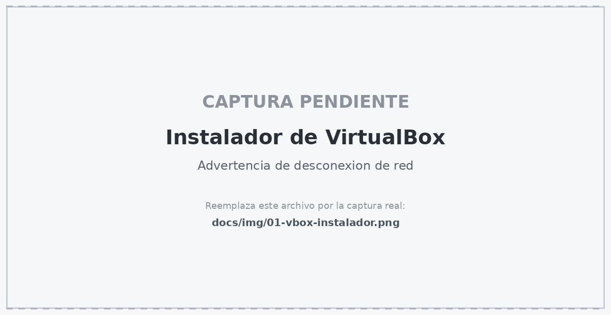

<!-- CAPTURA: docs/img/02-vbox-instalado.png — pantalla final del instalador -->
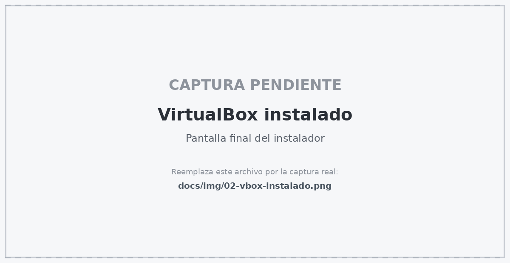

---

## 3. Crear la máquina virtual

Abre VirtualBox y haz clic en **Nueva**:

| Campo | Valor |
|---|---|
| **Nombre** | `Robotcito` (o el que quieras) |
| **Tipo** | Linux |
| **Versión** | Ubuntu (64-bit) |
| **Imagen ISO** | El archivo `.iso` que descargaste |
| **Instalación desatendida** | ✅ Marca **Omitir instalación desatendida** |

> Marcar *Omitir instalación desatendida* es importante: te deja configurar usuario, contraseña y particiones manualmente en lugar de que VirtualBox lo haga por ti.

<!-- CAPTURA: docs/img/03-vbox-nueva-maquina.png — diálogo "Nueva" con nombre, tipo, versión e ISO -->
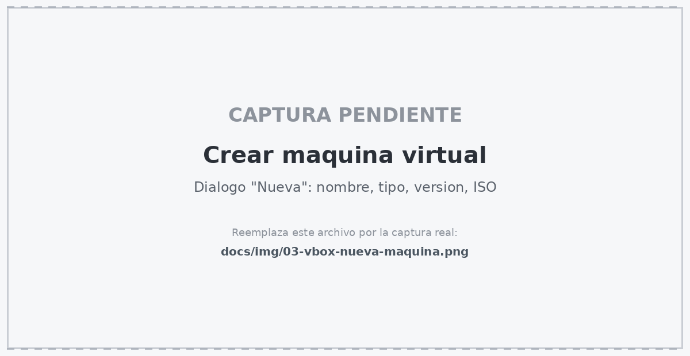

---

## 4. Ajustes críticos ANTES de encender

Si la máquina virtual arrancó sola, **apágala**: haz clic en la **X** de la ventana, elige **Apagar** y **Aceptar**. Estos ajustes deben hacerse con la máquina apagada.

Clic derecho sobre la máquina virtual → **Configuración**.

### 4.1 Recursos a asignar

| Recurso | Mínimo requerido | Recomendado |
|---|---|---|
| **Memoria RAM** | 4096 MB (4 GB) | 6144 – 8192 MB (6–8 GB) |
| **Procesadores (núcleos)** | 2 CPUs | 4 CPUs |
| **Disco virtual** | 40 GB (VDI dinámico) | 60 – 80 GB |
| **Memoria de video** | 128 MB | 128 MB + aceleración 3D |

> Nunca asignes más de la **mitad** de la RAM ni más de la mitad de los núcleos de tu computadora física, o el sistema anfitrión se vuelve inutilizable.

### 4.2 Sistema

- **Sistema → Placa Base:** asigna mínimo **4096 MB** de RAM.
- **Sistema → Procesador:** asigna **2 o 4 núcleos**.

<!-- CAPTURA: docs/img/04-vbox-sistema-ram.png — pestaña Sistema con la RAM asignada -->
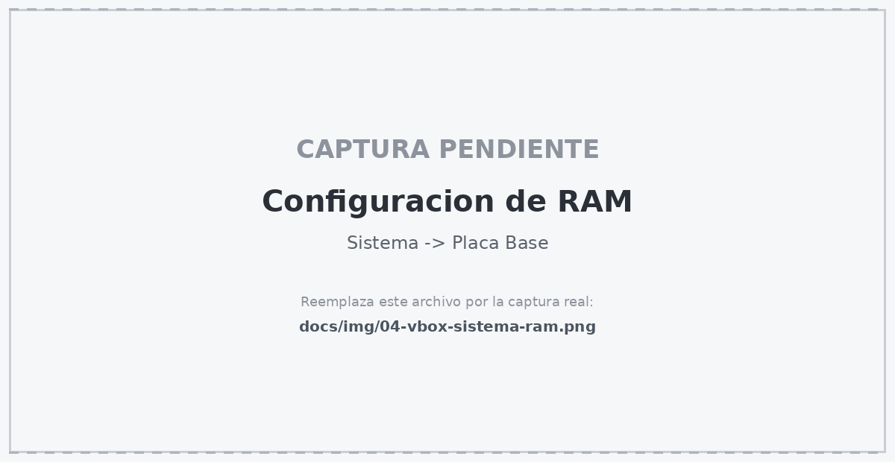

<!-- CAPTURA: docs/img/05-vbox-procesador.png — pestaña Procesador con los núcleos asignados -->
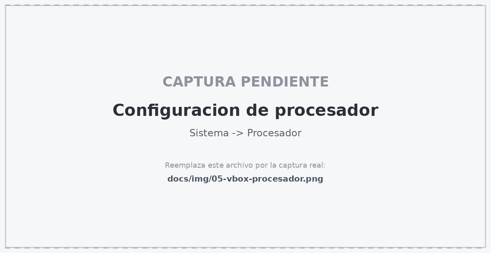

### 4.3 Pantalla — el ajuste más importante

- **Memoria de video:** **128 MB** (arrástralo al máximo)
- **Controlador gráfico:** **VMSVGA**
- ✅ **Habilitar aceleración 3D**

> **Sin aceleración 3D, Gazebo y RViz no abren o van a 2 FPS.** Es el error número uno de este proyecto.

<!-- CAPTURA: docs/img/06-vbox-pantalla-3d.png — pestaña Pantalla con 128 MB, VMSVGA y aceleración 3D marcada -->
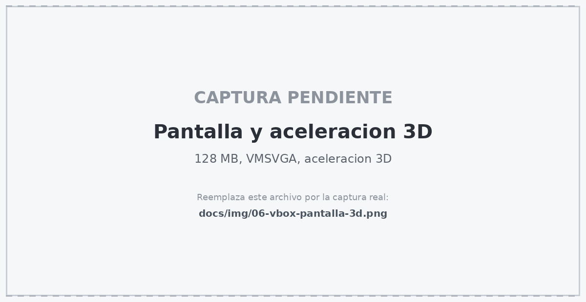

### 4.4 Red

Ve a **Red** y cambia **NAT** por **Adaptador puente**. Así la máquina virtual usa la misma tarjeta de red que tu PC y aparece como un equipo más en tu red local — útil cuando quieras comunicar nodos de ROS 2 entre máquinas.

<!-- CAPTURA: docs/img/07-vbox-red-puente.png — pestaña Red con Adaptador puente seleccionado -->
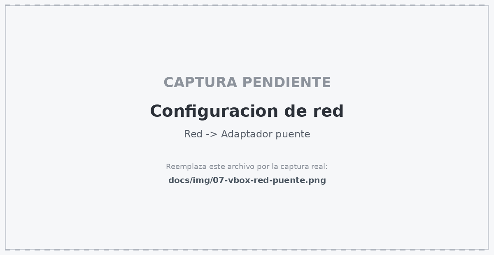

### 4.5 USB — para los servomotores

Ve a **USB** y selecciona **Controlador USB 3.0 (xHCI)**.

Esto es para la entrada de los servomotores Feetech. Si todavía no tienes el robot físico, no pasa nada: déjalo configurado de una vez para cuando lo tengas.

<!-- CAPTURA: docs/img/08-vbox-usb-xhci.png — pestaña USB con USB 3.0 (xHCI) seleccionado -->
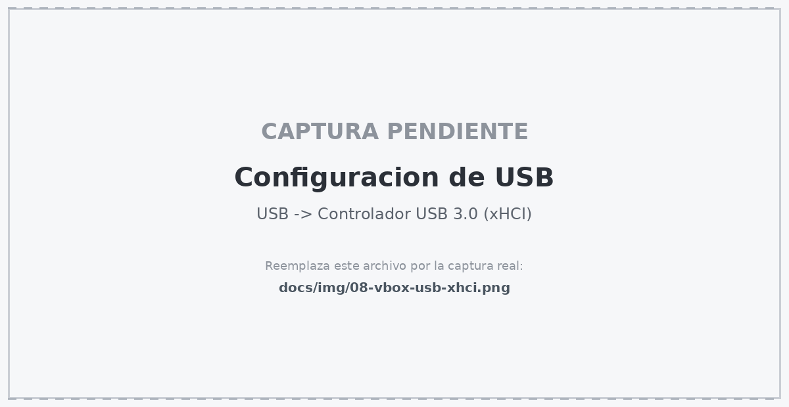

---

## 5. Instalar Ubuntu

Enciende la máquina virtual con **doble clic** sobre ella.

1. Selecciona **Try or Install Ubuntu**.
2. **Idioma:** Español o English → **Instalar Ubuntu**.
3. **Disposición del teclado:** la que uses (ej. *Español — Latinoamericano*).
4. **Tipo de instalación:** *Instalación mínima*, y marca **Descargar actualizaciones al instalar** e **Instalar programas de terceros**.
5. **Tipo de instalación de disco:** *Borrar disco e instalar Ubuntu* — esto **solo afecta al disco virtual** que creaste, no toca tu Windows.
6. Configura tu **usuario y contraseña**.

> ### ⚠️ RECUERDA LA CONTRASEÑA
> Anótala. En serio. La vas a escribir decenas de veces con `sudo` durante toda la instalación de ROS, y si la pierdes, la única salida práctica es reinstalar todo desde cero. Esto no es una broma, es una advertencia.

<!-- CAPTURA: docs/img/09-ubuntu-instalacion.png — pantalla del instalador de Ubuntu -->
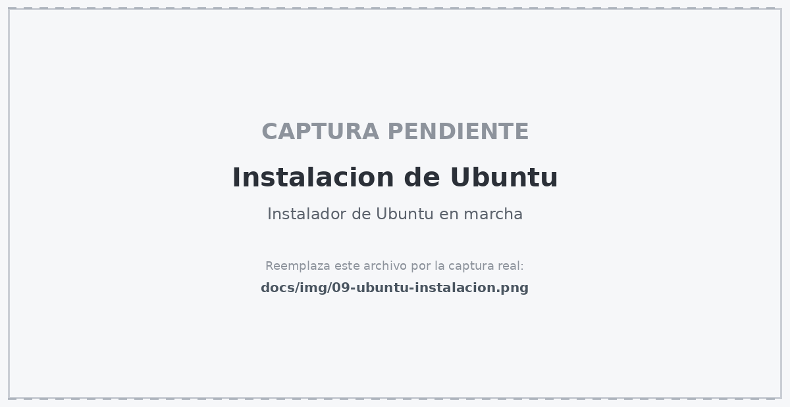

Al terminar, **reinicia**. Cuando arranque, si te ofrece actualizar (*Upgrade*), acepta y reinicia de nuevo.

---

## 6. Guest Additions — pantalla completa y portapapeles

Con la máquina encendida, ve al menú superior de VirtualBox:

**Dispositivos → Insertar imagen de CD de las «Guest Additions»**

Abre una terminal dentro de Ubuntu (**Ctrl + Alt + T**) y ejecuta:

```bash
sudo apt update && sudo apt install -y build-essential dkms linux-headers-$(uname -r)
sudo /media/$USER/VBox_GAs_*/VBoxLinuxAdditions.run
sudo reboot
```

Después del reinicio tendrás pantalla completa real, redimensionado automático de ventana y podrás habilitar el portapapeles compartido.

> **Consejo muy recomendable:** activa **Dispositivos → Portapapeles compartido → Bidireccional**. Todo lo que sigue son comandos que vas a copiar y pegar, y escribirlos a mano es donde la gente se equivoca. Un espacio de más y el comando no funciona.

<!-- CAPTURA: docs/img/10-ubuntu-terminal.png — terminal de Ubuntu recién abierta -->
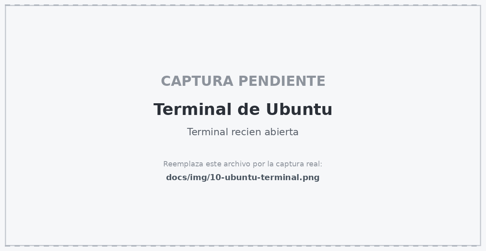

---

## 7. Conectar la webcam a la máquina virtual

Este paso es obligatorio: sin él, el script de teleoperación no encuentra la cámara.

Menú superior de VirtualBox: **Dispositivos → Webcams → [selecciona tu cámara]**

<!-- CAPTURA: docs/img/11-vbox-webcam.png — menú Dispositivos → Webcams con la cámara seleccionada -->
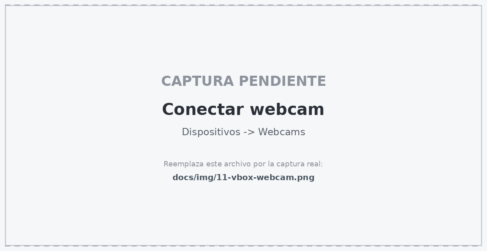

Comprueba que Ubuntu la ve:

```bash
ls -l /dev/video*
```

Debe aparecer al menos `/dev/video0`. Si no aparece nada, revisa que el **Extension Pack** esté instalado y que la cámara no esté siendo usada por otra aplicación en Windows (Zoom, Teams, la app Cámara).

---

## Listo

Ya tienes Ubuntu 22.04 funcionando. Continúa con:

**[→ 03 — Instalación de ROS 2 Humble](03-instalacion-ros2.md)**

O corre el instalador automático directamente:

```bash
sudo apt update && sudo apt install -y git
git clone https://github.com/Edangelux/so-arm100-teleop.git ~/so-arm100-teleop
cd ~/so-arm100-teleop && ./scripts/install.sh
```
