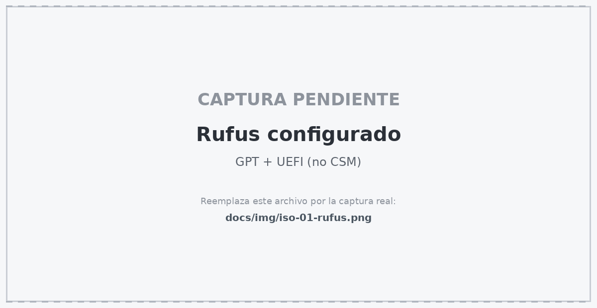
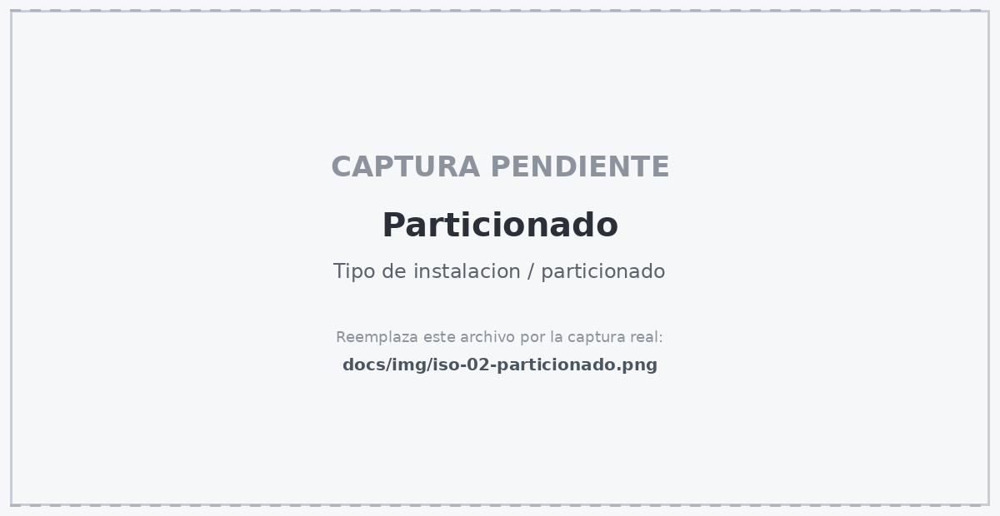

# 02 — Instalación nativa por ISO (USB / Dual Boot)

[← Anterior: máquina virtual](01-instalacion-maquina-virtual.md) · [Volver al inicio](../README.md) · [Siguiente: ROS 2 Humble →](03-instalacion-ros2.md)

---

Esta opción entrega el **100 % del rendimiento** del procesador y la tarjeta gráfica físicos. Es la diferencia entre que MediaPipe corra a 25–30 FPS con Gazebo abierto, o a 8 FPS entrecortados dentro de una máquina virtual.

**Esta opción conviene si** la computadora tiene características básicas o generales y una máquina virtual la ahogaría.

**Vas a necesitar:**
- Una memoria USB de **8 GB o más** (se borra por completo)
- **50 GB libres** en un disco: el mismo de Windows, o uno externo

> **Antes de empezar se respaldan los archivos importantes.** El procedimiento toca el particionado del disco. El procedimiento es estándar y seguro, pero un error tipográfico en la pantalla de particionado sí puede borrar Windows.

---

## 1. Descargar la ISO

- **[Ubuntu 22.04 LTS Desktop (64-bit)](https://releases.ubuntu.com/22.04/)** — `ubuntu-22.04.x-desktop-amd64.iso`

---

## 2. Crear la USB booteable

Se descarga e instala **[Rufus](https://rufus.ie/)** (Windows) o **[BalenaEtcher](https://etcher.balena.io/)** (multiplataforma).

Se conecta una memoria USB de 8 GB o más y, en **Rufus**, se configura:

| Campo | Valor |
|---|---|
| **Dispositivo** | Tu memoria USB |
| **Elección de arranque** | La ISO `ubuntu-22.04.x-desktop-amd64.iso` |
| **Esquema de partición** | **GPT** |
| **Sistema de destino** | **UEFI (no CSM)** |

Clic en **Empezar** y, cuando pregunte, selecciona **Escribir en modo Imagen ISO**.

<!-- CAPTURA: docs/img/iso-01-rufus.png — ventana de Rufus con GPT y UEFI configurados -->


> Si la computadora es anterior a ~2012 y no soporta UEFI, se usa **MBR** + **BIOS o UEFI-CSM**. En cualquier equipo moderno, GPT + UEFI es lo correcto.

---

## 3. Ajustes previos en la BIOS/UEFI

Se reinicia y se presiona la tecla de acceso a la BIOS al arrancar — normalmente **F2**, **F10**, **F12**, **ESC** o **DEL**, según la marca.

Dentro:

1. **Desactivar Fast Boot** (arranque rápido).
2. Si la instalación es en **arranque dual junto a Windows**, verificar que el controlador SATA esté en modo **AHCI**, no en *Intel RST* / *RAID*.
   > ⚠️ Cambiar de RST a AHCI con Windows ya instalado puede impedir que Windows arranque. Si el equipo está en modo RST, primero se busca "*cambiar a AHCI sin reinstalar Windows*" para la versión instalada — se hace habilitando el modo seguro antes del cambio.
3. Si Ubuntu no arranca desde la USB, desactiva también **Secure Boot**.
4. Guardar con **F10** y arrancar desde la memoria USB (menú de arranque: F12 o F9 en la mayoría de equipos).

---

## 4. Instalar Ubuntu

1. **Try or Install Ubuntu**.
2. **Idioma** y **disposición de teclado** (ej. *Español — Latinoamericano*).
3. **Tipo de instalación:** *Instalación normal* o *mínima*. Marcar **Descargar actualizaciones** e **Instalar programas de terceros para gráficos y Wi-Fi** — esto último instala los controladores propietarios de NVIDIA/AMD, que es justo lo que Gazebo necesita.
4. **Particionado**, según el caso:

   | Tu situación | Qué elegir |
   |---|---|
   | Disco dedicado solo para Ubuntu | **Borrar disco e instalar Ubuntu** |
   | Junto a Windows, automático | **Instalar Ubuntu junto a Windows Boot Manager** y arrastra el separador para asignarle 50 GB o más |
   | Control manual | **Más opciones** → crea una partición raíz `/` de al menos 50 GB en formato **ext4** |

5. Zona horaria, usuario y contraseña.

> ### ⚠️ RECUERDA LA CONTRASEÑA
> La contraseña se escribe decenas de veces con `sudo` durante la instalación de ROS; conviene anotarla.

<!-- CAPTURA: docs/img/iso-02-particionado.png — pantalla de tipo de instalación / particionado -->


6. Al terminar, **reiniciar** y **retirar la USB** cuando lo pida.

Con arranque dual, al encender aparece el menú **GRUB** con Ubuntu y Windows. Se elige con las flechas y Enter.

---

## 5. Verificar la cámara

Se abre una terminal (**Ctrl + Alt + T**) y se ejecuta:

```bash
ls -l /dev/video*
```

Debe aparecer al menos `/dev/video0`. En instalación nativa esto casi siempre funciona a la primera; no hay que pasar la cámara por ningún hipervisor.

---

## Listo

Se continúa con:

**[→ 03 — Instalación de ROS 2 Humble](03-instalacion-ros2.md)**

O corre el instalador automático:

```bash
sudo apt update && sudo apt install -y git
git clone https://github.com/Edangelux/so-arm100-teleop.git ~/so-arm100-teleop
cd ~/so-arm100-teleop && bash scripts/install.sh
```
