# 07 — Cómo funciona el sistema

[← Anterior: solución de problemas](06-solucion-de-problemas.md) · [Volver al inicio](../README.md)

Este documento explica la arquitectura: qué son los nodos, cómo se comunican, y qué recorrido hace un movimiento tuyo desde la cámara hasta el robot.

---

## «¿Se mueve por nodos?» — Sí. Esto es lo que significa

**Sí. Todo el sistema son nodos de ROS 2 comunicándose entre sí.** No hay ningún programa que "controle el robot" directamente: hay siete procesos independientes que se pasan mensajes.

Y no es una respuesta de manual — lo puedes **demostrar en vivo**. Con el sistema corriendo, en otra terminal:

```bash
ros2 node list
```

```
/bridge
/controller_manager
/move_group
/robot_state_publisher
/rviz2
/so_arm100_teleop_v13
/transform_listener_impl_...
```

Ese `/so_arm100_teleop_v13` es el nodo de teleoperación. Lo declara el propio script:

```python
super().__init__('so_arm100_teleop_v13')     # teleop_vision.py, clase TeleopNode
```

---

## ROS 2 en tres conceptos

Todo lo que sigue se construye con estos tres. No hay más.

| Concepto | Qué es | Analogía |
|---|---|---|
| **Nodo** | Un proceso que hace una tarea. No sabe quién más existe. | Una persona en una oficina |
| **Tópico** | Un canal con nombre. Unos publican, otros se suscriben. Se envía y ya — no hay confirmación. | Un tablón de anuncios |
| **Acción** | Una orden con objetivo, seguimiento y respuesta. El que la manda sabe cuándo terminó. | Un encargo con acuse de recibo |

La diferencia entre **tópico** y **acción** importa en este proyecto, y es la respuesta a por qué el brazo y la pinza se comandan distinto. Se explica más abajo.

---

## El grafo completo

```mermaid
graph LR
    CAM["Camara fisica<br/>/dev/video0"]

    subgraph TELEOP["Nodo /so_arm100_teleop_v13"]
        CV["OpenCV<br/>captura + dibujo"]
        MP["MediaPipe<br/>Pose + Hands"]
        MATH["Ángulos + filtro<br/>One Euro"]
    end

    subgraph GZ["Proceso de Gazebo"]
        CM["controller_manager<br/>(gz_ros2_control)"]
        ARM["arm_controller"]
        GRIP["gripper_controller"]
        JSB["joint_state_broadcaster"]
        PHY["Motor de física ODE<br/>1000 Hz"]
    end

    RSP["/robot_state_publisher<br/>URDF → TF"]
    MG["/move_group<br/>MoveIt 2"]
    RV["/rviz2"]

    CAM -->|"frames BGR"| CV
    CV --> MP
    MP --> MATH
    MATH -->|"TÓPICO<br/>/arm_controller/joint_trajectory"| ARM
    MATH -->|"ACCIÓN<br/>/gripper_controller/gripper_cmd"| GRIP

    ARM --> CM
    GRIP --> CM
    CM <--> PHY
    PHY --> JSB
    JSB -->|"TÓPICO<br/>/joint_states"| RSP
    RSP -->|"TÓPICO /tf"| RV
    JSB --> MG
    MG --> ARM
```



Los recuadros grises son **un solo proceso cada uno**. Fíjate en que `controller_manager` y los tres controladores viven **dentro del proceso de Gazebo** — eso es importante y se explica abajo.

---

## El recorrido de un movimiento, paso a paso

Levantas el brazo. Esto es lo que pasa, en orden:

**1. Captura — OpenCV**
```python
ret, frame = cap.read()          # ~30 veces por segundo
```
`cv2.VideoCapture(0)` lee de `/dev/video0` y entrega una imagen de 640×480 en formato BGR.

**2. Detección — MediaPipe**
```python
rgb = cv2.cvtColor(frame, cv2.COLOR_BGR2RGB)
pres = pose.process(rgb)         # 33 puntos del cuerpo
hres = hands.process(rgb)        # 21 puntos de la mano
```
Aquí trabajan **dos modelos distintos**: `Pose` da hombro, codo y muñeca; `Hands` da los nudillos con mucha más precisión. Ambos devuelven coordenadas normalizadas de 0 a 1.

**3. Cálculo de ángulos**

Hombro y codo se resuelven en **3D métrico** (`pose_world_landmarks`), donde los segmentos son largos y el seguimiento es fiable:
```python
a_rot, a_pit, a_elb = shoulder_elbow_angles(wlm, ids)
```
Se construye un marco de referencia del torso (derecha, arriba, adelante) a partir de los dos hombros y las dos caderas, y se proyecta el vector hombro→codo sobre él. **Así el resultado no depende de dónde estés parado ni de cómo esté girada la cámara.**

Las muñecas se resuelven **enteramente en 2D de imagen**:
```python
pitch = signed_angle_2d(fore2, hand2)      # antebrazo vs. mano
roll  = signed_angle_2d(fore2, knuckle2)   # antebrazo vs. línea de nudillos
```
Ambos ángulos son **relativos al antebrazo**, no a los ejes de la pantalla. Si no fuera así, girar el codo cambiaría la lectura de la muñeca aunque la muñeca no se moviera.

**4. Filtrado — One Euro**
```python
smoothed = filters[n](target, dt)
```
Un promedio simple obliga a elegir entre suavizar (con retraso) o responder (con temblor). El **filtro One Euro** adapta su frecuencia de corte a la velocidad: filtra fuerte cuando te mueves lento y poco cuando te mueves rápido.

**5. Publicación — el salto a ROS 2**
```python
msg = JointTrajectory()
msg.joint_names = ['Shoulder_Rotation', 'Shoulder_Pitch', 'Elbow',
                   'Wrist_Pitch', 'Wrist_Roll']
point.positions = q_cmd                        # 5 ángulos en radianes
point.time_from_start = Duration(nanosec=40_000_000)   # llegar en 40 ms
self.arm_pub.publish(msg)
```
**Aquí termina la visión artificial y empieza ROS 2.** Todo lo anterior era Python; a partir de aquí es un mensaje en la red.

**6. Interpolación — `arm_controller`**

`joint_trajectory_controller` recibe "estas 5 articulaciones, a estos ángulos, en 40 ms" y genera la trayectoria suave intermedia, actualizando a 50 Hz.

**7. Física — Gazebo**

`gz_ros2_control` escribe las posiciones objetivo en las articulaciones del modelo, y el motor **ODE** calcula a 1000 Hz cómo se mueve el brazo con su masa e inercia reales. El robot **no se teletransporta**: obedece a la física.

**8. Realimentación**

`joint_state_broadcaster` publica en `/joint_states` dónde quedó cada articulación de verdad. `robot_state_publisher` convierte eso en transformadas `/tf`, y RViz las dibuja.

> **Todo el ciclo tarda unos 40 ms.** El cuello de botella es MediaPipe, no ROS.

---

## Por qué el brazo va por tópico y la pinza por acción

No es una inconsistencia: **cada uno usa el mecanismo que su controlador acepta**, y esos controladores resuelven problemas distintos.

| | Brazo | Pinza |
|---|---|---|
| Controlador | `joint_trajectory_controller/JointTrajectoryController` | `position_controllers/GripperActionController` |
| Mecanismo | **Tópico** `/arm_controller/joint_trajectory` | **Acción** `/gripper_controller/gripper_cmd` |
| En el código | `self.arm_pub.publish(msg)` | `self.grip_client.send_goal_async(goal)` |
| Frecuencia | ~25 veces por segundo | solo cuando el pellizco cambia >0.02 |

**La razón de fondo:** el brazo se comanda continuamente y lo que importa es la posición *más reciente* — si un mensaje se pierde, el siguiente llega 40 ms después y lo corrige. Un tópico es perfecto para eso.

La pinza es distinta: agarrar un objeto es una operación con **inicio, esfuerzo y final**. Necesitas saber si se cerró, si topó con algo, y con cuánta fuerza. Eso es exactamente lo que una acción provee:

```python
goal = GripperCommand.Goal()
goal.command.position = float(pos)      # cuánto abrir
goal.command.max_effort = float(effort) # con cuánta fuerza
```

Por eso el script lleva control de si hay una orden en vuelo:
```python
if not self.check_gripper() or self.grip_busy:
    return                              # no encimar órdenes
```

> **Este punto costó tiempo real.** Una versión anterior del script publicaba la pinza a un **tópico** `/gripper_controller/joint_trajectory`. Con `GripperActionController` ese tópico **no existe**: los mensajes se perdían sin dar ningún error, y el brazo se movía mientras la pinza quedaba quieta. Es el tipo de fallo más difícil de encontrar, porque no falla — simplemente no pasa nada.

---

## Dónde vive el `controller_manager` (y por qué importa)

En la mayoría de los tutoriales de ROS 2, `controller_manager` es un nodo aparte (`ros2_control_node`). **Aquí no.**

En el URDF, el robot declara este plugin:

```xml
<plugin filename="gz_ros2_control-system"
        name="gz_ros2_control::GazeboSimROS2ControlPlugin">
  <parameters>controllers_5dof.yaml</parameters>
  <robot_param>robot_description</robot_param>
</plugin>
```

Eso hace que **`controller_manager` se cargue dentro del proceso de Gazebo**, no como proceso separado. Y la interfaz de hardware de cada articulación es:

```xml
<plugin>gz_ros2_control/GazeboSimSystem</plugin>
```

**Por qué importa:**

- Los controladores leen y escriben las articulaciones simuladas **sin pasar por la red**, en el mismo ciclo de la física. Cero latencia, cero desincronización.
- Por eso `ros2 node list` **no muestra** `arm_controller` ni `gripper_controller` como nodos: son *plugins* cargados dentro de `controller_manager`. Para verlos: `ros2 control list_controllers`.
- Y por eso el `ros_gz_bridge` de este proyecto solo cruza **`/clock`, `/tf` y `/tf_static`**. Los comandos de las articulaciones no cruzan el puente: nunca salen de Gazebo.

**Lo importante de este diseño:** para pasar de la simulación al robot físico **no se cambia una sola línea del script de teleoperación**. Solo cambia el plugin de hardware en el URDF:

```xml
<!-- Simulación -->
<plugin>gz_ros2_control/GazeboSimSystem</plugin>

<!-- Robot real (servos Feetech por USB) -->
<plugin>so_arm_100_controller/SOARM100Interface</plugin>
<param name="serial_port">/dev/ttyUSB0</param>
<param name="serial_baudrate">1000000</param>
```

El nodo de teleoperación publica al mismo tópico en los dos casos. **Eso es lo que hace valiosa la abstracción de `ros2_control`**, y es una respuesta sólida si te preguntan por el salto a hardware.

---

## Quién hace qué en la visión

Se confunden con facilidad porque van juntos, pero hacen cosas distintas:

| | Qué hace en este proyecto |
|---|---|
| **OpenCV** | Abre la cámara, lee fotogramas, convierte BGR→RGB, dibuja el esqueleto y el panel, muestra la ventana y lee las teclas. **No detecta nada.** |
| **MediaPipe** | Recibe la imagen y devuelve coordenadas de puntos del cuerpo y de la mano. **No toca la cámara ni dibuja.** |

Dicho de otro modo: **OpenCV es los ojos, MediaPipe es el reconocimiento.**

MediaPipe corre **dos modelos**, y la división no es casual:

- **`Pose`** — 33 puntos del cuerpo. Se usan hombros, codo, muñeca y caderas. Sus `pose_world_landmarks` están en **metros reales** con origen en la cadera, lo que permite calcular ángulos 3D fiables.
- **`Hands`** — 21 puntos de la mano, mucho más precisos que los 3 puntos de mano que trae `Pose`. Se usan para las muñecas y para el pellizco.

Para ahorrar CPU, `Hands` **no corre en todos los fotogramas**:
```python
HANDS_EVERY = 2                  # uno de cada dos
if frame_i % HANDS_EVERY == 0:
    hres = hands.process(rgb)
```

---

## Detalles del código que conviene poder defender

### Se copian ángulos, no posiciones

**El sistema no calcula dónde poner la mano del robot en el espacio.** Mide los ángulos de tus articulaciones y se los copia, articulación por articulación.

No hay cinemática inversa en el lazo de control. Es una decisión de diseño con ventajas concretas: no hay singularidades que resolver, no hay soluciones múltiples que elegir, y el mapeo es predecible — si doblas el codo, se dobla el codo.

*(El índice de manipulabilidad `w=` que muestra la pantalla sí usa el jacobiano, pero solo para **informar** de qué tan cerca estás de una singularidad. No interviene en el control.)*

### La calibración es relativa, no absoluta

```python
d = raw[n] - offsets[n]
```

Al presionar **`C`**, tu postura actual se guarda como `offsets`. A partir de ahí solo se comanda la **diferencia**. Por eso funciona con cualquier altura, complexión o distancia a la cámara.

### Los límites salen del URDF, no de la intuición

```python
JOINT_LIMITS = {
    'Elbow': (-1.49, 1.49),     # URDF real: ±1.5
    ...
}
GRIPPER_LIMITS = (-0.17, 1.56)  # URDF real: -0.1792 / +1.5708
```

Cada valor se verificó contra el `<limit>` real del URDF que Gazebo carga, siempre con un margen **hacia adentro**. Si el script permitiera más recorrido que el robot, el número de la pantalla seguiría subiendo después de que la física ya topó — y se sentiría como que el brazo "no termina de estirarse".

Las longitudes `L1 = 0.1160` y `L2 = 0.1350` también salen del URDF: son la norma de los `origin xyz` de los joints `Elbow` y `Wrist_Pitch`.

### Congelar es mejor que comandar basura

```python
if (np.linalg.norm(fore2) < MIN_FORE_LEN or ...):
    return None      # no se calcula el ángulo
```

Cuando el antebrazo apunta hacia la cámara (escorzo), su proyección 2D se acorta hacia cero y cualquier ruido de detección se amplifica en un ángulo enorme. El script prefiere **congelar el último valor válido** antes que comandar un número calculado sobre un vector casi nulo. El panel distingue las dos causas — `MANO NO DETECTADA` y `MUÑECA EN ESCORZO` — para que sepas cuál es.

---

## Verlo funcionando en vivo

Con el sistema corriendo, en otra terminal. **Esto vale más que cualquier explicación en una defensa.**

```bash
# Los nodos
ros2 node list

# Los controladores y su estado
ros2 control list_controllers

# Los comandos que el script está enviando, en tiempo real
ros2 topic echo /arm_controller/joint_trajectory

# Dónde está el robot de verdad, según la física
ros2 topic echo /joint_states

# A qué frecuencia se está comandando
ros2 topic hz /arm_controller/joint_trajectory

# La acción de la pinza
ros2 action list -t

# Quién publica y quién escucha un tópico
ros2 topic info /arm_controller/joint_trajectory --verbose
```

**El grafo dibujado:**

```bash
sudo apt install -y ros-humble-rqt-graph
rqt_graph
```

Muestra todos los nodos y las flechas entre ellos. Es la imagen que responde "¿se mueve por nodos?" sin decir una palabra — y sirve como figura para el documento de tesis.

---

## Preguntas probables, y por dónde responderlas

**«¿Usa cinemática inversa?»**
En el lazo de control no. Se copian ángulos articulares directamente. Hay un cálculo de jacobiano, pero solo para mostrar el índice de manipulabilidad y avisar de singularidades. La cinemática inversa está disponible por MoveIt (solucionador KDL) si se planifica hacia una pose cartesiana, que es una modalidad distinta.

**«¿Cómo sabe el robot dónde está?»**
`joint_state_broadcaster` lee el estado real de las articulaciones desde la física de Gazebo y lo publica en `/joint_states`. `robot_state_publisher` lo combina con el URDF para producir el árbol de transformadas `/tf`.

**«¿Qué pasa si se pierde un mensaje?»**
Nada grave, y es a propósito. El brazo se comanda ~25 veces por segundo; si uno se pierde, el siguiente llega 40 ms después con la posición actualizada. Por eso el brazo usa un tópico y no una acción: para un flujo continuo, el mensaje más reciente es el único que importa.

**«¿Esto funcionaría con el robot físico?»**
El nodo de teleoperación no cambia. Solo se sustituye el plugin de hardware en el URDF por `so_arm_100_controller/SOARM100Interface`, que habla por USB serie con los servos Feetech. Esa es precisamente la abstracción que da `ros2_control`.

**«¿Por qué MediaPipe y no otra cosa?»**
Corre en CPU en tiempo real, no necesita GPU ni cámara de profundidad, y sus `pose_world_landmarks` dan coordenadas 3D métricas a partir de una sola cámara — que es lo que permite calcular ángulos articulares con una webcam común.

**«¿Cuánta latencia tiene?»**
Alrededor de 40 ms de extremo a extremo. El cuello de botella es la inferencia de MediaPipe, no ROS 2 ni la simulación.

---

## Resumen de una frase

**Un nodo de ROS 2 lee la cámara con OpenCV, detecta la postura con MediaPipe, calcula los ángulos de tus articulaciones y los publica como una trayectoria; el controlador dentro de Gazebo la interpola y la ejecuta contra un motor de física, y devuelve el estado real por `/joint_states`.**

---

## Siguiente

- [05 — Ejecución y control](05-ejecucion.md) — todas las teclas y cómo ajustar el robot
- [04 — Workspace y compilación](04-workspace-y-compilacion.md) — qué corrige el overlay y por qué
- [06 — Solución de problemas](06-solucion-de-problemas.md) — cada error conocido con su causa
