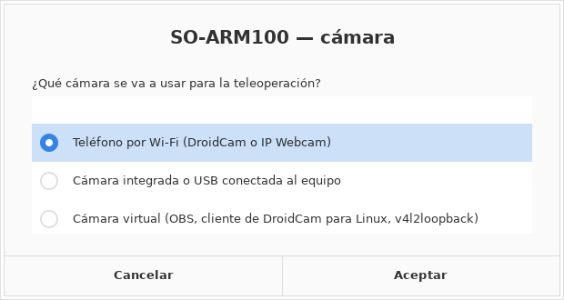
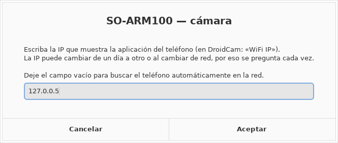
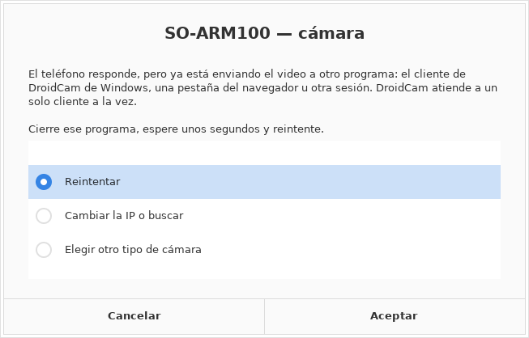
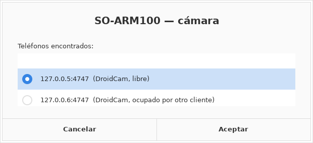
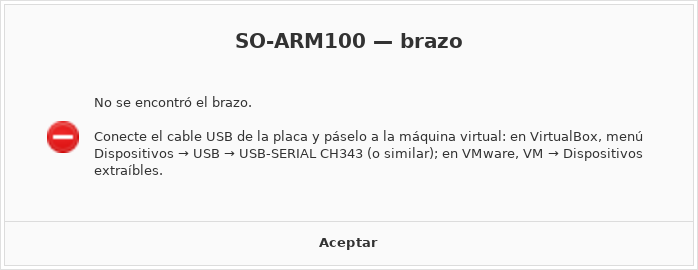

# 14 — Lanzador unificado de la versión presentada

[← Anterior: cierre del proyecto](12-cierre-del-proyecto.md) · [Volver al inicio](../README.md) · [Siguiente: v14, MoveIt y posturas seguras →](15-v14-moveit-y-posturas-seguras.md)

---

`scripts/soarm.sh` instala y opera el sistema **tal como se presentó en la defensa**: ejecuta `teleop_v13.py` sin modificar su algoritmo y levanta, en el orden correcto, los procesos que necesita cada modo. Sustituye a las cinco terminales de la [secuencia de la defensa](10-espejo-simulacion-y-robot-real.md#la-secuencia-de-la-defensa) por una sola orden.

Requiere Ubuntu 22.04 con ROS 2 Humble, nativo, en máquina virtual o bajo WSL2. Git Bash de Windows no sirve para ejecutarlo: sólo para publicar cambios en Git.

## Instalación

```bash
cd ~/so-arm100-teleop
bash scripts/soarm.sh instalar
```

Instala ROS 2 Humble y Gazebo si faltan, crea el entorno de Python con las versiones exactas que usó el equipo de la entrega (`entrega/entorno/requirements-recuperado.txt`, con MediaPipe 0.10.21), copia las fuentes de `entrega/src/` a un workspace nuevo, resuelve dependencias con `rosdep`, compila con `colcon` y agrega el usuario a los grupos `video` y `dialout`. Después de la instalación hay que cerrar sesión y volver a entrar para que los grupos surtan efecto.

Por omisión usa `~/ros2_ws_entrega` y `~/teleop_venv_entrega`, distintos de los de la instalación por fases, para que una no pise a la otra. Si el workspace ya existe y tiene archivos distintos de las fuentes, **no los sobrescribe**: se detiene y pide otra ruta con `--ws`.

## Atajos de una palabra

Para no escribir rutas ni opciones, la instalación agrega a `~/.bashrc` unas órdenes cortas y dos iconos en el menú de aplicaciones: **SO-ARM100 Teleoperación** y **SO-ARM100 Diagnóstico**. También se instalan solas con `bash scripts/instalar_atajos.sh`. Las preferencias se guardan en `~/.soarm.conf` y se cambian con `soarm-config`.

| Orden | Qué hace |
|---|---|
| `teleop` | Arranca todo; véase el recorrido de abajo |
| `teleop sim` · `teleop real` · `teleop ambos` | Lo mismo, con el modo fijado. Acepta cualquier opción de `soarm.sh`, más `--v13`, `--v14`, `--v15` y `--sin-moveit` |
| `soarm-camara` | Elige y prueba la cámara sin arrancar nada |
| `soarm-diagnostico` | Revisa la instalación completa y guarda un informe (véase [Validación por entorno](#validación-por-entorno)) |
| `centrar` · `servos` | `center_servos` y `list_servos`, compilados la primera vez. No corren si el lanzador tiene el puerto |
| `soarm-ensayo …` | Ensayos de rendimiento; véase [docs/17](17-ensayos-de-rendimiento.md) |
| `soarm-registros` · `soarm-actualizar` · `soarm-config` · `soarm-ayuda` | Registros de la última sesión, `git pull`, preferencias y lista de órdenes |

### Qué hace `teleop`

1. **Detecta el entorno:** Ubuntu nativo, máquina virtual o WSL2. En los dos últimos agrega `--software-gl`, porque Gazebo no abre su ventana con la aceleración gráfica de esos entornos.
2. **Busca el brazo.** Si el puerto configurado no existe, prueba `/dev/ttyACM*` y `/dev/ttyUSB*`. En WSL2 pasa la placa desde Windows con `usbipd`. Si no lo encuentra, una ventana explica qué hacer en ese entorno: conectar el cable, pasarlo a la máquina virtual desde su menú **Dispositivos → USB**, o compartirlo una vez con `usbipd bind`. En modo automático, sin brazo arranca la simulación.
3. **Pregunta la cámara**, con la elección anterior preseleccionada:

   | Tipo | Qué hace |
   |---|---|
   | Integrada o USB | Lista las cámaras que ve el sistema (sin los nodos de metadatos) y prueba que la elegida entregue una imagen. Si está ocupada por otra aplicación o falta el permiso del grupo `video`, lo dice |
   | Virtual | Igual, con las cámaras de OBS, del cliente de DroidCam para Linux o de v4l2loopback |
   | Teléfono por Wi-Fi | **Pide la IP cada vez**, porque cambia con la red y con el tiempo (IP dinámica), y propone la última usada. Acepta `192.168.1.38`, `192.168.1.38:8080` o una URL completa. Si se deja vacía, **busca el teléfono en la red** (DroidCam en el puerto 4747 e IP Webcam en el 8080) y lista los que encuentra, indicando si están libres u ocupados |

   Si la cámara no responde, está ocupada por otro cliente o no entrega video, la ventana explica la causa y ofrece reintentar, cambiar la IP, buscar o elegir otro tipo, en vez de terminar con un error.
4. **Imprime la orden completa** que ejecuta (`→ bash scripts/soarm.sh …`), para que siempre se sepa qué corrió y se pueda repetir a mano.

Las preguntas salen en ventanas cuando hay escritorio y está instalado `zenity`, que instala el propio lanzador. Sin escritorio salen en la terminal. `SOARM_UI=terminal` obliga a usar la terminal.

| ¿Qué cámara? | IP del teléfono | Teléfono ocupado | Búsqueda en la red |
|:---:|:---:|:---:|:---:|
|  |  |  |  |



## Validación por entorno

`soarm-diagnostico` revisa, en el equipo donde se ejecuta, todo lo que el sistema necesita. Revisa el sistema, los grupos, el repositorio, ROS 2, Gazebo, el workspace, MoveIt, el entorno Python, la pantalla, OpenGL, las cámaras, el puerto del brazo y los atajos. Cada línea sale como OK, AVISO o FALLA, con la corrección al lado. El informe queda en `~/soarm_diagnostico_AAAA-MM-DD_HHMM.txt`; en WSL2 se copia además a la carpeta Descargas de Windows. No mueve el brazo ni instala nada.

Estado de cada entorno al 21 de septiembre de 2026:

| Etapa | WSL2 | Ubuntu nativo | Máquina virtual |
|---|---|---|---|
| Instalación (`soarm.sh instalar`) | Ejecutada | Pendiente | Pendiente |
| Simulación (`sim`) | Ejecutada, con `--software-gl` | Pendiente | Pendiente |
| Brazo físico (`real`, `init` y `home`) | Ejecutado | Pendiente | Pendiente |
| Atajos, `teleop` y elección de cámara | Pendiente en el equipo | Pendiente | Pendiente |

Qué se comprobó sin esos equipos, en un Ubuntu 22.04 de pruebas y con un servidor de video simulado:

- La elección de cámara en sus nueve recorridos por terminal: IP correcta; teléfono ocupado y cambio de IP; sin respuesta y cambio de tipo; búsqueda automática; IP recordada; IP Webcam por URL; cámara integrada; cámara virtual ocupada; y ninguna cámara local.
- Las ventanas reales de zenity, en una pantalla virtual: tipo de cámara, IP, teléfono ocupado, búsqueda y brazo no encontrado. Las imágenes de arriba son esas capturas.
- `teleop` con el lanzador sustituido por uno falso: con y sin brazo, con el modo fijado y con la cámara pasada a mano.
- `soarm-diagnostico` en un equipo sin ROS, donde marca FALLA en lo que falta.

Para completar la tabla, en cada entorno:

```bash
cd ~/so-arm100-teleop && git pull
bash scripts/soarm.sh instalar          # en un equipo nuevo; en uno ya instalado basta instalar_atajos
bash scripts/instalar_atajos.sh
source ~/.bashrc
soarm-diagnostico                       # debe terminar sin FALLA
teleop sim                              # cámara, Gazebo, Q, menú
teleop                                  # con el brazo: ambos, init al cerrar, home al apagar
```

y se guarda el informe del diagnóstico de cada entorno en `pruebas/`.

## Los tres modos

```bash
bash scripts/soarm.sh sim                              # sólo el gemelo digital
bash scripts/soarm.sh real  --puerto /dev/ttyACM0      # sólo el brazo físico
bash scripts/soarm.sh ambos --puerto /dev/ttyACM0      # las dos plantas a la vez
```

| Modo | Procesos que levanta | Tópico del brazo | Acción de la pinza |
|---|---|---|---|
| `sim` | Gazebo | `/arm_controller/joint_trajectory` | `/gripper_controller/gripper_cmd` |
| `real` | Hardware bajo `/real` | `/real/arm_controller/joint_trajectory` | `/real/gripper_controller/gripper_cmd` |
| `ambos` | Gazebo, hardware y los dos nodos espejo | `/arm_controller/joint_trajectory`, replicado a `/real` | `/mirror_gripper_controller/gripper_cmd` |

En cada modo el lanzador **espera a que los controladores estén activos** antes de abrir la teleoperación; en `ambos` espera además a que aparezca la acción espejo de la pinza. Si un componente se detiene, cierra la sesión entera.

**Cierre.** `Q` en la ventana de visión cierra sólo la teleoperación: el lanzador lleva el brazo a la postura `init` a 0,5 rad/s y deja la sesión abierta con tres opciones en la terminal: `Enter` reabre la teleoperación, `h` lleva el brazo a `home` y apaga, y `x` apaga sin mover. `Ctrl+C` apaga en el acto sin mover nada; como el controlador desactiva el par de los servos al cerrarse, el brazo cae si no está en `home` o sostenido. Las posturas y el motivo de cada una están en [docs/15](15-v14-moveit-y-posturas-seguras.md).

Por omisión no se levanta MoveIt, porque la teleoperación de la versión 13 es articular directa y no pasa por el planificador. Con `--moveit` se abren además MoveIt 2 y RViz, y con `--v14` se usa la versión que arranca y reanuda desde la postura medida del brazo; las dos cosas se explican en [docs/15](15-v14-moveit-y-posturas-seguras.md).

## Opciones

| Opción | Por omisión | Qué cambia |
|---|---|---|
| `--puerto RUTA` | `/dev/ttyACM0` | Puerto serie de la placa de servos |
| `--camara N\|URL` | `0` | Número de la cámara (`/dev/videoN`) o URL de una cámara por red, como DroidCam; véase [Cámara por red](#cámara-por-red-droidcam-o-un-teléfono) |
| `--ancho N --alto N` | `640 480` | Resolución de captura, en formato MJPG |
| `--velocidad RAD_S` | `8.0` | Tope de velocidad articular, entre 0 y 8 rad/s |
| `--baud N` | `1000000` | Velocidad del bus serie |
| `--servo-speed N` | `2400` | Velocidad interna del servo, en pasos por segundo |
| `--servo-accel N` | `50` | Aceleración interna del servo |
| `--config RUTA` | `~/teleop_config.json` (con `--v15`, `~/teleop_config_v15.json`) | Signos y ganancias guardados con `S` |
| `--ws RUTA` · `--venv RUTA` | `~/ros2_ws_entrega` · `~/teleop_venv_entrega` | Workspace y entorno de Python |
| `--software-gl` | — | Renderizado por software, para máquinas virtuales sin aceleración 3D y **obligatorio bajo WSL2** (véase [WSL2](#bajo-wsl2)) |
| `--v14` | — | Usa `teleop_v14.py` en lugar de la versión presentada; [docs/15](15-v14-moveit-y-posturas-seguras.md) |
| `--moveit` | — | Abre MoveIt 2 y RViz junto con la teleoperación; [docs/15](15-v14-moveit-y-posturas-seguras.md) |
| `--v15` | — | Usa `teleop_v15.py`: confianza por articulación, ganancia por postura de referencia y giro de muñeca en 3D; [docs/16](16-v15-estimacion-de-angulos.md). Guarda su configuración en `~/teleop_config_v15.json` |
| `--dry-run` | — | Muestra el plan sin instalar ni iniciar nada |

Los valores por omisión son los que se usaron en la defensa. `--velocidad` es el único que conviene cambiar antes de conectar el brazo por primera vez: un valor de 0,5 a 1,0 rad/s atenúa el riesgo del bloqueo 6 de [docs/09](09-robot-fisico.md). Es un ajuste recomendado, no uno que se haya validado con el brazo.

## Cámara por red: DroidCam o un teléfono

El sistema no necesita una webcam conectada al equipo. Cualquier teléfono con **DroidCam** (Android o iPhone) o con **IP Webcam** (Android) sirve de cámara por la red, y es la única vía para usar un teléfono bajo WSL2, donde el cliente de DroidCam para Linux no puede crear un `/dev/video` porque el núcleo de WSL2 no trae por omisión el módulo que necesita.

**1. En el teléfono.** Se instala DroidCam desde la tienda de aplicaciones y se abre. La pantalla muestra la dirección **WiFi IP** y el **puerto**, 4747 por omisión. El teléfono y el equipo tienen que estar en la misma red WiFi.

**2. Comprobar la dirección en el navegador** del equipo:

```text
http://192.168.1.50:4747/video
```

con la IP que muestra el teléfono. Tiene que verse el video. **Después se cierra esa pestaña**: DroidCam sólo atiende a un cliente a la vez, y con el navegador conectado el sistema no podría abrirla.

**3. Lanzar con la URL:**

```bash
bash scripts/soarm.sh verificar --camara http://192.168.1.50:4747/video
bash scripts/soarm.sh sim       --camara http://192.168.1.50:4747/video
bash scripts/soarm.sh real      --camara http://192.168.1.50:4747/video --puerto /dev/ttyACM0 --velocidad 0.5
bash scripts/soarm.sh ambos     --camara http://192.168.1.50:4747/video --puerto /dev/ttyACM0 --velocidad 0.5
```

Antes de arrancar, el lanzador comprueba durante 3 s que llegan datos de esa dirección y, si no llegan, se detiene con un mensaje en lugar de abrir una ventana negra.

**Por cable USB, sin WiFi** (Android, en Ubuntu nativo): se activa la depuración USB en el teléfono, y en Ubuntu:

```bash
sudo apt install -y adb
adb forward tcp:4747 tcp:4747
bash scripts/soarm.sh sim --camara http://127.0.0.1:4747/video
```

Con **IP Webcam** la dirección es `http://IP:8080/video`. Con cualquier cámara IP que publique MJPEG o RTSP, su URL `http://…` o `rtsp://…`.

**Colocación.** El teléfono se fija en horizontal, en un soporte o trípode, a la altura del pecho y a 60–100 cm del operador. Si se mueve durante la sesión, la calibración con `C` deja de valer.

### Cómo funciona

`teleop_v13.py` abre la cámara con el backend V4L2, que sólo admite dispositivos `/dev/videoN`. Cuando `--camara` es una URL, `ejecutar_v13.py` le entrega a la versión 13 un módulo `cv2` intermediario ([`teleop_vision/camara_red.py`](../teleop_vision/camara_red.py)) que sólo cambia `VideoCapture`: abre la URL y lee en un hilo aparte conservando **únicamente el fotograma más reciente**. Sin ese hilo, OpenCV acumula fotogramas en su búfer y la imagen se retrasa cada vez más respecto del operador. Todo lo demás llega a la versión 13 sin cambios, y el archivo presentado no se modifica.

Se comprobó contra un servidor que imita el flujo de DroidCam a 1280×720 y 30 FPS: 60 lecturas seguidas sin fotogramas repetidos, entrega del fotograma más reciente con 0 o 1 de retraso tras pausas de 0,7 s, redimensionado a 640×480 y cierre limpio de la teleoperación 5 s después de cortarse el flujo. **No se ha probado todavía con DroidCam real.**

### Lo que cambia en las mediciones

La latencia que registra la versión 13 empieza a contar cuando el fotograma ya llegó al equipo. Con una cámara por red, **el tiempo que el teléfono tarda en codificar y enviar la imagen por WiFi no queda registrado**, y suele ser de varias decenas de milisegundos. Por eso las cifras de `~/latency_log.csv` obtenidas con DroidCam no son comparables con los 21,87 ms del proyecto, medidos con una webcam USB, y no deben mezclarse con ellas. Para la teleoperación en sí no es un problema: el umbral de 150 ms deja margen de sobra.

## Comprobaciones

```bash
bash scripts/soarm.sh ambos --dry-run      # qué haría, sin hacerlo
bash scripts/soarm.sh verificar            # paquetes, entorno de Python, cámara y puerto
```

Los registros de cada sesión quedan en `~/.local/state/soarm/`, un directorio por sesión y un archivo por proceso. El nodo de visión escribe además sus propios `~/fps_log.csv` y `~/latency_log.csv`, que **no son** los registros de [`pruebas/datos_originales/`](../pruebas/): ésos son los de la entrega y no se tocan.

## Cómo está construido

| Archivo | Función |
|---|---|
| `scripts/soarm.sh` | Valida las opciones, instala o levanta los procesos, espera a los controladores y cierra todo al salir |
| `teleop_vision/ejecutar_v13.py` | Carga `entrega/teleoperacion/teleop_v13.py` y sustituye, antes de arrancar, sus constantes de conexión |
| `teleop_vision/runtime_config.py` | Traduce el modo elegido a tópico, acción, cámara, resolución, velocidad y archivo de configuración |
| `teleop_vision/camara_red.py` | Cámara por red para DroidCam o IP Webcam: lee la URL en un hilo y entrega siempre el fotograma más reciente |
| `scripts/preparar_workspace.py` | Copia las fuentes al workspace sin sobrescribir cambios locales |
| `scripts/07_restaurar_entrega.sh` | Reconstruye el workspace de la entrega en una ruta nueva, sin iniciar el hardware |

El envoltorio sólo cambia siete constantes de `teleop_v13.py`: `ARM_TOPIC`, `GRIPPER_ACTION`, `CAMERA_INDEX`, `CAMERA_WIDTH`, `CAMERA_HEIGHT`, `MAX_JOINT_VEL` y `CONFIG_FILE`. Filtros One Euro, zonas muertas, signos, ganancias, límites articulares, cálculo angular, calibración y horizonte de 40 ms quedan exactamente como se presentaron. El archivo original no se modifica: su SHA-256 está en [`entrega/manifiesto_origen.json`](../entrega/manifiesto_origen.json).

## Secuencia completa de puesta en marcha y comprobación

Ésta es la secuencia que comprueba el sistema de principio a fin, del repositorio recién clonado al brazo físico replicando la simulación. Cada bloque se copia y se pega tal cual en la terminal de Ubuntu. Entre bloques se indica qué debe verse; si algo no coincide, se detiene ahí y se consulta la tabla [Si algo falla](#si-algo-falla).

### Paso 0 — Conectar la cámara y la placa de servos a Ubuntu

Depende de cómo corre Ubuntu:

- **Sin webcam en el equipo:** se usa un teléfono como cámara por la red, con la [sección de DroidCam](#cámara-por-red-droidcam-o-un-teléfono). En todos los pasos se agrega `--camara http://IP:4747/video` a las órdenes de `soarm.sh`, y en el paso 3 se omite `/dev/video*` en el `ls`.
- **Instalación nativa:** no hay que hacer nada.
- **VirtualBox:** en el menú de la máquina virtual, **Dispositivos → Webcams →** la cámara, y **Dispositivos → USB →** la placa de servos.
- **WSL2:** en PowerShell **como administrador**, con la cámara y la placa conectadas ([docs/11](11-instalacion-wsl2.md)):

```powershell
usbipd list
usbipd bind   --busid <BUSID de la cámara>
usbipd bind   --busid <BUSID de la placa>
usbipd attach --wsl --busid <BUSID de la cámara>
usbipd attach --wsl --busid <BUSID de la placa>
```

`bind` se hace una sola vez; `attach`, cada vez que se reinicia Windows o WSL.

### Paso 1 — Obtener el repositorio

Si todavía no está en Ubuntu:

```bash
sudo apt update && sudo apt install -y git
git clone https://github.com/Edangelux/so-arm100-teleop.git ~/so-arm100-teleop
```

Si ya estaba, se actualiza:

```bash
cd ~/so-arm100-teleop && git pull
```

### Paso 2 — Instalar

```bash
cd ~/so-arm100-teleop
bash scripts/soarm.sh instalar --dry-run
bash scripts/soarm.sh instalar
```

La primera orden sólo muestra el plan. La segunda tarda de 20 a 60 minutos según la conexión y pide la contraseña de `sudo`. Termina con **«Instalación completa»**.

Después hay que **cerrar sesión y volver a entrar**, para que el usuario quede en los grupos `video` y `dialout`. En VirtualBox o nativo, se cierra la sesión de Ubuntu. En WSL2, desde PowerShell:

```powershell
wsl --shutdown
```

y se vuelve a abrir Ubuntu. Bajo WSL2 hay que repetir los `attach` del paso 0.

### Paso 3 — Verificar la instalación

```bash
cd ~/so-arm100-teleop
groups
ls -l /dev/video* /dev/ttyACM*
bash scripts/soarm.sh verificar
```

**Qué debe verse:** `groups` incluye `dialout` y `video`; existen `/dev/video0` y `/dev/ttyACM0`; `verificar` imprime las versiones de OpenCV, MediaPipe y NumPy (4.11.0, 0.10.21 y 1.26.4) y la ruta de los tres paquetes `so_arm_100_bringup`, `so_arm_100_hardware` y `trajectory_mirror`.

### Paso 4 — Simulación

```bash
cd ~/so-arm100-teleop
bash scripts/soarm.sh sim --dry-run
bash scripts/soarm.sh sim
```

En máquina virtual sin aceleración 3D se agrega `--software-gl` a la segunda orden.

**Qué debe verse:** se abre Gazebo con el brazo; unos segundos después la terminal imprime **«Teleoperación iniciada»** y se abre la ventana de la cámara con el esqueleto. Con la mano visible y en postura neutra se presiona `C`; al mover hombro, codo y muñeca, el brazo simulado los sigue; el pellizco cierra la pinza. Se sale con `Q`: la terminal imprime **«Procesos de esta sesión cerrados»** y Gazebo se cierra solo.

### Paso 5 — Llevar el brazo físico a la postura cero

**Con ROS cerrado, el brazo sostenido con una mano y la pinza vacía.**

```bash
SCS=~/ros2_ws_entrega/src/so_arm_100_hardware/include/SCServo_Linux
U=~/so-arm100-teleop/brazo-fisico/utilidades/originales
g++ -std=c++14 -I $SCS $U/list_servos.cpp   $SCS/*.cpp -o ~/list_servos
g++ -std=c++14 -I $SCS $U/center_servos.cpp $SCS/*.cpp -o ~/center_servos
~/list_servos
~/center_servos
~/list_servos
```

**Qué debe verse:** el primer `list_servos` encuentra **seis servos**; `center_servos` los lleva a todos a 2048 pasos, que es la postura cero del modelo; el segundo `list_servos` muestra las seis posiciones cerca de 2048.

**Por qué este paso.** El driver toma 2048 pasos como cero, y la versión 13 arranca ordenando cero a las cinco articulaciones en 40 ms. Si el brazo arranca lejos de esa postura, el primer movimiento es un tirón: es el bloqueo 6 de [docs/09](09-robot-fisico.md). Centrar antes de lanzar hace que la primera orden no mueva nada. `center_servos` se mueve a una velocidad interna de 1000 pasos por segundo, bastante más lenta que el tope de la teleoperación.

### Paso 6 — Brazo físico solo, despacio

```bash
cd ~/so-arm100-teleop
bash scripts/soarm.sh real --puerto /dev/ttyACM0 --velocidad 0.5
```

**Qué debe verse:** la terminal espera a que los controladores de `/real` se activen y luego imprime «Teleoperación iniciada». Se calibra con `C` y se mueve primero **una sola articulación, poco**. El brazo físico sigue al operador con lentitud, por el tope de 0,5 rad/s. Se sale con `Q`.

### Paso 7 — Las dos plantas a la vez

Primero se repite el centrado del paso 5 (sólo `~/center_servos` con el brazo sostenido) y luego:

```bash
cd ~/so-arm100-teleop
bash scripts/soarm.sh ambos --puerto /dev/ttyACM0 --velocidad 0.5
```

**Qué debe verse:** Gazebo y el brazo físico siguen el mismo gesto. Cuando esto funciona despacio, se repite con la velocidad de la defensa, centrando otra vez antes:

```bash
~/center_servos
bash scripts/soarm.sh ambos --puerto /dev/ttyACM0
```

### Paso 8 — Guardar la evidencia

```bash
D=~/so-arm100-teleop/pruebas/verificacion_lanzador_$(date +%F)
mkdir -p "$D"
cp -r ~/.local/state/soarm/sesion-* "$D"/
~/list_servos > "$D"/list_servos_final.txt
cd ~/so-arm100-teleop/pruebas && tar czf ~/verificacion_lanzador_$(date +%F).tar.gz "$(basename "$D")"
ls -l ~/verificacion_lanzador_*.tar.gz
```

El archivo `.tar.gz` contiene los registros de cada proceso de cada sesión. Con él se actualiza el estado de este documento.

### Si algo falla

| Mensaje | Causa probable | Qué hacer |
|---|---|---|
| `Cámara inaccesible: /dev/video0` | Falta pasar la cámara, o no se cerró sesión tras la instalación | Paso 0 y `groups` del paso 3. Sin webcam, usar un teléfono: [Cámara por red](#cámara-por-red-droidcam-o-un-teléfono) |
| `Cámara por red inaccesible` | La aplicación del teléfono está cerrada, el equipo está en otra red o un navegador tiene el video abierto | Abrir la URL en el navegador, comprobar que se ve y cerrar la pestaña |
| `Puerto inaccesible: /dev/ttyACM0` | Falta pasar la placa, falta el grupo `dialout`, o la placa enumeró con otro nombre | `ls /dev/ttyACM* /dev/ttyUSB*` y usar el nombre que aparezca en `--puerto` |
| `Los controladores de … no se activaron en 120 s` | Gazebo o el hardware no terminaron de arrancar | Leer `gazebo.log` o `hardware.log` en la carpeta de registros que indica el mensaje |
| `Un componente se detuvo; se cierra la sesión` | Un proceso terminó con error | El registro de ese proceso, en la misma carpeta |
| `La acción espejo de la pinza no apareció en 30 s` | `trajectory_mirror_node` no arrancó | `espejo_acciones.log` |
| `Error al abrir el puerto /dev/ttyACM0` en `list_servos` | ROS todavía tiene el puerto abierto | Cerrar el lanzador con `Q` o `Ctrl+C` antes de usar las utilidades |
| Gazebo en blanco en VirtualBox | Sin aceleración 3D | Agregar `--software-gl` |
| Gazebo se abre y se cierra al instante; `gazebo.log` termina en `process has finished cleanly` tras `Loading controller_manager` | Bajo WSL2 el motor gráfico por omisión no puede crear la ventana, y al cerrarse la ventana Gazebo apaga la simulación | Agregar `--software-gl` |
| `Cámara por red: … respondió «text/html» en lugar de video` | DroidCam ya atiende a otro cliente: el cliente de Windows o una pestaña del navegador con el video | Cerrar ese cliente, esperar unos segundos y relanzar |
| `ir_a_pose: No llegaron estados articulares` | El controlador de esa planta no está publicando `joint_states` | El brazo no se mueve; revisar `hardware.log` o `gazebo.log` |
| El brazo se mueve al revés en una articulación | Signo del operador o de la cámara | Tecla `1`–`5` y `S` para guardar; véase [docs/05](05-ejecucion.md) |

---

## Bajo WSL2

La primera ejecución completa del lanzador se hizo el 21 de septiembre de 2026 en Windows con WSL2, Ubuntu 22.04 y un teléfono con DroidCam como cámara. Dejó tres requisitos propios de ese entorno:

1. **`--software-gl` en los modos `sim` y `ambos`.** El motor gráfico Ogre2 de Gazebo Fortress no logra crear su ventana con el OpenGL de WSLg. La ventana se cierra en el acto y, con ella, la simulación: el registro sólo muestra `process has finished cleanly`, sin error. Con renderizado por software funciona.
2. **Un solo cliente de DroidCam a la vez.** Mientras el cliente de Windows o una pestaña del navegador tengan el video abierto, el teléfono responde a cualquier otro programa con una página de texto. El lanzador lo detecta y lo informa.
3. **La cámara por red se lee sin FFmpeg.** El lector FFmpeg de las ruedas de OpenCV rechazaba la dirección de DroidCam bajo WSL2 sin indicar el motivo. `teleop_vision/camara_red.py` lee el flujo MJPEG directamente: corta el flujo por las marcas de inicio (`FF D8`) y fin (`FF D9`) de cada JPEG y decodifica cada imagen con `cv2.imdecode`.

La secuencia de órdenes para WSL2 queda así:

```bash
source ~/.soarm_env                       # CAM=http://IP:4747/video
cd ~/so-arm100-teleop
bash scripts/soarm.sh sim   --camara "$CAM" --software-gl
bash scripts/soarm.sh real  --camara "$CAM" --puerto /dev/ttyACM0 --velocidad 0.5
bash scripts/soarm.sh ambos --camara "$CAM" --puerto /dev/ttyACM0 --software-gl
```

## Alcance de lo verificado

El lanzador se probó en sus cuatro modos con `--dry-run`, con entradas inválidas y con la selección de tópicos de cada modo, y se comprobó que el envoltorio localiza el `teleop_v13.py` original. Esa revisión encontró y corrigió un defecto que habría detenido los tres modos: Humble imprime códigos de color al inicio de cada línea de `ros2 control list_controllers`, y la espera de controladores no reconocía la línea del controlador activo. Ahora los quita antes de buscar y acepta los dos formatos de salida de Humble.

**Primera ejecución completa: 21 de septiembre de 2026, WSL2.** La instalación desde cero, la simulación y la operación del brazo físico funcionaron con el lanzador. Esa ejecución encontró tres defectos, ya corregidos: la instalación comprobaba `rclpy` antes de cargar ROS y se detenía; la comprobación de la cámara por red aceptaba la página de «ocupado» de DroidCam como si fuera video; y el lector FFmpeg de OpenCV no abría el flujo de DroidCam. Los requisitos de ese entorno están en [Bajo WSL2](#bajo-wsl2).

**Pendiente:** archivar en `pruebas/` los registros de esas sesiones (`~/.local/state/soarm/sesion-*`) y repetir la secuencia en Ubuntu nativo. El cierre hacia `init`, el apagado en `home`, `--v14` y `--moveit` son posteriores a esa ejecución y todavía no se han probado; su estado está en [docs/15](15-v14-moveit-y-posturas-seguras.md).
