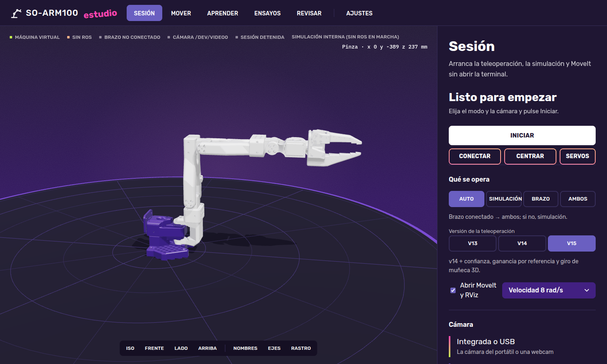
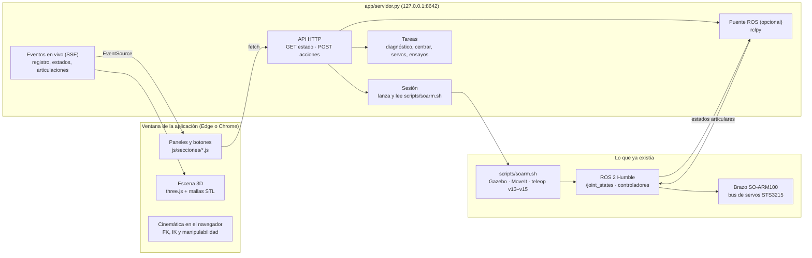
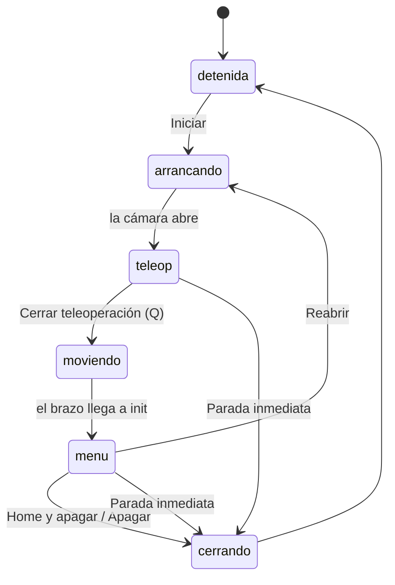
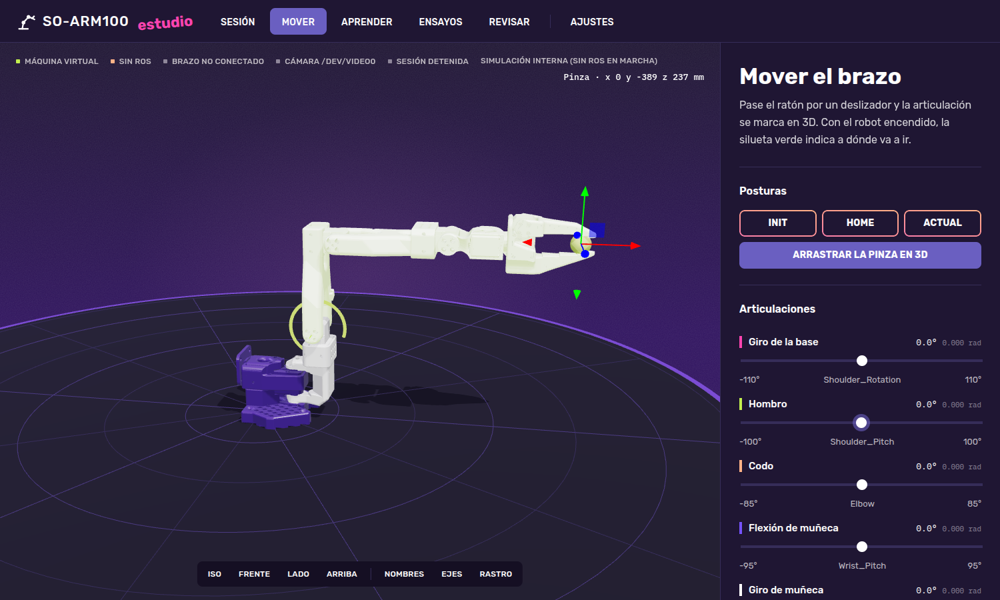
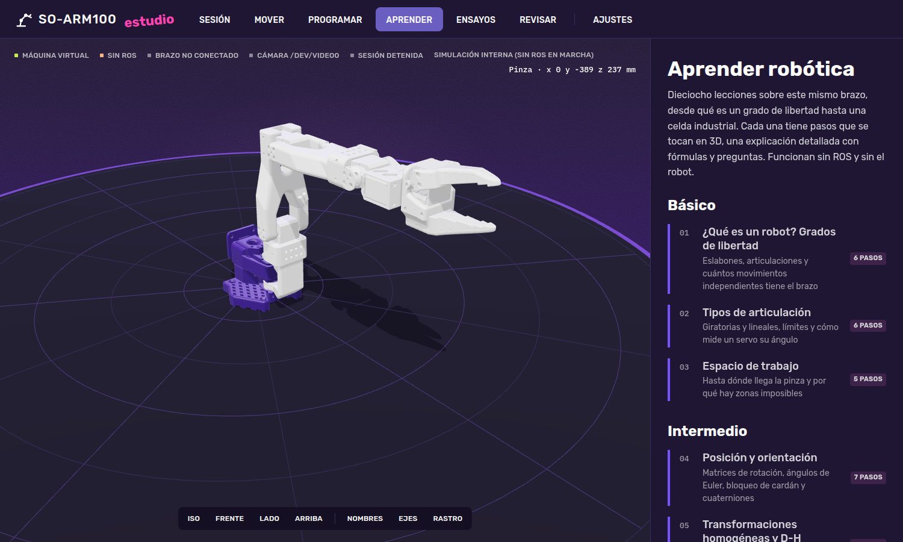
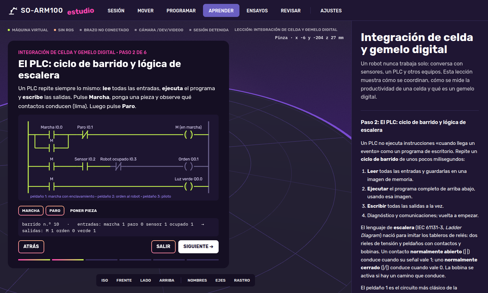
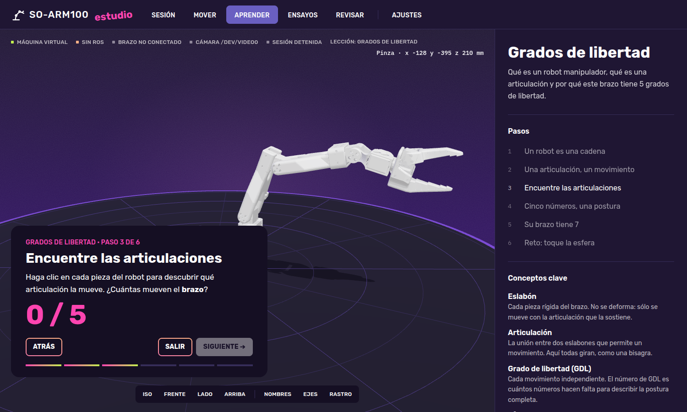
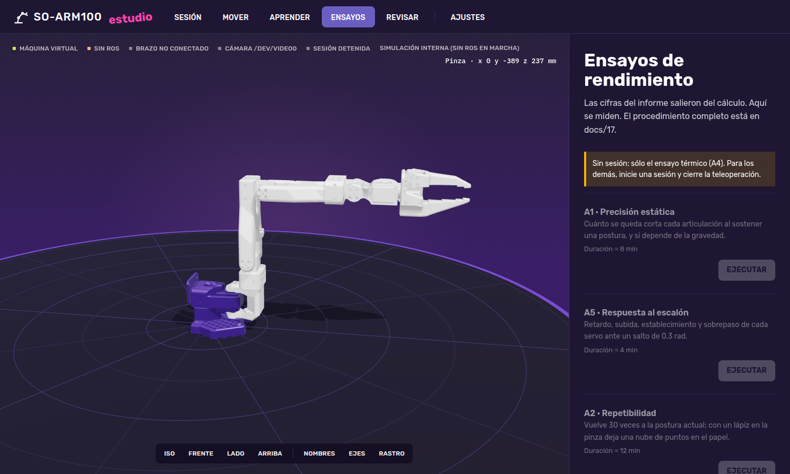
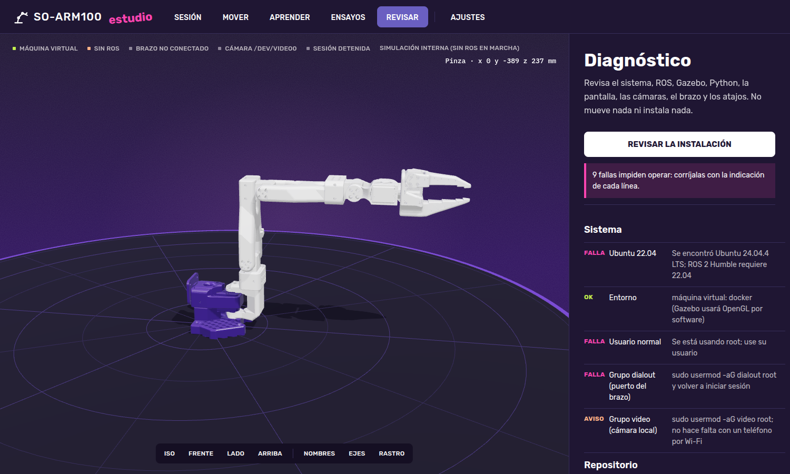

# 18 — SO-ARM100 Estudio: la aplicación de operación, pruebas y aprendizaje

[← Anterior: ensayos de rendimiento](17-ensayos-de-rendimiento.md) · [Volver al inicio](../README.md) · [Siguiente: Programar →](19-programar.md)

---

> **Estado:** las tres fases terminadas el 25 de septiembre de 2026. La fase 1 (sesión, mover, ensayos, revisar y la lección 1) se usó en el equipo del proyecto con el brazo real para ejecutar los ensayos A1 a A5 ([capítulo 17](17-ensayos-de-rendimiento.md#resultados-del-25-de-septiembre-de-2026)). Las lecciones 2 a 18 y la pestaña **Programar** ([capítulo 19](19-programar.md)) se comprobaron en un navegador Chromium automático, recorriendo cada paso de cada lección sin errores.

SO-ARM100 Estudio reúne en una ventana todo lo que hasta el capítulo 17 se hacía escribiendo órdenes: arrancar la teleoperación, elegir la cámara, mover el brazo, llevarlo a una postura segura, ejecutar los ensayos y revisar la instalación. Además trae un recorrido de 18 lecciones de robótica, desde qué es un grado de libertad hasta la integración de una celda industrial, que se practica con el modelo 3D del propio brazo y funciona sin ROS y sin el robot.



*Figura 18.1. Pantalla inicial. A la izquierda, el brazo en 3D construido con las mallas del URDF; arriba, el estado del equipo; a la derecha, el panel de la sección elegida en la barra superior.*

## Contenido

1. [Cómo se abre](#cómo-se-abre)
2. [Cómo está hecha](#cómo-está-hecha)
3. [Sesión: arrancar y cerrar sin terminal](#sesión-arrancar-y-cerrar-sin-terminal)
4. [Mover: articulaciones, posturas y cinemática inversa](#mover-articulaciones-posturas-y-cinemática-inversa)
5. [Aprender: el plan de 18 lecciones](#aprender-el-plan-de-18-lecciones)
6. [Programar](#programar)
7. [Ensayos y Revisar](#ensayos-y-revisar)
8. [Seguridad](#seguridad)
9. [Pruebas que debe superar el robot](#pruebas-que-debe-superar-el-robot)
10. [Pruebas de la aplicación en cada entorno](#pruebas-de-la-aplicación-en-cada-entorno)
11. [Diseño visual](#diseño-visual)
12. [Fases](#fases)
13. [Archivos](#archivos)
14. [Problemas frecuentes](#problemas-frecuentes)

## Cómo se abre

Hay tres formas equivalentes. Las tres arrancan un servidor local en el puerto 8642 y abren la aplicación en una ventana propia, sin barra de direcciones.

| Forma | Qué se hace | Cuándo conviene |
|---|---|---|
| Icono | Doble clic en **SO-ARM100 Estudio** (escritorio o menú de aplicaciones) | Uso diario |
| Atajo | `soarm-app` en una terminal | Si ya hay una terminal abierta |
| Directo | `bash ~/so-arm100-teleop/app/abrir.sh` | Si los atajos no están instalados |

El icono y el atajo los crea `bash scripts/instalar_atajos.sh`, el mismo instalador del capítulo 14. Si ya se había ejecutado antes, basta con ejecutarlo otra vez: no duplica nada.

`app/abrir.sh` hace cuatro cosas:

1. Comprueba si el servidor ya responde en `http://127.0.0.1:8642`. Si responde, lo reutiliza; así un segundo doble clic no abre otro servidor.
2. Si no responde, carga ROS 2 Humble y el workspace (cuando existen) y arranca `python3 app/servidor.py` en segundo plano. El registro queda en `~/.local/state/soarm/estudio.log`.
3. Espera hasta 10 s a que el servidor conteste. Si no contesta, muestra una ventana de error con las últimas líneas del registro.
4. Abre la ventana según el entorno:
   - **WSL2:** Microsoft Edge de Windows en modo aplicación (`msedge --app`). Edge llega al servidor de WSL por `localhost`, que Windows reenvía a WSL.
   - **Ubuntu nativo o máquina virtual:** el primero que encuentre de Chrome, Chromium, Edge o Brave en modo aplicación; si no hay ninguno, el navegador predeterminado.

Para detener el servidor: `soarm-app --parar`. Cerrar la ventana no lo detiene, a propósito: una sesión de teleoperación en marcha no debe caerse por cerrar una ventana.

> **Sin ROS.** Si ROS no está instalado, la aplicación abre igual. Las secciones Aprender y Mover (con el robot virtual) funcionan completas. Sesión y Ensayos avisan de que hace falta ROS.

## Cómo está hecha

La aplicación tiene dos partes: un servidor en Python que ejecuta en el equipo lo mismo que antes se escribía en la terminal, y una página web que dibuja el robot y los botones.



*Figura 18.2. Arquitectura. Las flechas indican quién llama a quién. La aplicación no reemplaza a `soarm.sh`: lo ejecuta y lee su salida.*

### El servidor

Está escrito sólo con la biblioteca estándar de Python (`http.server`, `subprocess`, `threading`), de modo que no requiere instalar nada. Sus piezas están en `app/estudio/`:

| Módulo | Función |
|---|---|
| `entorno.py` | Detecta si el equipo es WSL2, máquina virtual o Ubuntu nativo; lee y guarda `~/.soarm.conf`; busca el puerto del brazo y lo conecta con `usbipd` en WSL2; lista las cámaras locales y busca teléfonos con DroidCam en la red |
| `procesos.py` | Arranca `soarm.sh` con las opciones elegidas, lee su salida línea a línea y deduce el estado: `detenida`, `arrancando`, `teleop`, `moviendo`, `menu`, `cerrando`. Las respuestas del menú (Enter, `h`, `x`) se escriben en la entrada estándar del proceso, igual que al teclearlas |
| `puente_ros.py` | Si `rclpy` está disponible, se suscribe a `/joint_states` (simulación) y `/real/joint_states` (brazo) y publica las posiciones a la página 20 veces por segundo. También envía trayectorias y órdenes a la pinza |
| `eventos.py` | Reparte los eventos en vivo a todas las ventanas abiertas (Server-Sent Events) |
| `modelo.py` | Lee el URDF, quita la parte de xacro y entrega articulaciones, orígenes, ejes y mallas a la página |

La tabla siguiente relaciona cada ruta de la API con la orden que sustituye.

| Ruta | Método | Equivale a |
|---|---|---|
| `/api/estado` | GET | Mirar si hay brazo, cámara, ROS y sesión |
| `/api/sesion/iniciar` | POST | `teleop` o `bash scripts/soarm.sh <modo> [opciones]` |
| `/api/sesion/cerrar-teleop` | POST | Pulsar Q en la ventana de la cámara |
| `/api/sesion/menu` | POST | Responder Enter, `h` o `x` en el menú final |
| `/api/sesion/detener` | POST | Ctrl+C en la terminal del lanzador |
| `/api/camaras`, `/api/camaras/probar`, `/api/camaras/buscar` | GET, POST | `soarm-camara` |
| `/api/brazo/conectar` | POST | `usbipd attach` en WSL2 |
| `/api/mover`, `/api/pinza` | POST | `ros2 topic pub` de una trayectoria o `ir_a_pose.py` |
| `/api/trayectoria`, `/api/parar` | POST | Trayectoria articular completa de un programa de la pestaña Programar, y su parada |
| `/api/programas`, `/api/programas/<nombre>` | GET | Lista y contenido de los programas guardados (`.mod`) |
| `/api/programas/guardar`, `/api/programas/borrar` | POST | Guardar y borrar programas en `~/.local/share/soarm/programas/` |
| `/api/tarea` | POST | `soarm-diagnostico`, `centrar`, `servos`, `soarm-ensayo ...` |
| `/api/conf` | POST | `soarm-config` |
| `/api/eventos` | GET | Mirar la terminal: registro y estados en vivo |

### La página

La página no usa ningún framework. La escena 3D se hace con three.js r169, copiado en `app/web/vendor/three/` para que funcione sin Internet. El robot se construye desde el URDF: cada articulación es un grupo con su origen y su eje, y cada eslabón carga su malla STL. Por eso el modelo coincide con el que usan Gazebo y MoveIt.

La cinemática directa, la inversa y la manipulabilidad se calculan en el navegador (`js/cinematica.js`). Así, la sección Mover y las lecciones responden al instante sin ROS. La cinemática directa se comprobó contra `cinematica.py` del capítulo 8: en la postura `init` las dos dan la pinza en (0, −389, 237) mm.

## Sesión: arrancar y cerrar sin terminal

La sección Sesión sustituye a la orden `teleop`. Antes de arrancar se eligen:

- **Qué se opera.** *Auto* (ambos si hay brazo, simulación si no), *Simulación*, *Brazo* o *Ambos*.
- **Versión de la teleoperación.** v13 (la defendida), v14 (se sincroniza con el brazo al abrir) o v15 (confianza por articulación, ganancia por postura de referencia y giro de muñeca en 3D).
- **MoveIt y RViz.** Si se abren junto con la teleoperación (capítulo 15).
- **Velocidad máxima** del espejo en rad/s.
- **Cámara.** Integrada o USB, virtual (OBS, cliente de DroidCam) o teléfono por Wi-Fi. Para el teléfono se escribe la IP o se pulsa *Buscar el teléfono en la red*. La cámara se prueba antes de arrancar, con la misma comprobación de tipo de contenido del capítulo 14, de modo que una página de «DroidCam ocupado» ya no pasa por vídeo.

Al pulsar **Iniciar**, el servidor arma la orden de `soarm.sh` y la ejecuta. El registro aparece en el recuadro de la parte baja y el estado cambia solo:



*Figura 18.3. Estados de la sesión. Son los del lanzador del capítulo 15; la aplicación sólo los muestra y ofrece los botones que corresponden a cada uno.*

| Estado | Botones disponibles | Qué hacen |
|---|---|---|
| `detenida` | Iniciar, Conectar, Centrar, Servos | Arrancar; conectar el brazo con usbipd; llevar los seis servos a 2048; listar posición, carga y temperatura |
| `teleop` | Cerrar teleoperación | Igual que Q: el brazo va despacio a `init` |
| `menu` | Reabrir, Home y apagar, Apagar | Igual que Enter, `h` y `x` en el menú |
| cualquiera en marcha | Parada inmediata | Igual que Ctrl+C: detiene todo sin mover el brazo |

En el estado `menu` el brazo queda sostenido en `init`. Desde ahí se puede ir a la sección Mover y moverlo con los deslizadores, o a Ensayos y ejecutar A1, A2, A3 o A5.

## Mover: articulaciones, posturas y cinemática inversa



*Figura 18.4. Sección Mover. El deslizador del hombro está señalado y el hombro se marca en el modelo con su eje de giro. La esfera en la pinza se arrastra con las flechas: el robot calcula la postura por cinemática inversa.*

La sección tiene cinco bloques:

1. **Posturas.** `init`, `home` y *Actual* (copia la postura en que está el robot). Los valores salen de `scripts/poses_seguras.json`, los mismos que usa el lanzador.
2. **Arrastrar la pinza en 3D.** Muestra una esfera en la punta de la pinza con flechas en X, Y y Z. Al arrastrarla, `cinematica.js` resuelve la cinemática inversa por mínimos cuadrados amortiguados sobre las cuatro primeras articulaciones. Si el punto no es alcanzable, la esfera se pone fucsia y el robot se queda en la postura más cercana.
3. **Articulaciones.** Un deslizador por articulación, limitado a los límites seguros del URDF. Al pasar el ratón por un deslizador, la articulación se ilumina en el modelo y aparece su eje.
4. **Dónde queda la pinza.** Posición en milímetros, alcance horizontal e índice de manipulabilidad de Yoshikawa, w = √det(J·Jᵀ). Una barra indica lo cerca que está de una singularidad, y por debajo de w = 0,002 aparece un aviso.
5. **Ejecutar y secuencia de puntos.** Sin sesión, *Animar en el robot virtual* mueve sólo el modelo. Con la sesión en `menu`, *Mover el robot a esta postura* envía la trayectoria al brazo (y a Gazebo si el modo es *Ambos*), con la duración calculada a partir de la velocidad elegida. La secuencia guarda posturas y las reproduce en orden: es la base de la programación por puntos de un robot industrial.

Mientras hay una sesión en marcha, el modelo 3D sigue al brazo real o a la simulación con los datos de `/joint_states`. La postura que se prepara con los deslizadores aparece como una silueta verde transparente, de modo que se ve a dónde va a ir el brazo antes de moverlo.

## Aprender: el plan de 18 lecciones



*Figura 18.5. El plan de estudio: 18 lecciones en cuatro niveles. La etiqueta de la derecha dice cuántos pasos tiene cada una o «Hecha» si ya se terminó en este navegador.*

Cada lección es una secuencia de cinco a siete pasos sobre el modelo 3D. Cada paso tiene tres partes:

- **En la escena**, algo que se mueve o se toca: deslizadores que mueven el brazo, marcos de coordenadas, flechas de velocidad, nubes de puntos, obstáculos, gráficas y diagramas que cambian en vivo.
- **En la tarjeta de la lección**, dos o tres frases que dicen qué mirar y qué hacer, con las fórmulas escritas con KaTeX.
- **En el panel derecho**, la **explicación detallada** del paso: la teoría completa con fórmulas, tablas y referencias, y al final los conceptos clave y la bibliografía de la lección.

Las preguntas de opción múltiple y los retos no dejan avanzar hasta responder bien, y explican la respuesta. Varias lecciones usan los datos reales del proyecto: el ensayo A1 en la de calibración, A2 en la de seguridad (ISO 9283), A3 con 227 g en la de dinámica y A5 en la de control. Las lecciones 15 y 18 tienen botones que abren programas de ejemplo en la pestaña [Programar](19-programar.md).



*Figura 18.5b. Lección 18, paso 2: un diagrama de escalera que conduce en vivo (lima) mientras el PLC da la orden al robot de tomar una pieza.*



*Figura 18.6. Lección 1, paso 3: hay que hacer clic en cada pieza del brazo para descubrir qué articulación la mueve. El contador llega a 5 y entonces se habilita «Siguiente».*

La lección 1 (grados de libertad) está completa y tiene seis pasos:

| Paso | Qué se ve | Qué se hace |
|---|---|---|
| 1. Un robot es una cadena | Los eslabones se iluminan uno tras otro desde la base | Observar |
| 2. Una articulación, un movimiento | El codo se mueve solo con su eje y su arco dibujados | Observar |
| 3. Encuentre las articulaciones | Contador 0 / 5 | Clic en cada pieza hasta encontrar las cinco del brazo |
| 4. Cinco números, una postura | Cinco deslizadores pequeños | Mover el brazo y ver que cinco ángulos definen la postura |
| 5. Su brazo tiene 7 | Dibujo del brazo humano junto al del robot | Comparar 7 GDL con 5 GDL y ver qué movimiento falta |
| 6. Reto: toque la esfera | Una esfera en un punto alcanzable | Llevar la pinza a menos de 15 mm |

### Por qué estos cuatro niveles

Los niveles básico e intermedio siguen el orden de un curso universitario de robótica: geometría, cinemática y Jacobiano. El nivel avanzado añade lo que un curso de posgrado o un equipo de I+D usa hoy. El nivel industrial cubre lo que se encuentra al instalar un robot en una fábrica y que casi nunca se enseña con un brazo de escritorio.

| # | Nivel | Lección | Qué se practica con el SO-ARM100 |
|---|---|---|---|
| 1 | Básico | Grados de libertad | Contar articulaciones y fijar una postura con 5 números |
| 2 | Básico | Tipos de articulación | Giratorias y lineales, límites, cómo mide un servo su ángulo (codificador de 4096 pasos) |
| 3 | Básico | Espacio de trabajo | Nube de puntos alcanzables y zonas imposibles |
| 4 | Intermedio | Posición y orientación | Matriz de rotación, ángulos de Euler y bloqueo de cardán, cuaterniones |
| 5 | Intermedio | Transformaciones homogéneas y D-H | Marcos de cada eslabón dibujados sobre el modelo |
| 6 | Intermedio | Cinemática directa | De los ángulos a la pinza, comparado con el capítulo 8 |
| 7 | Intermedio | Cinemática inversa | Varias soluciones (codo arriba y abajo) o ninguna |
| 8 | Intermedio | Jacobiano y singularidades | Elipsoide de manipulabilidad sobre la pinza |
| 9 | Avanzado | Cuaterniones duales y teoría de tornillos | Un solo objeto para rotación y traslación; producto de exponenciales; interpolación ScLERP |
| 10 | Avanzado | Planificación de trayectorias | Perfiles trapezoidal y curva S, splines, tirón, SLERP |
| 11 | Avanzado | Dinámica | Par por gravedad en cada postura y su relación con la carga útil (ensayo A3) |
| 12 | Avanzado | Control | PID del servo, par calculado, impedancia y admitancia |
| 13 | Avanzado | Planificación con obstáculos | Espacio de configuraciones, RRT y colisiones, como en MoveIt |
| 14 | Avanzado | Visión y teleoperación | MediaPipe, filtros y latencia: cómo funciona este proyecto |
| 15 | Industrial | Programación de robots industriales | Marcos base, usuario y herramienta (TCP); jog; PTP, LIN y CIRC; zonas de aproximación |
| 16 | Industrial | Calibración | Cinemática, TCP y mano-ojo (cámara-robot) |
| 17 | Industrial | Seguridad y normas | ISO 10218, ISO/TS 15066 para cobots, ISO 9283 para desempeño, categorías de parada 0, 1 y 2 |
| 18 | Industrial | Integración de celda y gemelo digital | Apretón de manos con señales, PLC y escalera, Modbus y OPC UA, OEE, gemelo digital y retardo |

### La lección de cuaterniones duales

La lección 9 se incluyó a pedido expreso. Un cuaternión dual reúne en un solo objeto la rotación *r* (un cuaternión unitario) y la traslación *t*:

```
σ = r + ε · ½ t r        con ε² = 0
```

Encadenar dos movimientos es multiplicar sus cuaterniones duales, igual que con matrices homogéneas, pero con 8 números en vez de 16 y sin que los errores de redondeo deformen la rotación. La lección muestra una pieza que va de una pose a otra de dos maneras a la vez: interpolando por separado posición y orientación, e interpolando el cuaternión dual (ScLERP), que sigue un tornillo: gira y avanza a la vez alrededor de un eje fijo, dibujado en la escena. Después calcula los tornillos de las cinco articulaciones del SO-ARM100 a partir del URDF y comprueba que el producto de exponenciales, la alternativa moderna a Denavit–Hartenberg que usa el libro *Modern Robotics* de Lynch y Park, da la misma pose que la cadena del URDF (diferencia del orden de 10⁻¹⁶ m).

## Programar

La pestaña **Programar** enseña a mover el brazo con las instrucciones de un robot industrial (`MoveJ`, `MoveL`, `MoveC`, `MoveAbsJ`, `Offs`, pinza, señales, `FOR`, `WHILE`, `IF`, `PROC`), en una lista de instrucciones y en un editor de texto sincronizados, con una celda virtual de tres cubos, una bandeja, un sensor y una torre de luces. Los programas corren en el robot virtual o se envían al brazo y a Gazebo. Todo se explica en el [capítulo 19](19-programar.md).

## Ensayos y Revisar



*Figura 18.7. Sección Ensayos. Cada ensayo indica cuándo puede ejecutarse; sin sesión sólo se habilita el térmico (A4), que va directo al bus de servos.*

La sección Ensayos ejecuta las herramientas del capítulo 17 con un botón. El servidor comprueba el estado antes de lanzar cada una:

| Ensayo | Requiere | Opciones en pantalla |
|---|---|---|
| A1 Precisión estática, A5 Escalón, A2 Repetibilidad | Sesión en `menu` (brazo sostenido en init) | — |
| A3 Carga útil | Sesión en `menu` | Masa: sin carga, 50 g u 80 g |
| A4 Temperatura | Sesión `detenida` (usa el puerto directamente) | Duración: 15, 30, 60 o 90 min |
| Analizar | Cualquiera | Fecha de la carpeta de resultados |

La salida se ve en vivo y *Detener el ensayo* equivale a Ctrl+C. Al terminar, *Resultados* muestra el `resumen.md` de la fecha elegida con sus tablas y gráficas.



*Figura 18.8. Sección Revisar, ejecutada en el equipo de pruebas (un contenedor con Ubuntu 24.04 y usuario root, de ahí las fallas). Cada línea dice qué falla y cómo se corrige.*

Revisar ejecuta `scripts/diagnostico.sh` y presenta sus líneas OK, AVISO y FALLA agrupadas por tema. El informe completo se guarda igual que con `soarm-diagnostico`. Se agregó un grupo nuevo, *Aplicación SO-ARM100 Estudio*, que revisa Python, el motor 3D incluido, el navegador para la ventana y el icono.

## Seguridad

La aplicación mueve un brazo real, así que se diseñó para que un error de uso no lo mueva sin querer.

- **Sólo este equipo.** El servidor escucha en `127.0.0.1`: no se puede abrir desde otro equipo de la red. Existe la opción `--red` para una demostración, y hay que activarla a mano.
- **Sólo esta página.** Toda orden (POST) se rechaza si la cabecera `Origin` no es la de la propia aplicación. Una página web cualquiera abierta en el mismo navegador no puede mover el brazo.
- **Estados.** El brazo sólo se mueve desde Mover o Ensayos con la sesión en `menu`, es decir, con la teleoperación cerrada y el brazo ya sostenido en `init`. Durante la teleoperación, el gesto es el único que manda.
- **Límites.** Toda postura se recorta a los límites seguros del URDF en el navegador y otra vez en el servidor. La duración del movimiento sale de la mayor diferencia de ángulo dividida entre la velocidad, con un mínimo de 1 s y una velocidad máxima de 1,5 rad/s.
- **Confirmaciones.** *Centrar*, *Apagar* y *Parada inmediata* piden confirmación y explican qué va a pasar. *Apagar* recuerda que el brazo pierde el par y puede caer.
- **Parada física.** *Parada inmediata* equivale a Ctrl+C: corta el software. La parada de emergencia sigue siendo el interruptor de la fuente de 12 V.

## Pruebas que debe superar el robot

El capítulo 17 define siete ensayos (A1 a A5, B1 y B2) que miden precisión, respuesta, repetibilidad, carga, temperatura y fidelidad del espejo. Para considerar el sistema completo faltan seis grupos de pruebas más. Se proponen con su procedimiento y un criterio de aceptación concreto, de modo que el resultado sea «pasa» o «no pasa».

### C — Seguridad funcional

| Prueba | Procedimiento | Criterio de aceptación |
|---|---|---|
| C1 Parada inmediata | En teleoperación con el brazo en movimiento, pulsar *Parada inmediata*. Grabar en vídeo a 60 fps | Los servos dejan de recibir órdenes en menos de 200 ms (se cuenta en el vídeo desde el clic hasta que el brazo deja de seguir el gesto) |
| C2 Pérdida de la cámara | Tapar la cámara 5 s y luego desconectarla | Con la cámara tapada el brazo se queda quieto; al desconectarla, el lanzador cierra la teleoperación y el brazo va a `init` |
| C3 Pérdida del bus | Desenchufar el USB del brazo durante la sesión `menu` | La aplicación lo marca en rojo en menos de 2 s y no intenta enviar más movimientos |
| C4 Límites | Pedir con los deslizadores cada articulación en su extremo | Ningún servo supera el límite del URDF (se lee con *Servos*) y ninguno se detiene por sobrecarga |
| C5 Origen ajeno | Desde otra página, enviar un POST a `/api/mover` | El servidor responde 403 y el brazo no se mueve |

### D — Espacio de trabajo

| Prueba | Procedimiento | Criterio de aceptación |
|---|---|---|
| D1 Alcance | Llevar el brazo a `init` y medir con regla la distancia horizontal del eje de la base a la punta de la pinza | 389 mm ± 5 mm, el valor calculado |
| D2 Mapa de puntos | Marcar en una hoja 9 puntos en una cuadrícula de 100 mm; llevar la pinza a cada uno con *Arrastrar la pinza en 3D* | Error de posición menor de 10 mm en los 9 puntos |

### E — Trayectorias

| Prueba | Procedimiento | Criterio de aceptación |
|---|---|---|
| E1 Movimiento articular (PTP) | Reproducir una secuencia de 4 puntos 10 veces | Todas las repeticiones terminan en los mismos 4 puntos con la dispersión del ensayo A2 |
| E2 Recta (LIN) | Con MoveIt y el planificador Pilz, mover la pinza 150 mm en línea recta con un lápiz sobre papel | Desviación máxima de la recta menor de 5 mm |
| E3 Tiempo de ciclo | Cronometrar un ciclo de recoger y colocar entre dos puntos a 300 mm | Registrar el tiempo; sirve de base para la lección 18 (OEE) |

### F — Pinza

| Prueba | Procedimiento | Criterio de aceptación |
|---|---|---|
| F1 Apertura | Abrir y cerrar 20 veces midiendo la apertura con calibrador | Dispersión menor de 1 mm |
| F2 Sujeción | Sostener objetos de 20, 50 y 80 g y girar la muñeca 90° | El objeto no se desliza con 20 y 50 g; con 80 g se registra el resultado |

### G — Resistencia

| Prueba | Procedimiento | Criterio de aceptación |
|---|---|---|
| G1 Dos horas | Repetir el ciclo E3 durante 2 h mientras corre el ensayo A4 | Ningún servo pasa de 65 °C, ninguno se desconecta y el error final en `init` no crece más de 1° respecto del inicial |

### H — Usabilidad

| Prueba | Procedimiento | Criterio de aceptación |
|---|---|---|
| H1 Primera vez | Cinco personas que no conocen el proyecto abren la aplicación y arrancan una teleoperación sin ayuda | Al menos 4 de 5 lo consiguen en menos de 5 min |
| H2 Cuestionario SUS | Tras H1, las mismas personas responden el cuestionario SUS de 10 preguntas | Puntuación media de 68 o más (el promedio de la industria) |
| H3 Lección 1 | Las mismas personas hacen la lección de grados de libertad | Al menos 4 de 5 responden bien, al final, cuántos GDL tiene el brazo y por qué |

Orden sugerido: C primero (es condición para todo lo demás), luego D y F en una sesión, E y G juntos, y H al final con el sistema ya ajustado.

## Pruebas de la aplicación en cada entorno

Antes de dar la aplicación por buena en el equipo del proyecto, conviene recorrer esta lista en cada entorno. Se anota «sí» o lo que ocurrió.

| # | Comprobación | WSL2 | Ubuntu nativo | Máquina virtual |
|---|---|---|---|---|
| 1 | `bash scripts/instalar_atajos.sh` crea el icono SO-ARM100 Estudio | | | |
| 2 | El icono (o `soarm-app`) abre la ventana en menos de 10 s | | | |
| 3 | El brazo 3D aparece y gira con el ratón | | | |
| 4 | Revisar termina y la sección *Aplicación* sale en OK | | | |
| 5 | La lección 1 se completa hasta el reto | | | |
| 6 | Cámara: *Probar* acepta la cámara correcta y rechaza una ocupada | | | |
| 7 | Iniciar en simulación abre Gazebo y el modelo 3D sigue a Gazebo | | | |
| 8 | Cerrar teleoperación lleva a `init` y aparece el menú | | | |
| 9 | Desde Mover, *Mover el robot a esta postura* mueve Gazebo | | | |
| 10 | Con el brazo: Conectar, Iniciar en *Ambos*, Q, Home y apagar | | | |
| 11 | *Parada inmediata* detiene todo | | | |
| 12 | `soarm-app --parar` detiene el servidor | | | |

## Diseño visual

La interfaz toma el lenguaje visual de [sentry.io](https://sentry.io/welcome/): fondo violeta muy oscuro con grano, títulos grandes en negrita, botones en mayúsculas y listas con una barra lateral de color. Se eligió porque es una interfaz de herramientas técnicas pensada para leerse bien durante horas en pantalla oscura, y porque la escena 3D luce sobre un fondo así.

| Elemento | Cómo se ve | Para qué |
|---|---|---|
| Fondo | `#1f1633` que baja a `#30145f`, con grano | Contraste con el robot blanco |
| Botón principal | Blanco con texto oscuro; al pasar el ratón entra un degradado rosa–durazno | La acción que sigue (Iniciar, Siguiente, Revisar) |
| Botón secundario | Borde en degradado rosa–durazno; al pasar el ratón se llena de violeta | Acciones normales |
| Barra de navegación | Texto en mayúsculas; la sección activa, llena de violeta `#6a5fc1` | Saber dónde se está |
| Listas | Barra de 4 px a la izquierda, violeta; la elegida pasa a un degradado fucsia–lima | Cámaras y lecciones |
| Avisos en línea | Fondo tenue con una barra de 4 px: ámbar, lima o fucsia | Aviso, correcto o error |
| Letra | Rubik para el texto, IBM Plex Mono para cifras y registro | Las dos van incluidas (licencia OFL), no se descargan |

Cada articulación conserva un color en toda la aplicación (deslizadores, etiquetas, lecciones): giro de la base fucsia, hombro lima, codo durazno, flexión de muñeca violeta, giro de muñeca blanco y pinza gris.

## Fases

| Fase | Contenido | Estado |
|---|---|---|
| 1 | Servidor, escena 3D, Sesión, Mover, Ensayos, Revisar, Ajustes, lección 1, icono y atajo | Terminada y usada con el brazo real (ensayos del 25 de septiembre) |
| 2 | Lecciones 2 a 8 (básico e intermedio) | Terminada |
| 3 | Lecciones 9 a 18 (avanzado e industrial) y la pestaña Programar con celda virtual, ejemplos y retos | Terminada; falta ejecutar los ejemplos de Programar en el brazo real |

Cada fase se prueba antes de empezar la siguiente.

## Archivos

| Archivo | Qué es |
|---|---|
| `app/abrir.sh` | Arranca el servidor si hace falta y abre la ventana; `--parar` lo detiene |
| `app/servidor.py` | Servidor HTTP con la API y los eventos en vivo |
| `app/estudio/*.py` | Entorno, sesión, tareas, puente ROS, eventos y modelo |
| `app/web/index.html` | La página |
| `app/web/css/estilo.css` | Todo el estilo visual |
| `app/web/js/principal.js` | Arranque, navegación e indicadores |
| `app/web/js/escena.js` | Escena 3D, resaltado de articulaciones, etiquetas, rastro y objetivo |
| `app/web/js/cinematica.js` | Cinemática directa e inversa y manipulabilidad |
| `app/web/js/secciones/*.js` | Una por sección del panel |
| `app/web/js/lecciones/gdl.js` | Lección 1 |
| `app/web/js/lecciones/l02_*.js` … `l18_*.js` | Lecciones 2 a 18, una por archivo |
| `app/web/js/lecciones/comun.js` | Piezas comunes: deslizadores, gráficas, marcos, flechas, fórmulas, tornillos y cuaterniones duales |
| `app/web/js/programa/*.js` | Lenguaje, planificador, ejecutor, celda y ejemplos de la pestaña Programar ([capítulo 19](19-programar.md)) |
| `app/web/vendor/` | three.js r169, KaTeX 0.18.9 (fórmulas) y las fuentes Rubik e IBM Plex Mono, con sus licencias |
| `scripts/atajos.bash` | Nuevo atajo `soarm-app` |
| `scripts/instalar_atajos.sh` | Nuevo icono SO-ARM100 Estudio |
| `scripts/diagnostico.sh` | Nuevo grupo *Aplicación SO-ARM100 Estudio* |

## Problemas frecuentes

| Síntoma | Causa probable | Qué hacer |
|---|---|---|
| El icono no hace nada | El servidor no arrancó | Ver `~/.local/state/soarm/estudio.log`; ejecutar `bash app/abrir.sh` en una terminal para ver el error |
| En WSL2 no se abre ninguna ventana | Edge no está o `cmd.exe` no está en el PATH | Abrir `http://127.0.0.1:8642` en cualquier navegador de Windows |
| La ventana abre en blanco | El navegador no tiene WebGL | En la máquina virtual, activar la aceleración 3D (capítulo 1, figura vm-19) o probar con Chrome |
| «Sin ROS» aunque ROS está instalado | El servidor se arrancó sin cargar ROS | `soarm-app --parar` y abrir otra vez con el icono, que carga ROS |
| Mover dice que no llegan estados | La sesión está arrancando o el lanzador cayó | Esperar al estado `menu`; revisar el registro de la sección Sesión |
| El puerto 8642 está ocupado | Otro programa lo usa | `SOARM_APP_PUERTO=8650 soarm-app` |
| Al ejecutar un programa o mover: «Ruta desconocida» | El servidor se había arrancado antes de actualizar el repositorio (`git pull`) y sigue con el código viejo, que no conoce las rutas nuevas | Cerrar la sesión y ejecutar `soarm-app --parar` y `soarm-app`. `abrir.sh` compara la huella del código del servidor encendido (`app/estudio/version.py`) con la del disco y, si difieren y no hay sesión abierta, lo reinicia solo; con una sesión abierta sólo avisa |

---

[← Anterior: ensayos de rendimiento](17-ensayos-de-rendimiento.md) · [Volver al inicio](../README.md) · [Siguiente: Programar →](19-programar.md)
