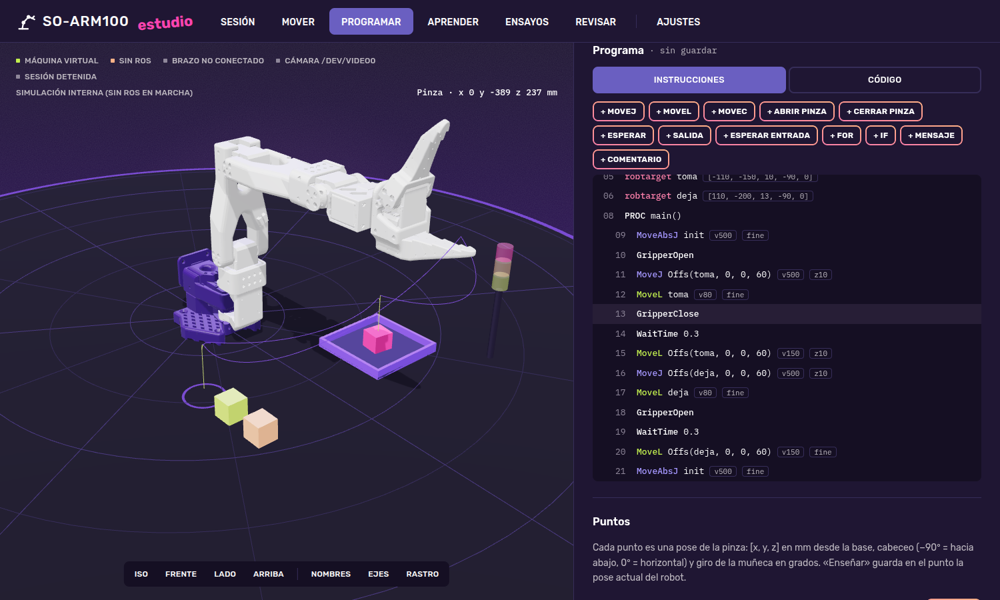
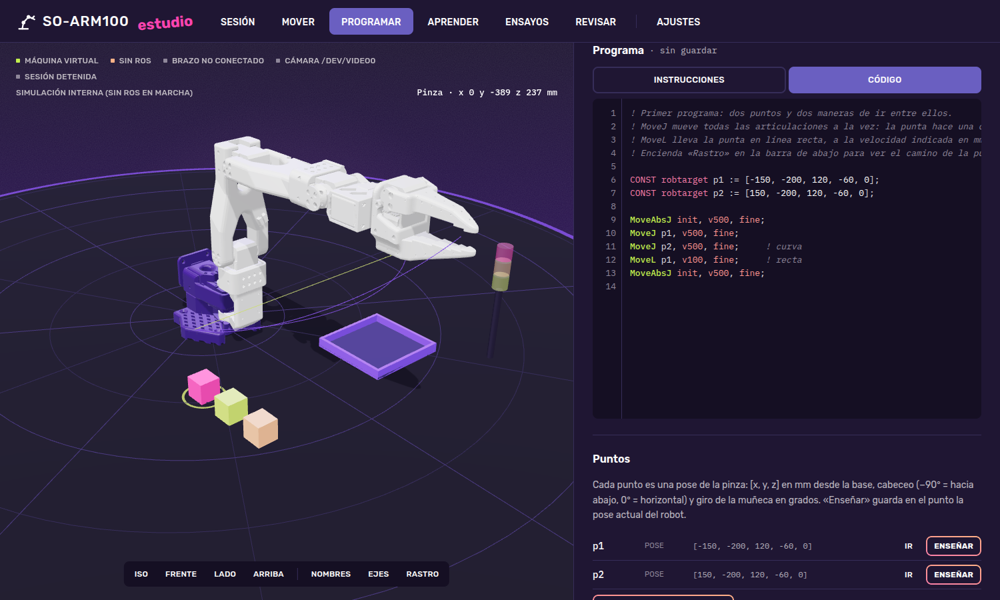
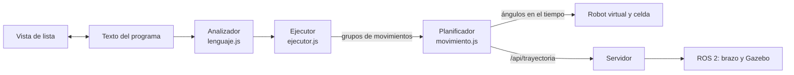

# 19 — Programar: el robot con instrucciones de robot industrial

[← Anterior: SO-ARM100 Estudio](18-aplicacion-estudio.md) · [Volver al inicio](../README.md)

---

> **Estado:** terminado el 25 de septiembre de 2026. Los ocho programas de ejemplo se comprobaron en el robot virtual, en un navegador Chromium automático y con pruebas en Node.js del analizador, el planificador y el ejecutor. Falta ejecutar los ejemplos sobre el brazo real con el destino «Brazo o Gazebo».

La pestaña **Programar** de SO-ARM100 Estudio enseña a mover el brazo como se programa un robot industrial: con puntos guardados y órdenes de movimiento como `MoveJ` y `MoveL`, pinza, señales y bucles. El mismo programa se ejecuta en el **robot virtual**, sin riesgo, o en el **brazo real y en Gazebo**, cuando hay una sesión abierta.



*Figura 19.1. La pestaña Programar con el ejemplo «Tomar y colocar un cubo». A la izquierda, la celda virtual con el camino planificado; a la derecha, el panel con la ejecución, el programa en forma de lista y los puntos.*

## Contenido

1. [Qué se puede hacer](#qué-se-puede-hacer)
2. [Un primer programa](#un-primer-programa)
3. [El lenguaje](#el-lenguaje)
4. [Tipos de movimiento](#tipos-de-movimiento)
5. [La celda virtual](#la-celda-virtual)
6. [Ejemplos y retos](#ejemplos-y-retos)
7. [Ejecutar en el brazo real](#ejecutar-en-el-brazo-real)
8. [Cómo funciona por dentro](#cómo-funciona-por-dentro)
9. [Archivos](#archivos)

## Qué se puede hacer

| Tarjeta | Para qué sirve |
|---|---|
| **Ejecutar** | Elegir el destino (robot virtual, o brazo y Gazebo), la velocidad del programa (*override*, de 10 a 100 %), y **Verificar**, **Ejecutar**, **Paso a paso** o **Detener**. La consola muestra los mensajes y los errores con su línea. |
| **Programa** | El programa en dos vistas sincronizadas: **Instrucciones**, una lista como la de una consola de programación, donde cada línea se edita con un formulario; y **Código**, un editor de texto con colores y números de línea. Lo que se cambia en una aparece en la otra. |
| **Puntos** | Los puntos del programa (`robtarget`). **Ir** lleva el robot virtual al punto; **Enseñar** guarda en el punto la pose actual. |
| **Mover a mano** | El mando de movimiento paso a paso (*jog*): cartesiano (la pinza en línea recta sobre x, y, z, cabeceo) o articular (cada articulación), con pasos de 1 a 20 mm o grados, y la pinza. |
| **Celda de trabajo** | Tres cubos, una bandeja, un sensor (`di1`) y una torre de luces (`do1` a `do3`), con el estado de cada pieza y de cada señal. |
| **Retos** | Cuatro ejercicios que se comprueban solos al terminar el programa. |

Arriba del panel están los **ejemplos**, los **programas guardados** y los botones Nuevo, Guardar, Guardar como, Exportar `.mod` e Importar. Los programas se guardan en `~/.local/share/soarm/programas/` como archivos `.mod` de texto. El último texto escrito se conserva también en el navegador, para no perderlo al cerrar la ventana.

## Un primer programa

Los puntos se declaran arriba; las instrucciones se ejecutan de arriba abajo:

```
! Dos puntos y dos maneras de ir entre ellos.
CONST robtarget p1 := [-150, -200, 120, -60, 0];
CONST robtarget p2 := [150, -200, 120, -60, 0];

MoveAbsJ init, v500, fine;     ! postura de inicio, por ángulos
MoveJ p1, v500, fine;          ! movimiento articular: la punta hace una curva
MoveJ p2, v500, fine;
MoveL p1, v100, fine;          ! movimiento lineal: la punta va en recta a 100 mm/s
MoveAbsJ init, v500, fine;
```

Un **robtarget** es una pose de la pinza con cinco números, `[x, y, z, cabeceo, giro]`: posición en mm desde la base y dos ángulos en grados. El cabeceo es −90° con la pinza hacia abajo y 0° horizontal. El brazo mira hacia −y, así que los puntos de trabajo tienen `y` negativa. Un robot industrial de seis ejes usa posición y cuaternión; aquí bastan cinco números porque el brazo tiene cinco articulaciones y su orientación sólo admite cabeceo y giro.

Anatomía de una orden de movimiento, igual que en RAPID de ABB:

```
MoveL  p2,  v100,  z10;
 │     │     │      └ zona: redondea el paso por el punto con 10 mm (fine = se detiene)
 │     │     └ velocidad de la punta: 100 mm/s (vmax = 1000)
 │     └ punto destino
 └ tipo de movimiento
```

## El lenguaje

Es un subconjunto de **ABB RAPID**, el lenguaje más difundido en la enseñanza de robótica industrial, con tres simplificaciones: el punto y coma es opcional, no hace falta declarar herramienta ni objeto de trabajo (`tool0`, `wobj0` se aceptan y se ignoran) y los puntos tienen cinco números.

### Datos

| Declaración | Ejemplo | Qué es |
|---|---|---|
| `CONST robtarget` | `CONST robtarget toma := [-110, -150, 10, -90, 0];` | Pose de la pinza: mm y grados |
| `CONST jointtarget` | `CONST jointtarget recogido := [0, -60, 60, 45, 0];` | Cinco ángulos articulares en grados |
| `VAR num` | `VAR num n := 0;` | Número; también `bool` (0 o 1) |
| Predefinidos | `init`, `home` | Las dos posturas seguras del proyecto (capítulo 15) |
| Señales | `di1` a `di4`, `do1` a `do4` | Entradas y salidas digitales de la celda |

`VAR`, `CONST` y `PERS` se aceptan los tres; en esta versión se comportan igual.

### Instrucciones

| Instrucción | Ejemplo | Qué hace |
|---|---|---|
| `MoveJ` | `MoveJ p1, v500, z10;` | Movimiento articular: todas las articulaciones a la vez |
| `MoveL` | `MoveL p1, v100, fine;` | La punta en línea recta |
| `MoveC` | `MoveC via, fin, v100, fine;` | Arco de círculo que pasa por `via` |
| `MoveAbsJ` | `MoveAbsJ init, v500, fine;` | A ángulos absolutos (`jointtarget`), sin cinemática inversa |
| `Offs` | `MoveL Offs(toma, 0, 0, 60), v150, z10;` | El punto desplazado en mm, en los ejes de la base |
| `RelTool` | `MoveL RelTool(toma, 0, 0, -30), v50, fine;` | El punto desplazado en los ejes de la pinza (z = hacia donde apunta) |
| `GripperOpen`, `GripperClose` | `GripperClose;` | Abre o cierra la pinza; al cerrarse sobre una pieza, la sujeta |
| `GripperSet` | `GripperSet 40;` | Apertura en %: 0 cerrada, 100 abierta |
| `WaitTime` | `WaitTime 0.5;` | Espera en segundos |
| `SetDO`, `Set`, `Reset` | `SetDO do1, 1;` · `Set do2;` · `Reset do2;` | Escribe una salida |
| `WaitDI` | `WaitDI di1, 1;` | Espera a que una entrada tenga un valor |
| `TPWrite` | `TPWrite "Pieza " + n;` | Escribe en la consola |
| `VelSet` | `VelSet 50;` | Velocidad de todo el programa en % |
| `Incr`, `Decr`, `:=` | `Incr n;` · `n := n * 2;` | Cambian variables |
| `Stop` | `Stop;` | Pausa hasta pulsar Siguiente |
| `FOR` | `FOR i FROM 0 TO 2 DO … ENDFOR` | Bucle con contador (admite `STEP`) |
| `WHILE` | `WHILE n < 3 DO … ENDWHILE` | Bucle con condición |
| `IF` | `IF di1 = 1 THEN … ELSEIF … ELSE … ENDIF` | Decisión |
| `PROC` | `PROC tomar() … ENDPROC` y la llamada `tomar;` | Procedimientos; si hay `PROC main()`, el programa empieza ahí |

Expresiones: `+ - * /`, comparaciones `= <> < > <= >=`, `AND`, `OR`, `NOT`, paréntesis, `pi` y las funciones `Abs`, `Sqrt`, `Round`, `Trunc`, `Sin`, `Cos`, `Tan`, `Min` y `Max` (ángulos en grados). Los comentarios empiezan con `!`.

### Mensajes de error

**Verificar** analiza el texto, planifica todos los movimientos sin ejecutarlos y marca la línea del primer problema. Los mensajes dicen qué falta y dan un ejemplo:

| Problema | Mensaje |
|---|---|
| Sintaxis | `Falta «DO» (FOR i FROM 1 TO 3 DO).` |
| Punto sin declarar | `El punto «p7» no existe. Declárelo arriba: CONST robtarget p7 := [x, y, z, cabeceo, giro];` |
| Punto fuera de alcance | `El punto [300, -300, 250] con cabeceo -90° está fuera del alcance del brazo (queda a 112 mm y 4°).` |
| Recta que sale del alcance | `MoveL: el camino sale del alcance del brazo cerca de [x, y, z] mm (40 % del recorrido).` |
| Singularidad | `MoveL: el brazo tendría que dar un salto brusco de 38° cerca del 55 % del recorrido. Es una singularidad: pruebe con MoveJ o cambie el punto.` |

## Tipos de movimiento



*Figura 19.2. El ejemplo «Primeros pasos» con el camino planificado: el tramo violeta es un `MoveJ` (curva) y el lima un `MoveL` (recta).*

- **MoveJ** interpola los **ángulos**: cada articulación va de su valor inicial al final, todas empiezan y terminan a la vez. Es el movimiento más rápido y seguro frente a singularidades, pero la punta describe una curva difícil de prever. Se usa para ir de un sitio a otro por el aire.
- **MoveL** interpola la **pose**: la punta avanza en recta a velocidad constante y el cabeceo cambia de forma uniforme. Hace falta cinemática inversa en cada punto del camino y puede fallar si la recta pasa cerca de una singularidad o fuera de los límites. Se usa para acercarse y retirarse de una pieza.
- **MoveC** recorre un arco por tres puntos: el actual, `via` y `fin`. Un círculo completo son dos `MoveC`.
- **MoveAbsJ** va a ángulos dados, sin cinemática inversa: es el modo más fiable de volver a una postura conocida.

La **zona** decide qué pasa en cada punto: `fine` se detiene exactamente; `z10` pasa a menos de 10 mm, redondeando la esquina sin frenar. Las zonas bajan el tiempo de ciclo; `fine` es obligatorio donde se toma o se deja una pieza. La lección 10 de Aprender explica los perfiles de velocidad y el tirón.

## La celda virtual

| Elemento | Posición (mm) | Detalle |
|---|---|---|
| cubo1 (fucsia) | x −110, y −150 | 25 mm de lado, sobre el sensor de entrada |
| cubo2 (lima) | x −110, y −200 | 25 mm |
| cubo3 (durazno) | x −110, y −250 | 25 mm |
| Bandeja | centro x 110, y −200 | 100 × 100 mm, bordes de 12 mm |
| Sensor `di1` | x −110, y −150 | Vale 1 si hay una pieza encima (el anillo se pone lima) |
| Torre de luces | x 200, y −300 | `do1` lima, `do2` durazno, `do3` fucsia |

Para tomar una pieza, la pinza debe cerrarse con la pieza entre los dedos: el centro de los dedos a menos de 25 mm del centro del cubo. Al abrirse, la pieza cae hasta la mesa, la bandeja o el cubo de abajo. Las entradas `di2` a `di4` se pulsan a mano en la tarjeta de la celda, para simular botones.

## Ejemplos y retos

| Ejemplo | Qué enseña | Ciclo al 100 % |
|---|---|---|
| 1. Primeros pasos | `MoveJ` contra `MoveL` | 8,8 s |
| 2. Tomar y colocar un cubo | Aproximación y retirada con `Offs`, pinza, `PROC` | 11,1 s |
| 3. Cuadrado con MoveL | `MoveL` encadenados, esquinas con `fine` | 12,0 s |
| 4. Zonas: fine contra z20 | Cómo el redondeo baja el tiempo de ciclo | 10,8 s |
| 5. Círculo con MoveC | Dos arcos | 12,1 s |
| 6. Apilar tres cubos | `FOR` y procedimientos (`PROC`); cada cubo 25 mm más alto | 26,8 s |
| 7. Señales: esperar al sensor | `WaitDI`, `SetDO`, torre de luces | 11,1 s |
| 8. Paletizado en cuadrícula | `FOR` anidados, `IF`, contador (tres cubos en una cuadrícula de 2 × 2) | 27,9 s |

Los **retos** proponen un estado final de la celda y se comprueban solos cuando termina un programa en el robot virtual (o con **Comprobar ahora**). Quedan marcados como logrados en ese navegador.

| Reto | Nivel | Qué se pide |
|---|---|---|
| El cubo lima a la bandeja | Fácil | Sólo cubo2 en la bandeja; los demás, en su sitio |
| Los tres a la bandeja | Medio | Los tres cubos dentro de la bandeja |
| Una torre en la bandeja | Medio | Los tres apilados dentro de la bandeja |
| La fila al revés | Difícil | cubo3 y cubo1 intercambiados; cubo2 en su sitio |

La lección 15 de Aprender («Programación de robots») recorre estos conceptos paso a paso y tiene botones que abren los ejemplos en esta pestaña.

## Ejecutar en el brazo real

1. Abrir una sesión desde la pestaña Sesión (modo real, sim o ambos) y esperar el estado **menu**: el controlador activo y la teleoperación cerrada.
2. En Programar, elegir el destino **Brazo o Gazebo**. La nota debajo dice qué se va a mover.
3. **Verificar** el programa. Empezar con el control de velocidad al 25–50 %.
4. **Ejecutar** con la mano cerca del interruptor de la fuente. **Detener** envía una parada al controlador.

Por dentro, el programa se planifica completo en la aplicación y cada grupo de movimientos se envía como **una trayectoria articular** (puntos cada 50 ms o más) a `/api/trayectoria`, que la publica en el controlador de ROS 2 del modo elegido. El servidor rechaza la trayectoria si algún punto sale de los límites articulares, si los tiempos no crecen o si alguna articulación pasaría de 2,5 rad/s. La pinza se mueve con `/api/pinza`. En la celda real no hay sensor ni luces: `WaitDI` espera a que se pulse la entrada en la tarjeta de la celda y `SetDO` sólo enciende la luz virtual.

> **La celda virtual no existe en la mesa.** Antes de ejecutar un programa de tomar y colocar sobre el brazo real, hay que colocar piezas reales donde el programa las espera, o quitar las instrucciones de pinza. El brazo no detecta choques.

## Cómo funciona por dentro



- **Analizador.** Convierte cada línea en un nodo (movimiento, pinza, señal, bucle…) y arma los bloques `FOR`, `WHILE`, `IF` y `PROC`. El texto es la fuente de verdad: al editar una instrucción en la lista, sólo se reescribe esa línea.
- **Ejecutor.** Recorre los nodos, evalúa expresiones y variables, y agrupa los movimientos seguidos hasta un `fine`, una instrucción que no es de movimiento o 40 movimientos, para planificarlos juntos y poder redondear las zonas.
- **Planificador.** Para `MoveL` y `MoveC` muestrea el camino cada 2 mm y resuelve la cinemática inversa en cada muestra partiendo de la anterior (mínimos cuadrados amortiguados sobre posición y cabeceo). Si entre dos muestras alguna articulación salta más de 0,25 rad, declara singularidad. Las zonas se redondean con una curva de Bézier en el espacio articular. La velocidad se ajusta con una pasada hacia adelante y otra hacia atrás que respetan la velocidad pedida, 1,5 rad/s por articulación y una aceleración máxima.

## Archivos

| Archivo | Qué es |
|---|---|
| `app/web/js/secciones/programar.js` | La pestaña: tarjetas, editor, lista, jog, celda y retos |
| `app/web/js/programa/lenguaje.js` | Analizador del lenguaje, texto de cada instrucción y colores |
| `app/web/js/programa/ejecutor.js` | Ejecución, variables, señales y pinza |
| `app/web/js/programa/movimiento.js` | Planificador de MoveJ, MoveL, MoveC y zonas |
| `app/web/js/programa/celda.js` | Celda virtual: piezas, bandeja, sensor y luces |
| `app/web/js/programa/ejemplos.js` | Los ocho ejemplos |
| `app/web/js/cinematica.js` | `pose()` e `ikPose()`: pose de la pinza y su inversa |
| `app/servidor.py` | Rutas `/api/trayectoria`, `/api/parar` y `/api/programas*` |
| `app/estudio/puente_ros.py` | Publicación de trayectorias y parada en ROS 2 |

---

[← Anterior: SO-ARM100 Estudio](18-aplicacion-estudio.md) · [Volver al inicio](../README.md)
