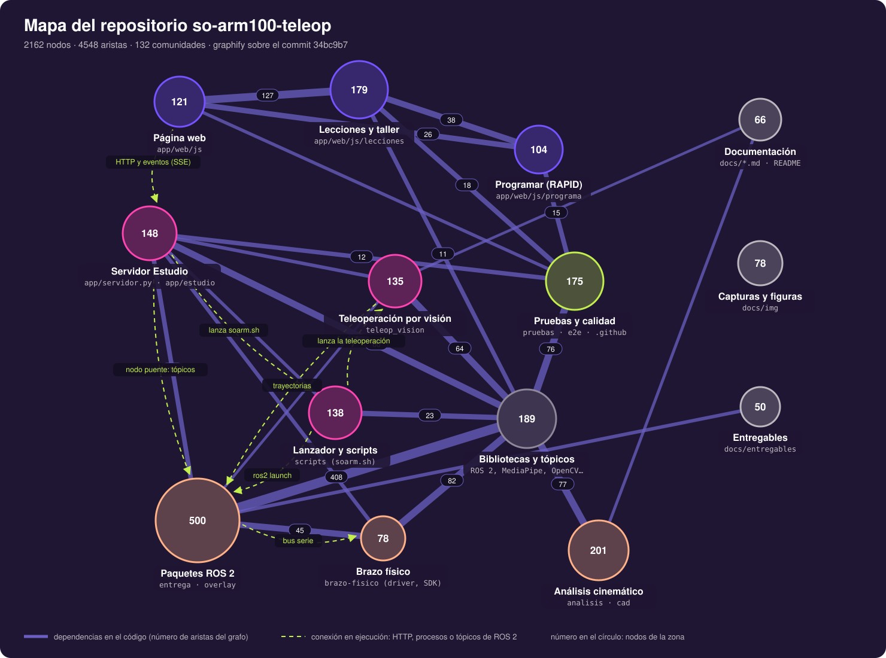

# 21 — Mapa del repositorio

Este capítulo muestra **cómo está armado el repositorio por dentro**: qué partes hay, cuánto pesa cada una y quién depende de quién. Es el plano que conviene mirar antes de cambiar algo, para saber qué más se puede afectar. El mapa se generó con [graphify](https://github.com/Graphify-Labs/graphify), una herramienta que lee el código y los documentos y arma con ellos un **grafo de conocimiento**.



*Figura 21.1. Mapa del repositorio. Cada círculo es una zona; el número es la cantidad de nodos del grafo que hay en ella y su área es proporcional a ese número. Las líneas violeta son dependencias que aparecen en el código, con su número de aristas. Las líneas discontinuas lima son conexiones que existen cuando el sistema corre, pero que en el código son solo texto: rutas HTTP, procesos que se lanzan y tópicos de ROS 2.*

## Contenido

1. [Qué es un grafo de conocimiento del código](#qué-es-un-grafo-de-conocimiento-del-código)
2. [Cómo leer la figura](#cómo-leer-la-figura)
3. [Las 14 zonas](#las-14-zonas)
4. [Qué dice el mapa](#qué-dice-el-mapa)
5. [El grafo interactivo](#el-grafo-interactivo)
6. [Cómo se actualiza](#cómo-se-actualiza)
7. [Límites del mapa](#límites-del-mapa)

## Qué es un grafo de conocimiento del código

Un grafo es un conjunto de **nodos** unidos por **aristas**. En este grafo:

- **Nodos:** cada función, clase, método, archivo, documento, figura o concepto que graphify encontró. Por ejemplo `Ejecutor`, `puntosParaRobot()`, `SOARM100Interface` o «Doc 19: Programar».
- **Aristas:** relaciones entre ellos. «`programar.js` importa `movimiento.js`», «`moverRobot()` llama a `enviar()`», «el documento 19 describe la celda virtual».

graphify obtiene las aristas de dos maneras, y cada una queda marcada en el grafo:

| Origen | Cómo se obtiene | Cuántas hay |
|---|---|---|
| `EXTRACTED` | Del **árbol sintáctico** del código: los `import`, las llamadas y las clases se leen directamente del archivo. Es exacto. | 4195 |
| `INFERRED` | Deducidas por un modelo de lenguaje al leer documentos, figuras y código que no se analiza sintácticamente. Llevan una confianza de 0 a 1. | 353 |

Luego graphify agrupa los nodos en **comunidades**: conjuntos de nodos muy conectados entre sí y poco con el resto, que es lo que mide la *modularidad* de un grafo. Salieron 132 comunidades, como «Lenguaje RAPID (parser)», «Cámara de Windows (camwin)» o «Plugin ros2_control».

El grafo completo tiene **2162 nodos y 4548 aristas** y se construyó sobre el commit `34bc9b7`.

## Cómo leer la figura

132 comunidades son demasiadas para una figura. Por eso la figura 21.1 agrupa los nodos por **zona del repositorio**, según la carpeta del archivo de donde salió cada nodo. Después cuenta cuántas aristas cruzan de una zona a otra: esas son las líneas violeta, y su grosor crece con el logaritmo de ese número. Las relaciones dentro de una misma zona no se dibujan, porque no cruzan a otra.

Las **líneas discontinuas** no salen del grafo: se agregaron a mano porque el análisis del código no las ve. Por ejemplo, la página web y el servidor se hablan por HTTP. En el código eso es una cadena de texto (`fetch('/api/trayectoria')`), no una llamada entre funciones, así que el grafo casi no las une: hay solo 2 aristas entre «Página web» y «Servidor Estudio». Para entender el sistema en marcha hacen falta las dos capas.

## Las 14 zonas

| Zona | Carpetas | Nodos | Qué hace |
|---|---|---|---|
| Página web | `app/web/js` | 121 | La interfaz de SO-ARM100 Estudio: pestañas, escena 3D, cinemática en el navegador, cámara del navegador |
| Lecciones y taller | `app/web/js/lecciones` | 179 | Las 18 lecciones de Aprender y el taller RAPID con su corrector |
| Programar (RAPID) | `app/web/js/programa` | 104 | Lenguaje, intérprete, planificador de trayectorias, celda virtual y retos |
| Servidor Estudio | `app/servidor.py`, `app/estudio` | 148 | Servidor HTTP, sesión, nodo puente con ROS 2, cámara de Windows |
| Pruebas y calidad | `pruebas`, `e2e`, `.github` y configuraciones | 175 | Pruebas unitarias, e2e, CI, linter, knip, Stryker |
| Lanzador y scripts | `scripts` | 138 | `soarm.sh`, instaladores, atajos, `ir_a_pose.py` |
| Teleoperación por visión | `teleop_vision` | 135 | Nodos v13, v14 y v15, cámara por red, calibración del operador |
| Bibliotecas y tópicos | (sin archivo propio) | 189 | Lo que el código usa pero no está en el repositorio: rclpy, MediaPipe, OpenCV, three.js, y los tópicos de ROS 2 |
| Paquetes ROS 2 | `entrega`, `overlay` | 500 | Paquetes del brazo tal como se entregaron: descripción, lanzamientos, MoveIt, driver |
| Brazo físico | `brazo-fisico` | 78 | Driver del brazo real, SDK de los servos, espejo simulación y brazo real, protecciones |
| Análisis cinemático | `analisis`, `cad` | 201 | Modelo D-H, cinemática directa e inversa, jacobiano, figuras |
| Documentación | `docs/*.md`, `README.md` | 66 | Los 21 capítulos |
| Capturas y figuras | `docs/img` | 78 | Capturas de pantalla y figuras de los capítulos |
| Entregables | `docs/entregables` | 50 | Documento técnico, estudio económico y presentaciones |

## Qué dice el mapa

**1. Dos bloques casi independientes.** Arriba está la aplicación: página web, lecciones, Programar y servidor. Abajo están ROS 2, el brazo y el análisis. En el código se tocan muy poco: 14 aristas entre el servidor y los paquetes ROS 2, y ninguna directa entre la página y ROS. Toda la comunicación pasa por el **nodo puente** (`app/estudio/nodo_puente.py`) y por `soarm.sh`, es decir, por las líneas discontinuas. Es una buena señal de diseño: se puede cambiar la interfaz sin tocar el robot, y al revés.

**2. La zona más pesada es la de ROS 2.** Tiene 500 nodos y 408 aristas hacia las bibliotecas externas. Casi todo es el driver en C++ (`SOARM100Interface`, 66 aristas, el nodo más conectado del grafo) y el SDK de los servos (`SMS_STS`, `SCS`). Es código de terceros adaptado, y el más delicado: ahí se decide lo que recibe cada servo.

**3. Los puentes críticos.** Hay nodos que unen comunidades que de otro modo no se tocarían. Si uno de ellos se rompe, se afectan varias partes a la vez. Se miden con la **centralidad de intermediación** (*betweenness*): la fracción de caminos más cortos del grafo que pasan por el nodo. Los más altos son:
   - `SOARM100Interface::read()`, con 0,053: une el plugin de ros2_control con los ensayos, que leen el brazo por el mismo camino.
   - `SOARM100Interface::write()`, con 0,051: la otra mitad, lo que se escribe a los servos.
   - `el()`, con 61 aristas: la función que crea cada elemento de la interfaz.

**4. Pruebas y calidad llega a casi todo.** Tiene 175 nodos, con aristas hacia Programar, lecciones, servidor y bibliotecas. Es lo que se buscaba en la etapa de calidad: las partes con más lógica (el intérprete RAPID, el planificador, el puente de ROS) tienen pruebas que las usan directamente.

**5. Huecos de documentación.** graphify encontró 283 nodos aislados, con una conexión o ninguna. La mayoría son constantes locales (`lienzo`, `ctx`, `POSE`). No son errores, pero sí candidatos a revisar si alguno debería estar documentado o usarse en otro sitio.

## El grafo interactivo

La figura es un resumen. El grafo completo, con sus 2162 nodos, está en [`docs/mapa/grafo_interactivo.html`](mapa/grafo_interactivo.html).

**Cómo abrirlo.** Hay que abrirlo con doble clic en la copia local del repositorio: GitHub no muestra páginas HTML dentro del repositorio. Necesita conexión a internet la primera vez, porque carga la biblioteca de dibujo `vis-network`.

**Qué se puede hacer:**
- buscar un nodo por nombre;
- ver sus vecinos y de qué archivo y línea sale;
- mover el grafo y acercarse.

El informe completo de graphify, con las 132 comunidades, los nodos más conectados, las relaciones sorprendentes y las preguntas que sugiere, está en [`docs/mapa/GRAPH_REPORT.md`](mapa/GRAPH_REPORT.md).

## Cómo se actualiza

graphify no forma parte de la aplicación: es una herramienta para el desarrollo, instalada en Windows. Hacer el grafo completo desde cero cuesta muchos tokens (el primero leyó unos 831 000), así que para actualizarlo se usa el modo incremental, que solo relee lo que cambió.

**1. Dentro de Claude Code**, en la carpeta del repositorio, actualiza el grafo:
```
/graphify --update
```

**2. En Git Bash**, en la carpeta del repositorio:
```bash
python docs/mapa/aristas_manuales.py && graphify export html
python docs/mapa/figura_mapa.py graphify-out/graph.json docs/img/mapa_repositorio.svg
cp graphify-out/graph.html docs/mapa/grafo_interactivo.html
cp graphify-out/GRAPH_REPORT.md docs/mapa/GRAPH_REPORT.md
```

Qué hace cada comando:
- `aristas_manuales.py` vuelve a agregar las 52 aristas que el análisis no ve: las rutas HTTP, el protocolo JSON entre `puente_ros.py` y `nodo_puente.py`, y los tópicos y acciones de ROS 2. Cada arista lleva el archivo y la línea donde se verificó.
- `figura_mapa.py` vuelve a dibujar la figura 21.1.
- Los dos `cp` copian el grafo interactivo y el informe a `docs/mapa`, que es lo que se sube al repositorio.

La carpeta `graphify-out/` está en `.gitignore`: tiene la caché y archivos intermedios que no se suben.

## Límites del mapa

- **Las aristas `INFERRED` pueden estar mal.** Son 353 y las propuso un modelo de lenguaje. Por ejemplo, el grafo dice que `test_camwin.py` «usa» `CamaraNavegador`, y es cierto; pero también une `load_config()` de un nodo de teleoperación con la función `f()` de `nodo_puente.py`, y eso es falso: `f` es un cierre local que solo se parece por el nombre.
- **Nombres repetidos se juntan.** El nodo `Time` reúne `rclcpp::Time` (C++) y el módulo `time` (Python). Los caminos que pasan por esos nodos no son dependencias reales.
- **Lo que es texto no se ve.** Las rutas HTTP, los tópicos de ROS 2 y los procesos lanzados desde `soarm.sh` son cadenas de texto para el análisis. Por eso se agregan a mano (`aristas_manuales.py`) y se dibujan aparte en la figura.
- **Es una foto.** El grafo corresponde al commit `34bc9b7`. Si el código cambia mucho, hay que actualizarlo con los pasos de la sección anterior.

---

[← Anterior: Protecciones del brazo físico](20-protecciones-del-brazo.md) · [Volver al inicio](../README.md)
