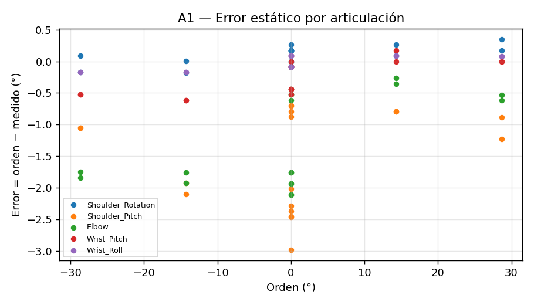
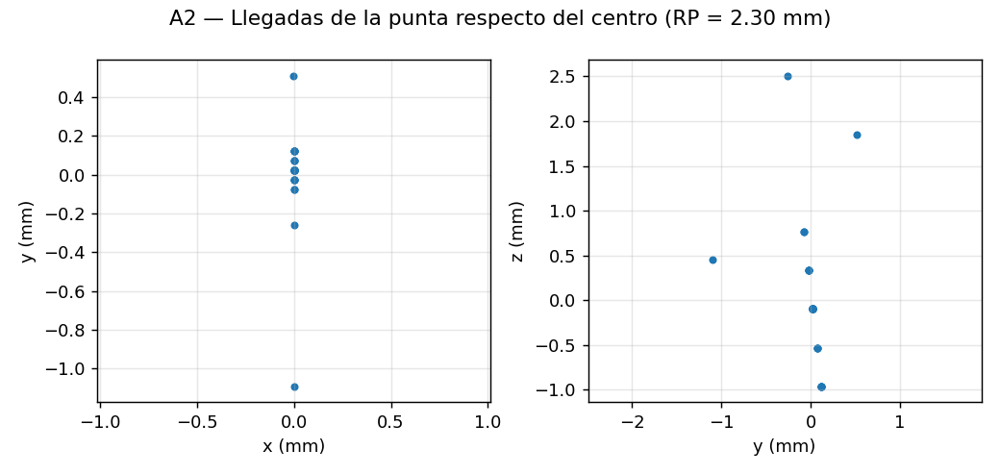
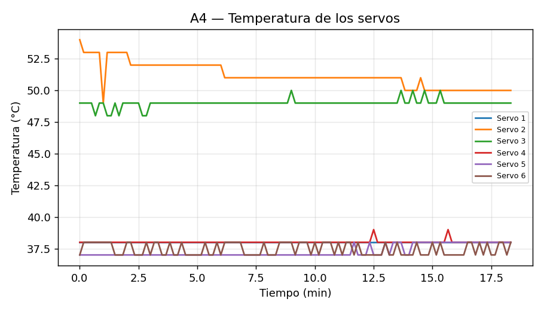
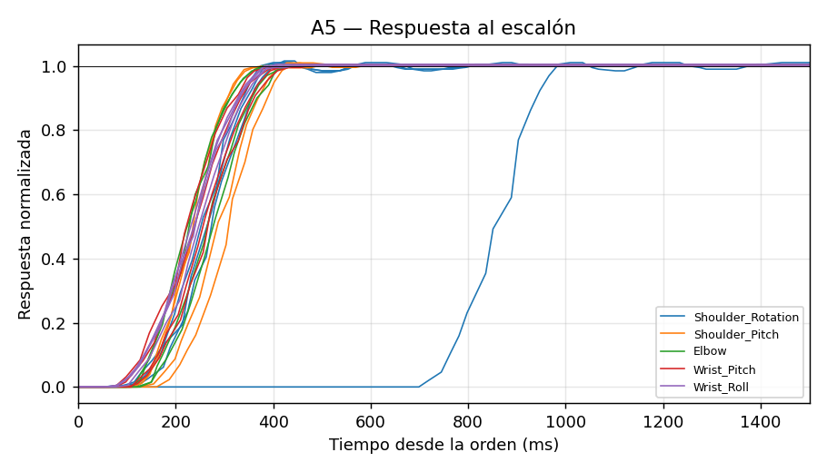
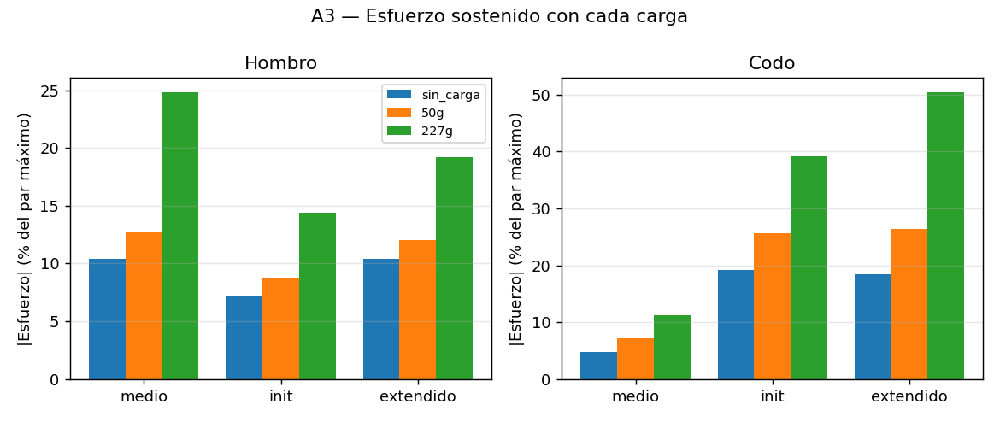

# Resultados de los ensayos

### A1 — Precisión estática (`a1_estatico_real_100819.csv`)

Modo real, amplitud 0.5 rad.

| Articulación | Puntos | Error medio (°) | Desv. (°) | Máx. |error| (°) | Error en +A (°) | Error en −A (°) | |Esfuerzo| medio (%) |
|---|---|---|---|---|---|---|---|
| Shoulder_Rotation | 18 | +0.10 | 0.14 | 0.35 | +0.22 | -0.07 | 1.4 |
| Shoulder_Pitch | 18 | -1.53 | 0.76 | 2.99 | -0.93 | -1.53 | 14.7 |
| Elbow | 18 | -1.26 | 0.71 | 2.11 | -0.44 | -1.82 | 12.3 |
| Wrist_Pitch | 18 | -0.23 | 0.26 | 0.61 | +0.04 | -0.57 | 2.3 |
| Wrist_Roll | 18 | -0.03 | 0.11 | 0.17 | +0.08 | -0.17 | 0.0 |

**Error de cada articulación con el brazo en init** (qué articulación se queda corta):

| Articulación | Error medio en init (°) |
|---|---|
| Shoulder_Rotation | +0.17 |
| Shoulder_Pitch | -2.38 |
| Elbow | -1.82 |
| Wrist_Pitch | -0.11 |
| Wrist_Roll | -0.07 |

### A2 — Repetibilidad (`a2_repetibilidad_real_101500.csv`)

30 llegadas.

| Articulación | Desviación (°) | Rango (°) |
|---|---|---|
| Shoulder_Rotation | 0.000 | 0.000 |
| Shoulder_Pitch | 0.116 | 0.879 |
| Elbow | 0.185 | 0.879 |
| Wrist_Pitch | 0.000 | 0.000 |
| Wrist_Roll | 0.000 | 0.000 |

Punta de la pinza, por cinemática directa de las posiciones medidas: distancia media al centro 0.543 mm, desviación 0.587 mm, **RP = l̄ + 3·S = 2.304 mm**.

Es la repetibilidad según los encoders del propio servo; la nube de puntos del lápiz en el papel es la medida externa y puede ser mayor por holguras que el encoder no ve.

### A4 — Temperatura (`a4_termico_103052.csv`)

30.0 min previstos, amplitud 20.0°, límite 55 °C; terminó por: interrumpido.

| Servo | Inicial (°C) | Final (°C) | Máxima (°C) | Subida (°C) | |Carga| media (%) |
|---|---|---|---|---|---|
| 1 | 38 | 38 | 38 | +0 | 2.3 |
| 2 | 54 | 50 | 54 | -4 | 13.1 |
| 3 | 49 | 49 | 50 | +0 | 12.0 |
| 4 | 38 | 38 | 39 | +0 | 2.7 |
| 5 | 37 | 38 | 38 | +1 | 0.8 |
| 6 | 37 | 38 | 38 | +1 | 2.4 |

### A5 — Respuesta al escalón (`a5_escalon_real_102350.csv`)

Amplitud 0.3 rad, trayectoria de 0.1 s.

| Articulación | Escalones | Retardo (ms) | Subida 10-90 % (ms) | Establecimiento (ms) | Sobrepaso (%) | Error final (°) |
|---|---|---|---|---|---|---|
| Shoulder_Rotation | 4 | 317 | 174 | 501 | 1.1 | +0.09 |
| Shoulder_Pitch | 4 | 184 | 162 | 336 | 0.5 | -1.14 |
| Elbow | 4 | 162 | 161 | 340 | 0.0 | -1.10 |
| Wrist_Pitch | 4 | 148 | 192 | 342 | 0.0 | -0.24 |
| Wrist_Roll | 4 | 139 | 180 | 333 | 0.1 | -0.02 |

### A3 — Carga útil

| Carga | Postura | Error hombro (°) | Error codo (°) | Error muñeca (°) | Esfuerzo hombro (%) | Esfuerzo codo (%) | Esfuerzo muñeca (%) |
|---|---|---|---|---|---|---|---|
| sin_carga | medio | -1.12 | -0.38 | -0.62 | +10.4 | +4.8 | +6.4 |
| sin_carga | init | -0.70 | -2.02 | -0.62 | +7.2 | +19.2 | +6.4 |
| sin_carga | extendido | -0.97 | -2.03 | -0.44 | +10.4 | +18.5 | +4.8 |
| 50g | medio | -1.38 | -0.64 | -0.53 | +12.8 | +7.2 | +5.6 |
| 50g | init | -0.88 | -2.72 | -0.62 | +8.8 | +25.6 | +6.4 |
| 50g | extendido | -1.15 | -2.90 | -0.79 | +12.0 | +26.4 | +8.0 |
| 227g | medio | -2.70 | -1.08 | -1.23 | +24.8 | +11.2 | +12.0 |
| 227g | init | -1.49 | -4.22 | -1.76 | +14.4 | +39.2 | +16.8 |
| 227g | extendido | -1.94 | -5.53 | -1.67 | +19.2 | +50.4 | +16.0 |

