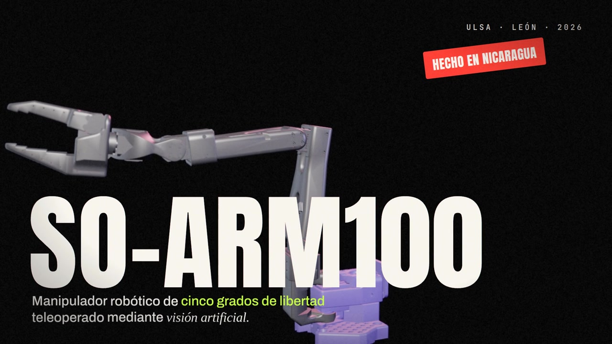
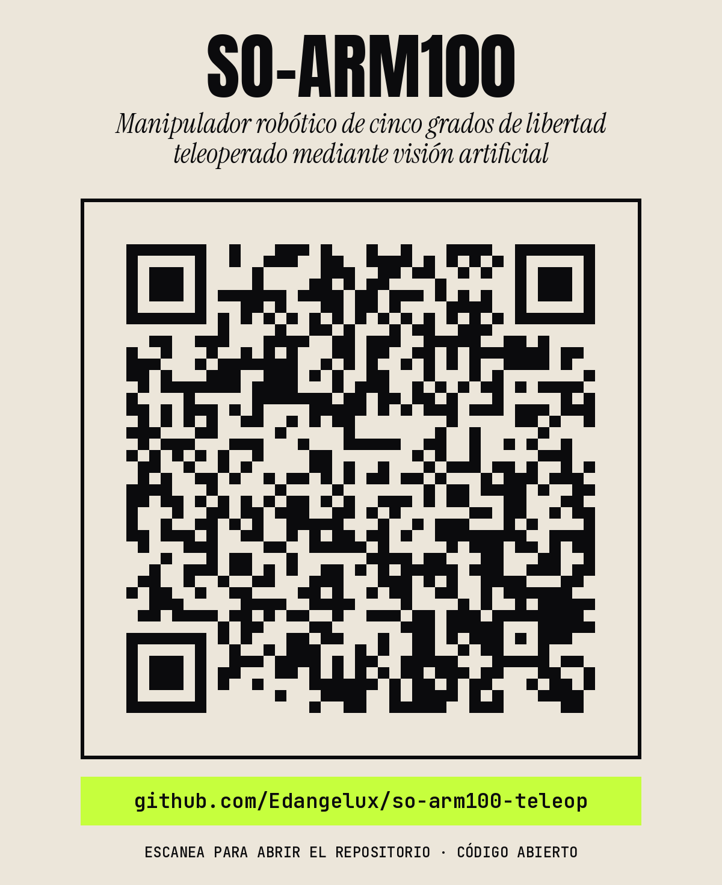

# Video del proyecto

Video de presentación de **«Manipulador robótico de cinco grados de libertad teleoperado mediante visión artificial»**, construido sobre el brazo SO-ARM100. Explica el proyecto a cualquier persona, sin conocimientos previos: el problema que resuelve, el brazo, el software, la visión artificial, la matemática, los resultados medidos y SO-ARM100 Estudio.

## Archivos

| Archivo | Qué es |
|---|---|
| [`videos/so-arm100_video.mp4`](videos/so-arm100_video.mp4) | Video completo: 5 min 15 s, 1920×1080, 30 cuadros por segundo |
| [`videos/so-arm100_teaser.mp4`](videos/so-arm100_teaser.mp4) | Teaser de 60 s, horizontal (1920×1080) |
| [`videos/so-arm100_teaser_vertical.mp4`](videos/so-arm100_teaser_vertical.mp4) | El mismo teaser en vertical (1080×1920), para Instagram, TikTok o estados |
| [`musica/musica_video.mp3`](musica/musica_video.mp3) | Música original del video completo |
| [`musica/musica_teaser.mp3`](musica/musica_teaser.mp3) | Música original del teaser |
| [`imagenes/miniatura.jpg`](imagenes/miniatura.jpg) | Miniatura de 1280×720 |
| [`imagenes/qr_repositorio.png`](imagenes/qr_repositorio.png), [`.svg`](imagenes/qr_repositorio.svg) | Código QR que abre este repositorio |

## Qué cuenta el video

Son 21 escenas de 15 s. La música va a 128 BPM, así que cada escena dura exactamente 8 compases y cada corte cae sobre el ritmo.

| # | Tiempo | Escena | Qué se ve |
|---|---|---|---|
| 1 | 0:00 | Gancho | Tres grabaciones reales a la vez: el brazo, la defensa y MoveIt. «¿Y si un robot pudiera copiar tu brazo?» |
| 2 | 0:15 | Título | El brazo en 3D, «SO-ARM100», el título del proyecto y la defensa: «Te mueves. Y el robot te copia» |
| 3 | 0:30 | El problema | El laboratorio con una sola estación: 450 min ÷ 35 estudiantes = 12,86 min de práctica por estudiante |
| 4 | 0:45 | La propuesta | Los equipos industriales son caros y cerrados; la propuesta es una estación abierta, barata y replicable de USD 336,66 |
| 5 | 1:00 | ¿Qué es el SO-ARM100? | Diseño abierto de The Robot Studio con Hugging Face, licencia Apache-2.0, piezas impresas en 3D, 6 servos STS3215 y LeRobot |
| 6 | 1:15 | Anatomía | Los cinco grados de libertad, uno por uno, con un rótulo que sigue a cada articulación |
| 7 | 1:30 | Construcción | El brazo separado en sus piezas, el ensamble en SolidWorks y el alcance máximo de 431,70 mm |
| 8 | 1:45 | Pioneros | Hasta donde sabemos, la primera estación de teleoperación por visión con un SO-ARM100 en el país, y lo que se puede hacer con ella |
| 9 | 2:00 | Ubuntu y ROS 2 | Por qué Ubuntu 22.04 (ROS 2 Humble; WSL2 en Windows), qué es un nodo y qué es un tópico |
| 10 | 2:15 | Simulación | Gazebo y MoveIt con RViz lado a lado, y SO-ARM100 Estudio abriéndolos con un botón |
| 11 | 2:30 | MediaPipe | Qué es: redes neuronales que encuentran 33 puntos del cuerpo (Pose) y 21 de la mano (Hands) en una cámara común |
| 12 | 2:45 | Del gesto al movimiento | El diagrama del proyecto, etapa por etapa (cámara, MediaPipe, teleoperación, ROS 2, brazo físico, Gazebo y SO-ARM100 Estudio), con la grabación real de cada etapa de fondo |
| 13 | 3:00 | La matemática | Las fórmulas con que se calculan los ángulos del brazo humano y el filtro One Euro, junto a un esqueleto que se mueve |
| 14 | 3:15 | Tres versiones | v13 (la de la defensa), v14 (sabe dónde está el brazo) y v15 (en pruebas) |
| 15 | 3:30 | El movimiento real | El brazo de cerca y, en pantalla dividida, el operador, el brazo real y su gemelo en SO-ARM100 Estudio y en Gazebo |
| 16 | 3:45 | Resultados | 34,05 FPS, 21,87 ms, 0,492°, 2,30 mm, 227 g y 54 °C |
| 17 | 4:00 | Por qué SO-ARM100 Estudio | Las órdenes de terminal de la defensa frente a un solo botón, y cómo está hecha la aplicación |
| 18 | 4:15 | Aprender | Las lecciones, de lo básico a lo industrial, con la aplicación al lado |
| 19 | 4:30 | Programar | Programar como un robot industrial, apilar tres cubos y teleoperar con un botón |
| 20 | 4:45 | Todo es abierto | El mapa del repositorio y su dirección en GitHub |
| 21 | 5:00 | Cierre | «Construir para entender. Medir para mejorar.», el equipo y el título del proyecto |

El teaser toma 16 tramos de 3,75 s del video, con sus propias transiciones y su propia mezcla de la música.

## Recursos multimedia que se usaron

| Recurso | Qué se usó |
|---|---|
| Grabaciones reales | La defensa del proyecto (30·09·2026); el brazo en la estación de trabajo (15·09·2026); el brazo pasando de la postura home a init (28·09·2026); una grabación de pantalla con MediaPipe y Gazebo (02·09·2026); y, del 01·10·2026, SO-ARM100 Estudio abriendo Gazebo, MoveIt y RViz, el gemelo digital copiando al operador y el brazo de cerca |
| Fotografías | El laboratorio, el brazo armado y las piezas impresas, tomadas de la presentación técnica del proyecto |
| Diseño mecánico | El video del ensamble del brazo en SolidWorks |
| SO-ARM100 Estudio | Grabaciones de la aplicación funcionando: sesión, mover, aprender, una lección, programar, el taller y los ensayos |
| Modelo 3D | Las mallas del brazo (las mismas del modelo URDF que usan Gazebo y MoveIt), renderizadas en Blender |
| Mapa del repositorio | El grafo de conocimiento del repositorio ([capítulo 21](../docs/21-mapa-del-repositorio.md)) |
| Tipografías | Anton, Instrument Serif, Archivo y JetBrains Mono, todas con licencia SIL Open Font |
| Música | Original, compuesta para el video: perreo (dembow, bajo 808 y requinto de guitarra) alternado con UK garage, a 128 BPM y sin letra. No tiene derechos de terceros |
| Montaje | DaVinci Resolve Studio |

## Datos que muestra el video y de dónde salen

| Dato | Fuente |
|---|---|
| 35 estudiantes, 450 min, 12,86 min por estudiante | Presentación técnica; `docs/entregables/README.md` |
| USD 336,66 · C$ 12 456,42 | Presentación técnica, presupuesto |
| 431,70 mm de alcance | `analisis/cinematica/ANALISIS_CINEMATICO.md` |
| 34,05 FPS · 21,87 ms · 0,492° | `README.md`, «Resultados medidos» |
| 2,30 mm · 227 g · 54 °C | `README.md`, ensayos del brazo real del 25 de septiembre de 2026 |
| Fórmulas de los ángulos y filtro One Euro | `entrega/teleoperacion/teleop_v13.py`; el filtro es el de Casiez, Roussel y Vogel (CHI 2012) |
| SO-ARM100: The Robot Studio con Hugging Face, Apache-2.0, 6 servos STS3215, LeRobot | Repositorio oficial del SO-ARM100 y documentación de LeRobot |
| MediaPipe Pose (33 puntos) y Hands (21 puntos) | Documentación de MediaPipe |
| ROS 2 Humble sobre Ubuntu 22.04 y WSL2 en Windows | Documentación de ROS 2 Humble |
| 2162 piezas de código y documentos, 4548 relaciones | `graphify-out/graph.json` ([capítulo 21](../docs/21-mapa-del-repositorio.md)) |

El esqueleto de la escena de la matemática es una animación ilustrativa: lo que viene del código son las fórmulas.

## Código QR

Abre <https://github.com/Edangelux/so-arm100-teleop>. Tiene corrección de errores alta (nivel H), así que se puede leer aunque se imprima pequeño o se ensucie un poco. Para imprimirlo en grande conviene usar la versión `.svg`, que no pierde nitidez.
